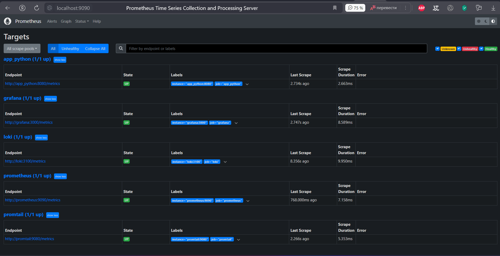
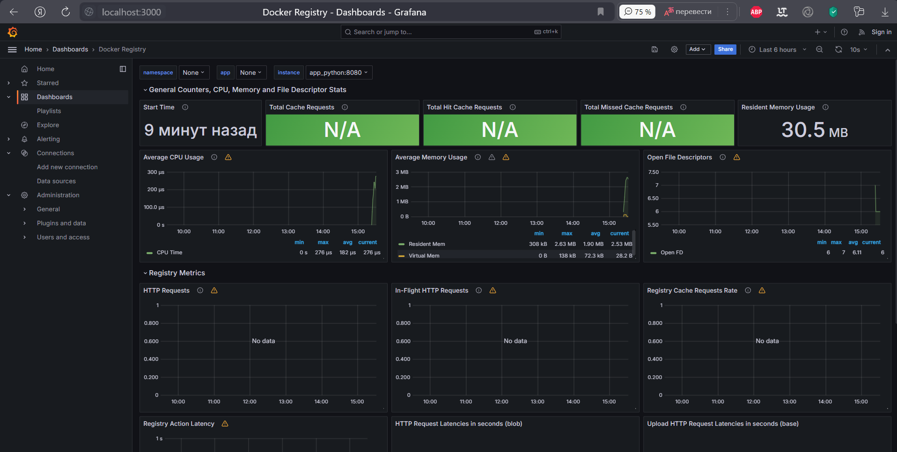

# Metrics aggregation and visualization

## Task 1: Prometheus Setup

1. I wrote prometheus.yml file to scrape metrics from Loki and Prometheus containers with scrape_interval and scrape_timeout set to 10s.
2. I changed the `docker-compose.yml` file to include Prometheus by adding prometheus sub-service.
3. I also changed app_python service to include prometheus client library to expose metrics on /metrics endpoint.
4. I verified Prometheus targets by accessing `http://localhost:9090/targets`.
   

## Task 2: Dashboard and Configuration Enhancements

1. I added log rotation mechanisms and memory limits for all services in the `docker-compose.yml` file: memory limit for container - 200M and log rotation for 10 files with 15MB size.
2. Screenshots of various dashboards I imported into Grafana:
   
   
   
