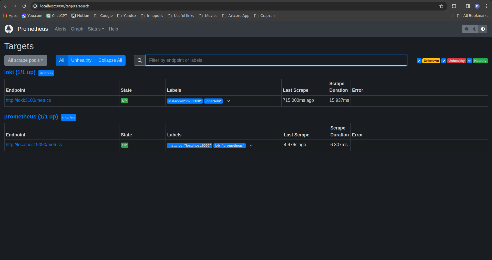
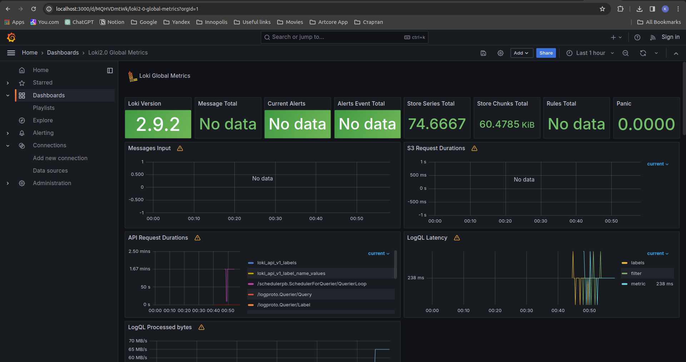
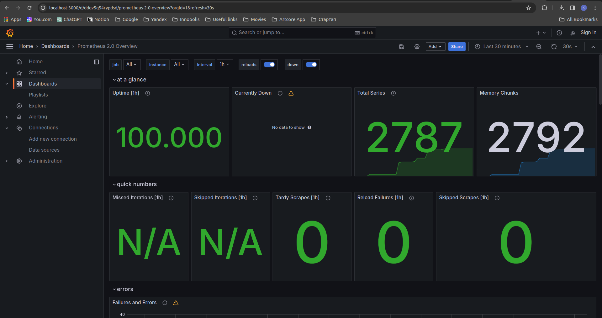
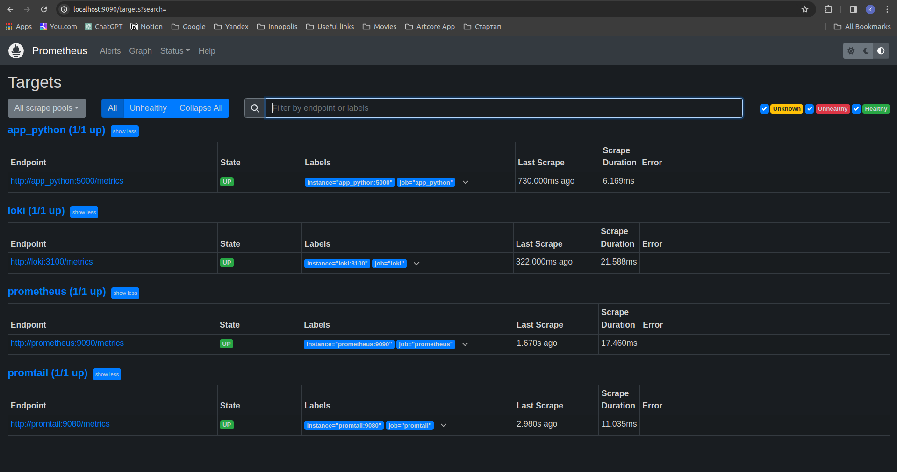
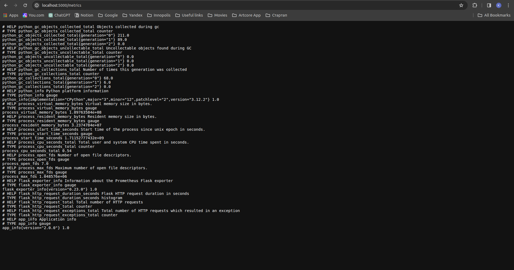

# Prometheus Targets



# Graphana Loki and Prometheus metrics

## Loki Dashboard



## Prometheus Dashboard



# Log rotation and memory limits

To add log rotation I add the following lines to docker-compose.yml:

```
x-logging: &default-logging
  driver: "json-file"
  options:
    tag: "{{.ImageName}}|{{.Name}}"
    max-size: "100m"
    max-file: "10"
```

To add memory limits in each service I added:
```
deploy:
      resources:
        limits:
          memory: 250M
```

# Add all services to Prometheus



# App Python metrics



```python
metrics = PrometheusMetrics(app)
metrics.info('app_info', 'Application info', version='2.0.0')
```