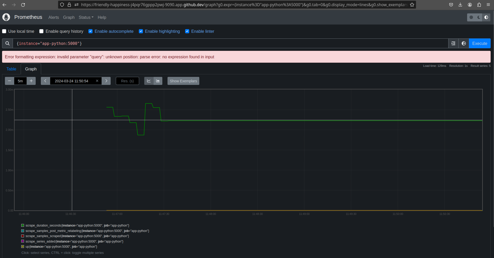
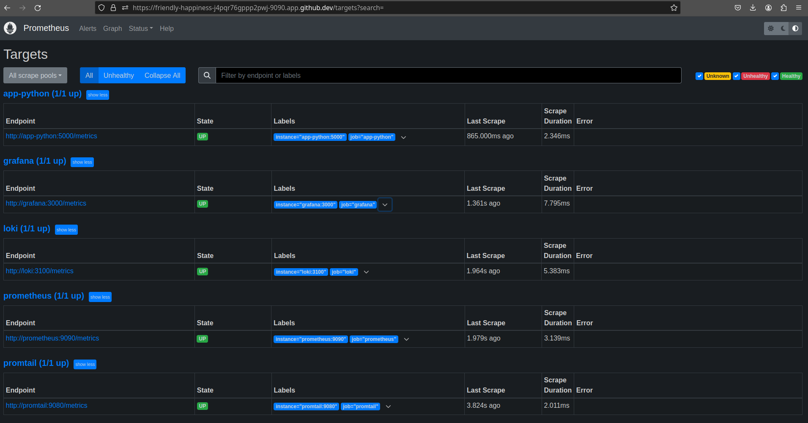
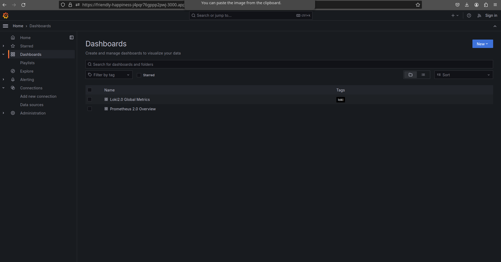
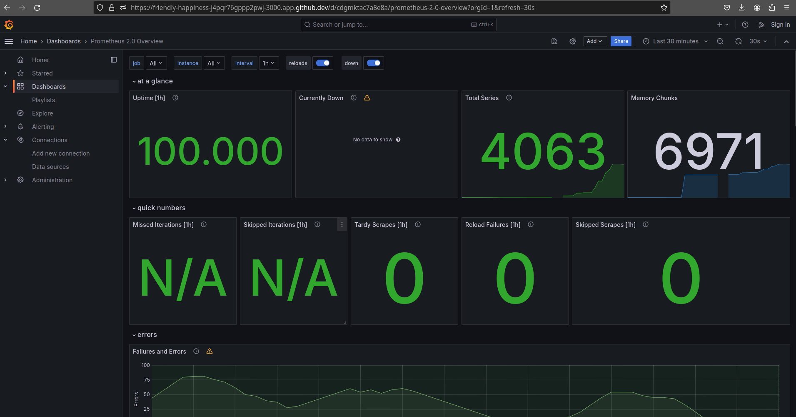
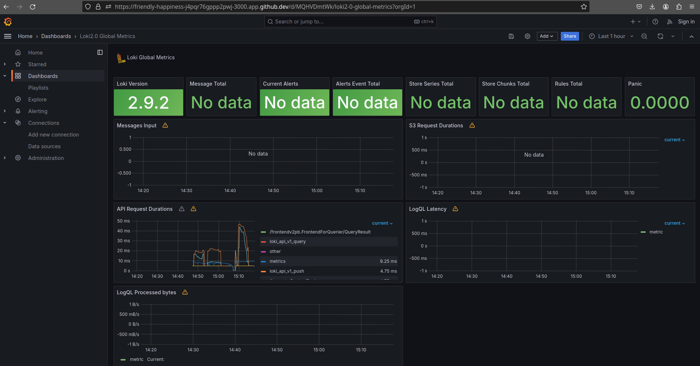

# App metrics

## Log rotation

I added some mechanism to make log rotation possible in my project.

In `docker-compose.yml` I limited count of files up to 5 and limited size of each file up to 
20 Mb (100 Mb in total).

## App python

I added prometheus in the my app python application. It checks if pyhton app is working and collecting metrics. 

## Prometheus

## Grafana

