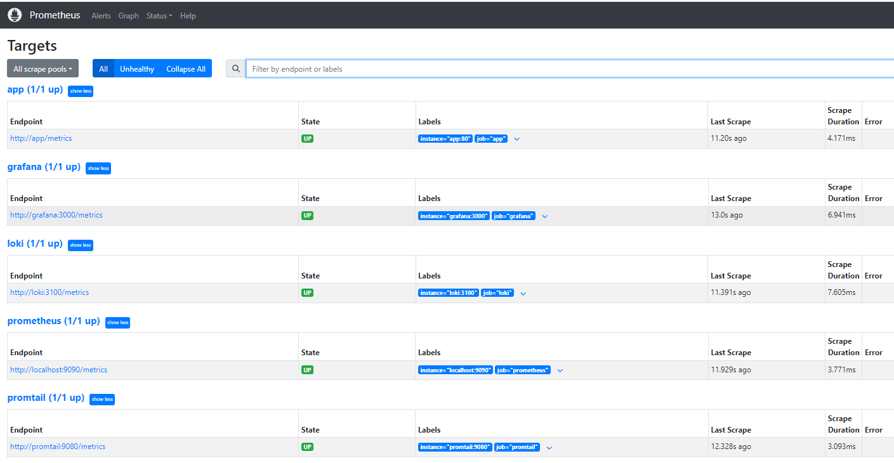
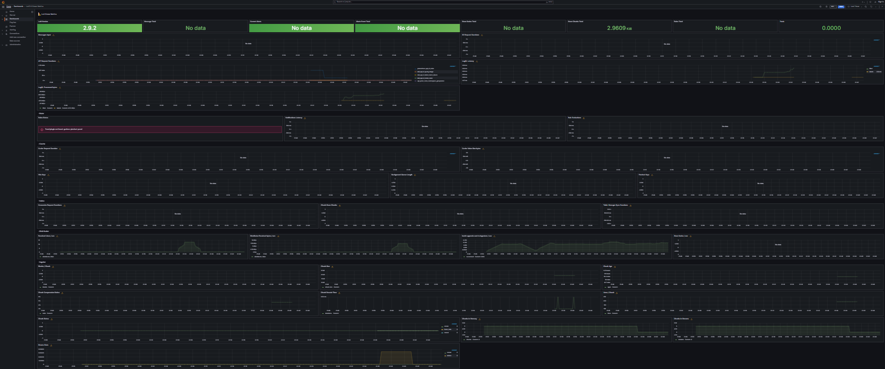
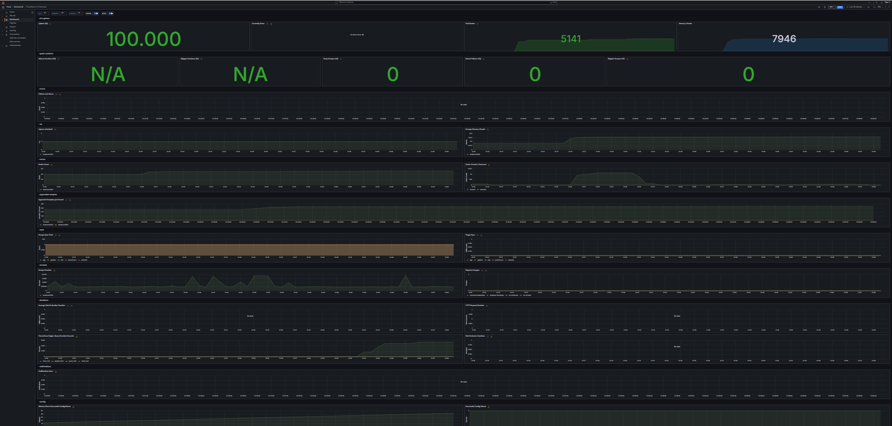

# Metrics

## Prometheus Setup

- I have expanded my existing `docker-compose.yml` file to include Prometheus.
- I have configured Prometheus to collect metrics from both Loki and Prometheus containers.

### Setup Verification

To ensure that Prometheus is correctly scraping metrics I have accessed the [targets](http://localhost:9090/targets).
Here is screenshot from this page:



## Dashboard and Configuration Enhancements

### 1. Grafana Dashboards

#### Loki



#### Prometheus



### 2. Service Configuration Updates

#### Added log rotation mechanisms

To add rotation added these lines to x-logging:

```text
max-size: 100M
max-file: 3
```

It constrains the max size of log file to `100MB` and the number of files to `3`.

#### Specified memory limits for containers

Each container now has `512 MB` of memory

### 3. Metrics Gathering

I extended prometheus in the beginning it gathers metrics from all services defined in the `docker-compose.yml` file

## Obtain Application Metrics

To obtain application metrics I registered my app instance using `Instrumentator`
from `prometheus_fastapi_instrumentator` library. 
I did it through these lines:

```python
from prometheus_fastapi_instrumentator import Instrumentator

Instrumentator().instrument(app).expose(app)
```