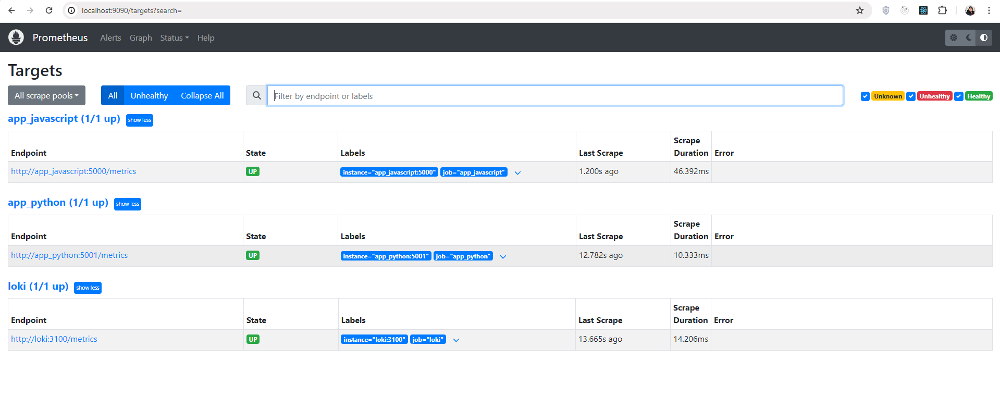
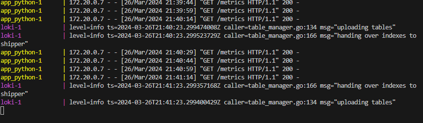

## Service Configuration Updates

Updated the `docker-compose.yml` file to include log rotation and memory limits for each service. Here's an example of the changes:

```dockercompose
services:
  app_python:
    ...
    logging:
      driver: "json-file"
      options:
        max-size: "200k"
        max-file: "10"
    deploy:
      resources:
        limits:
          memory: 500M
    ...
```

## Health Checks:

Added health checks to the `docker-compose.yml` file to monitor the status of the containers. Here's an example of the changes:

```dockercompose
services:
  app_python:
    ...
    healthcheck:
      test: ["CMD", "curl", "-f", "http://localhost:5001"]
      interval: 30s
      timeout: 10s
      retries: 3
  app_javascript:
    ...
    healthcheck:
      test: ["CMD", "curl", "-f", "http://localhost:5000"]
      interval: 30s
      timeout: 10s
      retries: 3

  prometheus:
    ...
    healthcheck:
      test: ["CMD", "curl", "-f", "http://localhost:9090"]
      interval: 30s
      timeout: 10s
      retries: 3
```

## Metrics Gathering:

Extended Prometheus to gather metrics from all services. Here's the updated `prometheus.yml` file:

```yaml
global:
  scrape_interval: 15s
  evaluation_interval: 15s

scrape_configs:
  - job_name: "loki"
    static_configs:
      - targets: ["loki:3100"]
  - job_name: "app_javascript"
    static_configs:
      - targets: ["app_javascript:5000"]
  - job_name: "app_python"
    static_configs:
      - targets: ["app_python:5001"]
```

## Metrics Integration:

### Integrated metrics into the Flask application using the `prometheus_flask_exporter` package. Here's the updated `app.py` file:

```python
# Import necessary modules
from prometheus_flask_exporter import PrometheusMetrics

# Create Flask application instance
app = Flask(__name__)

# Initialize metrics
metrics = PrometheusMetrics(app)

@app.route("/")
@metrics.counter('app_requests', 'Application Request Count',
         labels={'endpoint': lambda: request.path})
def current_time():
  ...
```

### Used the `prom-client` for the express application to expose metrics. Here's the updated `app.js` file:

```javascript
// Create a new Prometheus collector
const collectDefaultMetrics = client.collectDefaultMetrics;

// Probe every 5th second.
collectDefaultMetrics({ timeout: 5000 });

// Expose metrics endpoint for Prometheus
app.get("/metrics", async (req, res) => {
  try {
    const metrics = await client.register.metrics();
    res.set("Content-Type", client.register.contentType);
    res.end(metrics);
  } catch (error) {
    console.error("Error generating metrics:", error);
    res.status(500).send("Internal Server Error");
  }
});
...
```

## Screenshots:

Here are some screenshots of the Prometheus dashboard showing the metrics from the Flask application:





