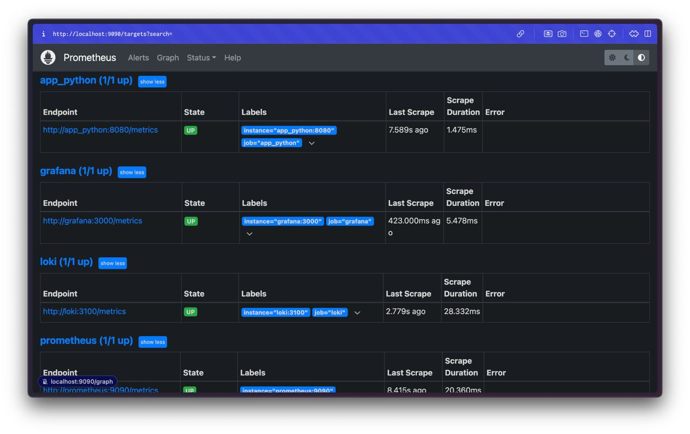
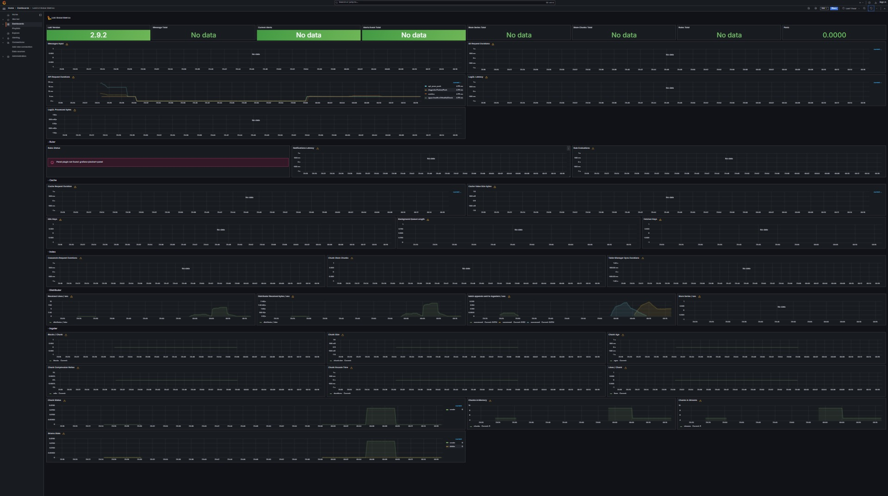
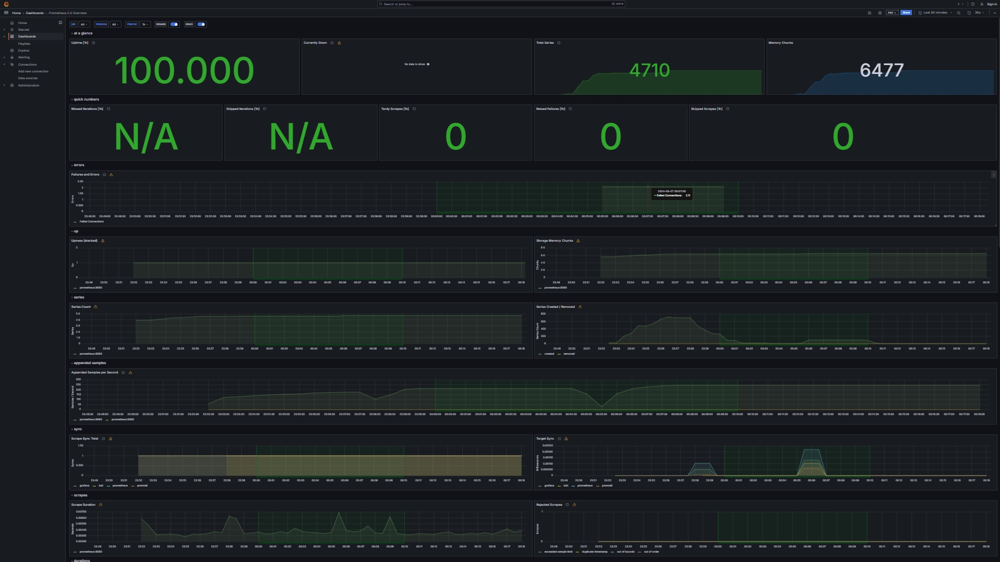
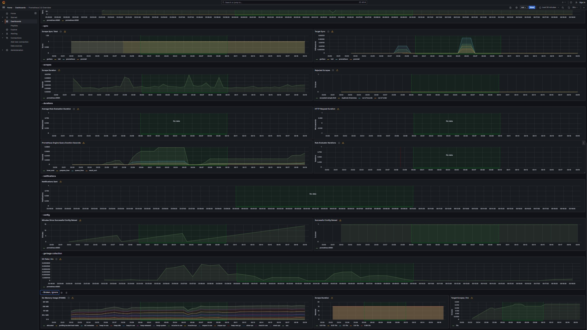
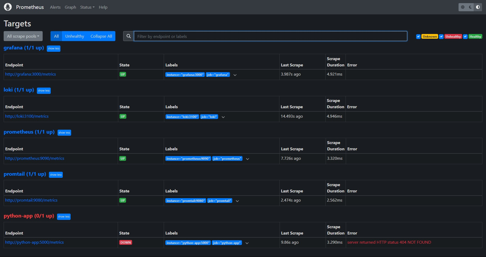

# Screenshots
## *Task 1*

[](./screenshots/prometheus.jpg)

## *Task 2.1*

### Loki
[](./screenshots/loki dashboard.jpg)

### Prometheus
[](./screenshots/prometheus dashboard part 1.jpg)
[](./screenshots/prometheus dashboard part 1.jpg)


# Changes Made to Docker Compose and Prometheus Configuration

In this document, I'll outline the changes made to the Docker Compose (`docker-compose.yml`) and Prometheus configuration (`prometheus.yml`) files without including the actual code from these files.

## Docker Compose Configuration (`docker-compose.yml`)

1. **Added Log Rotation Settings**:
   - Included log rotation settings (`max-size` and `max-file`) within the `x-logging` section to ensure log files are rotated when they reach a certain size and retain a limited number of log files.

   ```yaml
   x-logging:
     &default-logging
     driver: "json-file"
     options:
       tag: "{{.ImageName}}|{{.Name}}"
       max-size: "10m" # Rotate logs when they reach 10MB
       max-file: "3"   # Retain up to 3 log files

2. **Specified Memory Limits and Reservations**:

Added memory limits and reservations to all services in the Docker Compose file to ensure better resource management and prevent memory-related issues.
```yaml
services:
  my-service:
    image: my-image:latest
    deploy:
      resources:
        limits:
          memory: 512M
        reservations:
          memory: 256M
```


## Prometheus Configuration (`prometheus.yml`)
Added Prometheus Job Configurations:

Included job configurations for all services defined in the Docker Compose file within the Prometheus configuration. These configurations enable Prometheus to scrape metrics from each service and monitor their health and performance.

```yaml
global:
  scrape_interval:     15s
  evaluation_interval: 15s

scrape_configs:
  - job_name: my-service
    static_configs:
      - targets: ['my-service:service-port']
```

# Extended Prometheus for gathering metrics from all services
[](./screenshots/prometheus updated.jpg)

The Python application is encountering an error due to the incomplete bonus task. As a result, no metrics are being displayed, and there is no available information at the '/metrics' endpoint.