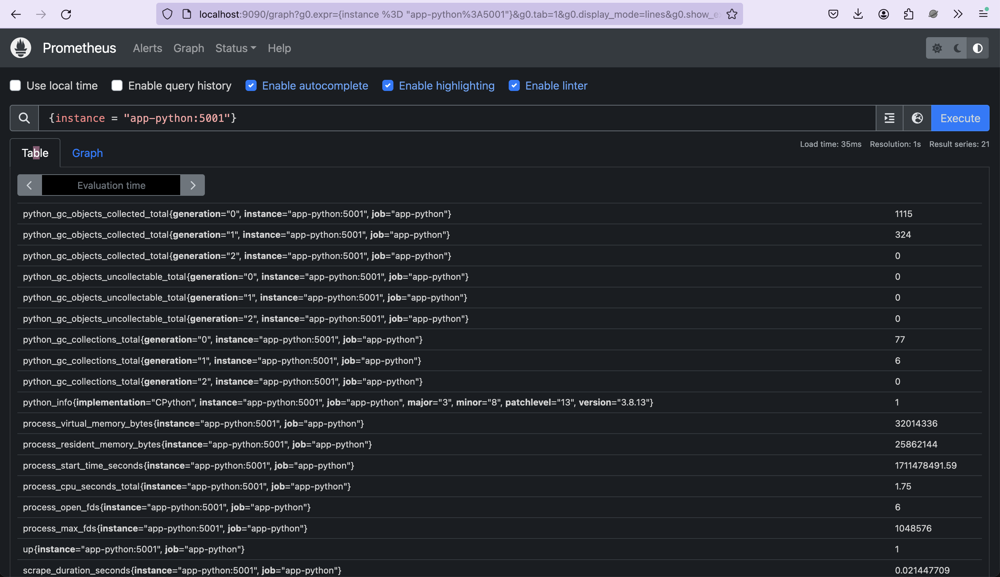
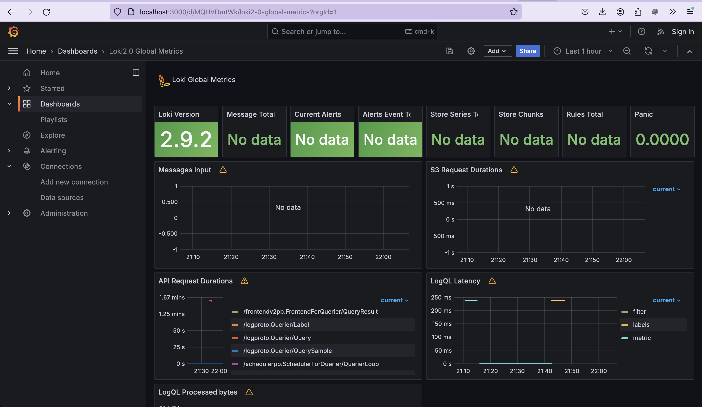
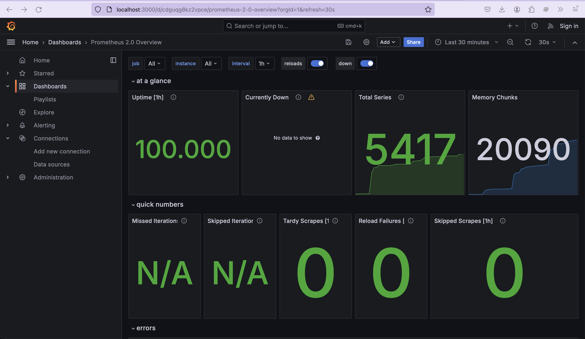

# Lab 8: Monitoring with Prometheus

## Task 1

Here, I update app-python and docker-compose.yml to check prometheus outpurs.

## Task 2 

I add promtail.yml and import dashboards to visualise metrics in Grafana

