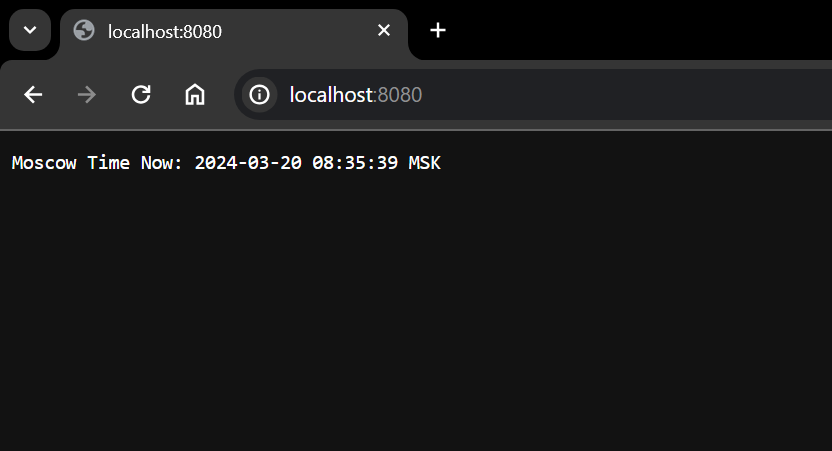
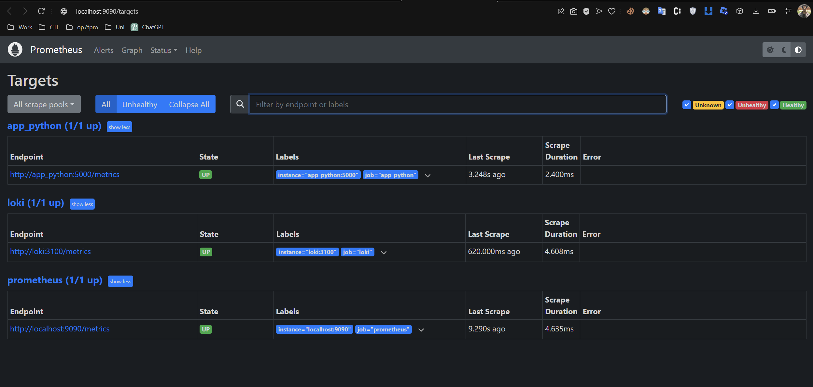
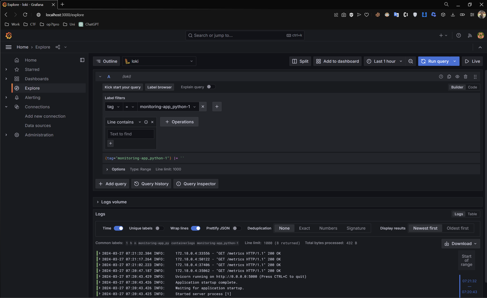
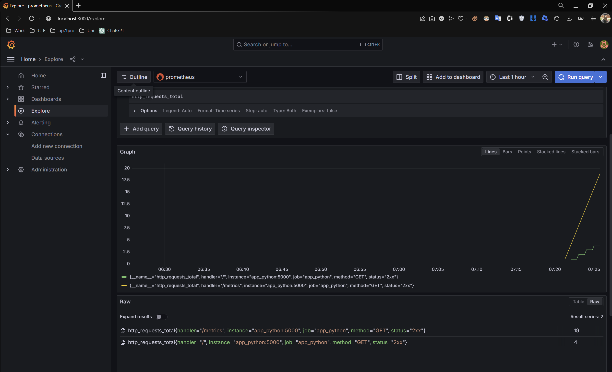
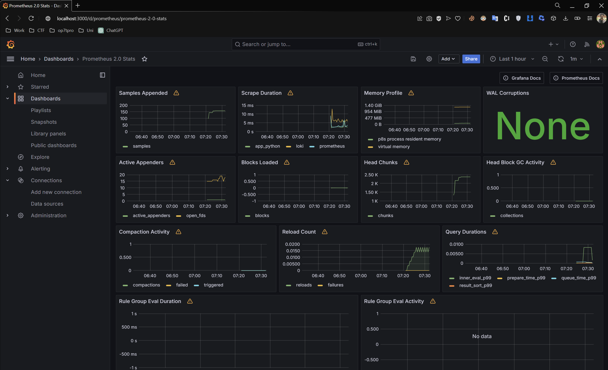
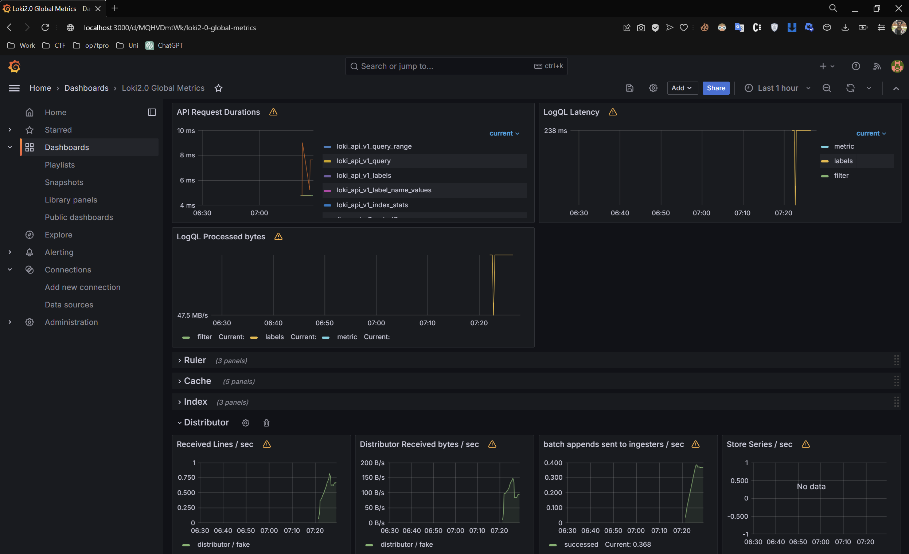
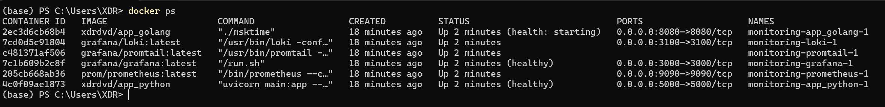

# Logging and Monitoring

## Overview: 

### Grafana

- Grafana is primarily a web application designed for visualization and analytics. When deployed, for example, as a Docker image, it offers an intuitive user interface for the creation and customization of **dashboards** that contain various **panels** (including **graphs**, **bars**, **gauges**, **charts**, etc.) to help you visualize the data, such as **metrics** or **logs**, collected by a **monitoring** solution like **Prometheus** or **Grafana Loki** from different systems or databases.
- It also provides the capability to set up **alerts** and boasts a **[plugin system](https://grafana.com/grafana/plugins/)**, allowing you to expand its functionality and seamlessly integrate with other tools.

### Grafana Loki

- Grafana Loki is a monitoring solution akin to Prometheus, with a specific focus on application **logs**, which are gathered by **[clients](https://grafana.com/docs/loki/latest/clients/)**, as opposed to handling general metrics.
- It stores logs as compressed objects and employs indexing for optimal efficiency, allowing users to perform queries using the **LogQL** language.

### Promtail

- Promtail is a crucial log collector and processor within the Prometheus ecosystem, responsible for efficiently gathering and shipping application **logs** to Grafana Loki for analysis.
- Its flexibility and configurability make it a valuable tool for enhancing observability by centralizing the collection and storage of log data.

### Prometheus
- A monitoring tool that collects metrics from various instances and saves them in a time-series database.
- Uses client libraries in various languages for application metrics and exporters for system metrics.
- Metrics can be accessed via web UI with PromQL, integrated with visualization tools like Grafana, or set up for alerts through an alert manager.

## Steps

### Logging

- Ensure that the application produces accessible logs when the container is running.

### Exporting logs

- An HTTP endpoint for application logs by Loki
- Custom metrics can be defined and exported using Python client libraries.
- 3rd party exporters, such as prometheus-flask-exporter, are available for Python applications.

### Preparing Environment
- Create a [docker-compose.yml](../monitoring/docker-compose.yaml) file to deploy the application alongside the logging and monitoring stack within a shared network [[reference](https://github.com/grafana/loki/blob/main/production/docker-compose.yaml)].
- Prepare configuration files for Loki [[reference](https://grafana.com/docs/loki/latest/configuration/examples/)] and Promtail [[reference](https://grafana.com/docs/loki/latest/clients/promtail/configuration/)].
  - The **Loki configuration** defines internal settings for the Loki server and specifies where logs should be stored, either locally or remotely.
  - The **Promtail configuration** contains details about the Promtail server, the storage of positions, and how to extract logs from files.
  - The **Prometheus configuration** defines target endpoints to scrape and how often to scrape them.
- Launch all containers using a `command` that specifies the location of the configuration files.

### Demo

- Run `docker-compose up` 
- Ensure that all containers are running.

- Ensure that the application is running on port 5000. 

  

- Ensure that the additional app is running on port 8080. 

  

- Verify Grafana UI is accessible on port 3000.

  - username:`admin`
  - password:`admin`

    

- Verify Prometheus UI is accessible at http://localhost:9090/targets and all targets are up in status tab, you can also run queries with autocompletion.

    

- Configuration -> Data source -> Add data source -> Loki -> URL = `http://loki:3100` -> Save and test.

- Explore -> Loki -> Add query -> Write PromQL query or use UI builder. 
  - We can see that container logs were scraped successfully.

    
    
  - Example query showing application endpoint responses: `http_request_total`
    

### Dashboards

- Now we can create interesting dashboards from data collected by Prometheus and Loki and export them as reusable JSON.

- We can also import ready-to-use dashboards for monitoring loki and prometheus

  - Dashboards → New → Import → Upload JSON File.
- Now we can create dashboards from data collected by Loki and export them as reusable JSON.

  

**Dashboards for Prometheus and Loki**
- Metrics names and Grafana dashboard types may evolve, causing empty panels. Adjust queries as needed to stay updated.

  

  

### Healthchecks
  

## Best Practices

- For in-depth guidance, refer to official documentation on best practices for [Grafana](https://grafana.com/docs/grafana/latest/best-practices/) and [Loki](https://grafana.com/docs/loki/latest/best-practices/).
- Develop informative logs adhering to a standardized format.
- Implement log rotation to conserve memory and disk space effectively.
- Craft straightforward and easily comprehensible dashboards with clear, meaningful names.
- When setting up alerts, aim for trigger conditions that demand immediate attention.
- Minimize unnecessary dashboard reloads to reduce network congestion.
