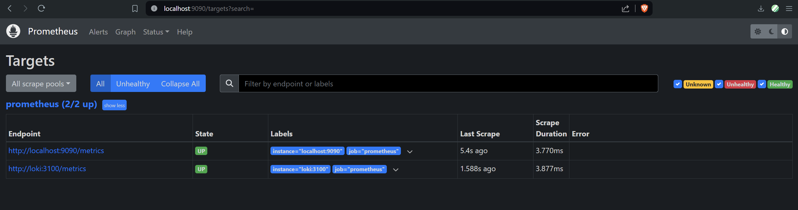
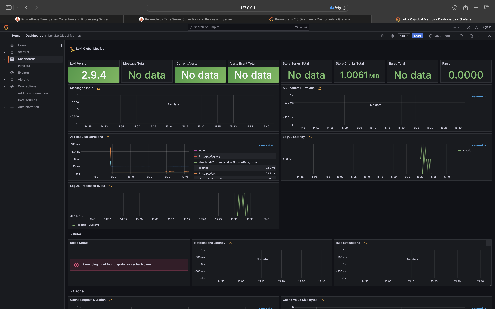
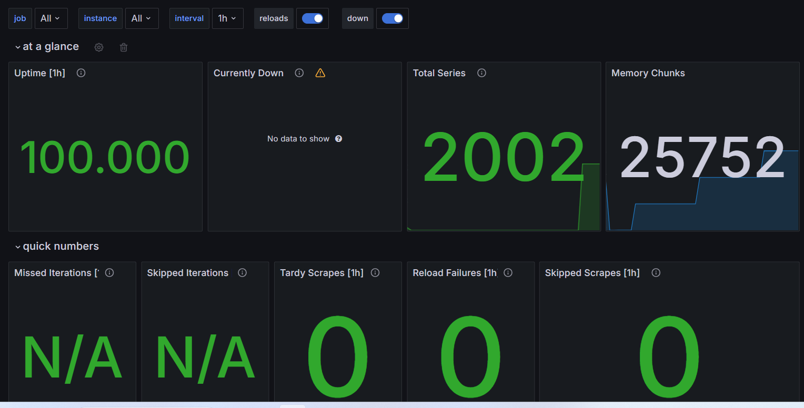

# Metrics

## Screenshots
1. Prometheus targets:

2. Loki Dashboard

3. Prometheus Dashboard


## Docker Compose changes

### Log rotation

The following parameters have been added to the `x-logging` configuration:

```yml
max-size: "10m"
max-file: "3"
```

With these configuration, Docker will keep up to 3 log files for each service, and
each file will be a maximum of 10MB. 

### Memory limits

Memory limits have been set by adding this configuration for each service:

```yml
x-deploy:
  &default-deploy
  resources:
    limits:
      memory: 100M
```

With this configuration, each service is limited to using a maximum of 100MB.
