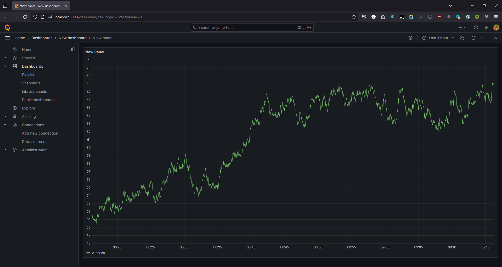

# Metrics

## Prometheus Status


## Grafana Dashboard



## Loki dashboard


## Prometheus dashboard


### Healthcheck
The following healthcheck is implemented in the `docker-compose.yml` file:
```yml
healthcheck:
      test: ["CMD", "curl", "-f", "<container_name>:<port>"]
      interval: 30s
      timeout: 15s
      retries: 3
```