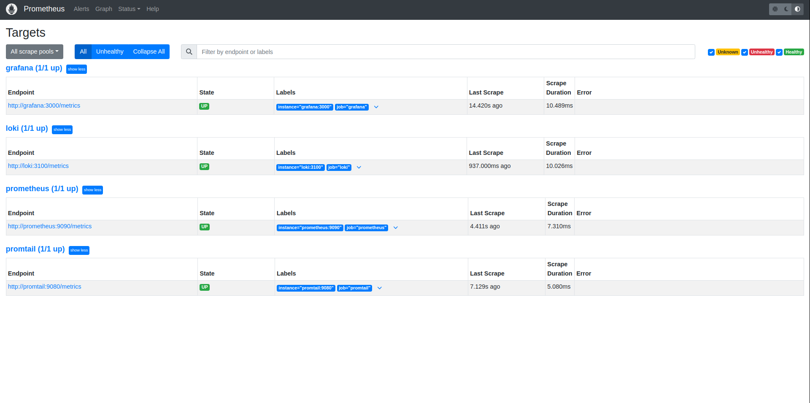

## All targets



## Loki dashboard


## Prometheus dashboard


## Log rotation

```yml
x-logging:
  &default-logging
  driver: "json-file"
  options:
    max-size: "5m"
    max-file: "3"
    tag: "{{.ImageName}}|{{.Name}}"
```
Here I used following options for log rotation:

- max-size: "5m": This sets the maximum size of each log file to 5 megabytes (5m). When the log file reaches this size, Docker will rotate the log file and create a new one.

- max-file: "3": This specifies that a maximum of 3 log files will be kept. When the maximum number of log files is reached, Docker will delete the oldest log file when a new one is created.

## Memory limit

```yml
x-deploy:
  &default-deploy
  resources:
    limits:
      memory: 100M
```

Here I used following option to setup memoty limit for each container:

- limits: This sub-key defines the resource limits for the deployment. In this case, it sets a memory limit of 100M (100 megabytes) for the container.


