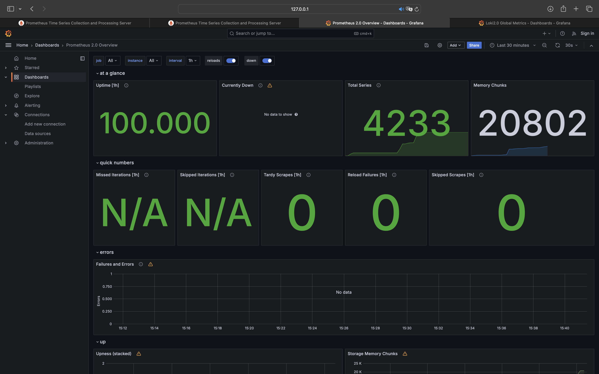
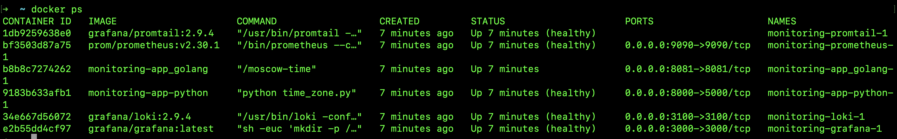

# Metrics

## Prometheus targets


## Loki Dashboard


## Prometheus Dashboard



## Enchancements on Docker Compose configuration

### Log rotation

The `x-logging` configuration now includes the following settings for log rotation:

```yml
max-size: "10m"
max-file: "3"
```

Docker will retain up to three log files, each no larger than 10MB, for each service under these settings. Docker will automatically rotate a log file and produce a new one when it gets to 10MB. Docker will begin removing the oldest log files if there are more than three.

### Memory limits

By generating a yaml anchor and adding it to each service's configuration, memory restrictions have been created. Each service can only use a maximum of 100MB of memory with this configuration:

```yml
x-deploy:
  &default-deploy
  resources:
    limits:
      memory: 100M

...
<service>:
    deploy: *default-deploy
```

### Python App

To expose common Prometheus metrics, I have included the `prometheus-fastapi-instrumentator` package into the FastAPI application.

The `prometheus-fastapi-instrumentator` package was added tto the project.

We can check all metrics in Prometheus:


## Bonus: Docker Healthchecks
 
`/health` endpoint was added to the Python app. Also, configuration below was added to each service in `docker-compose.yml` file:

```yml
healthcheck:
      test: [ "CMD", "curl", "-f", "http://localhost:8000" ]
      interval: 10s
      timeout: 10s
      retries: 3
```

The statuse of the docker containers:


