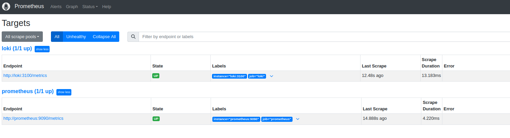
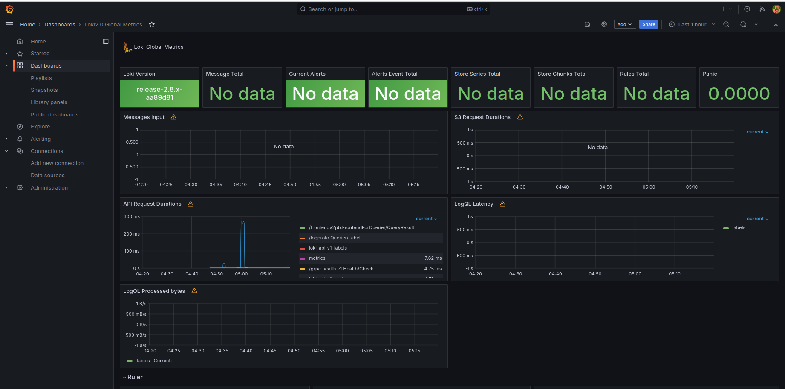
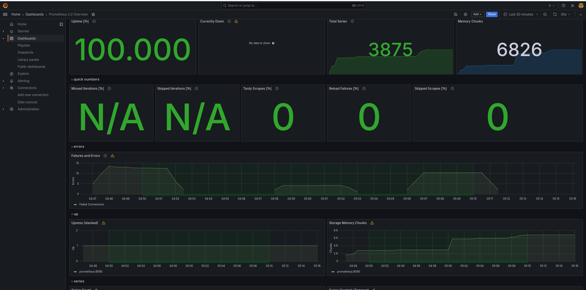
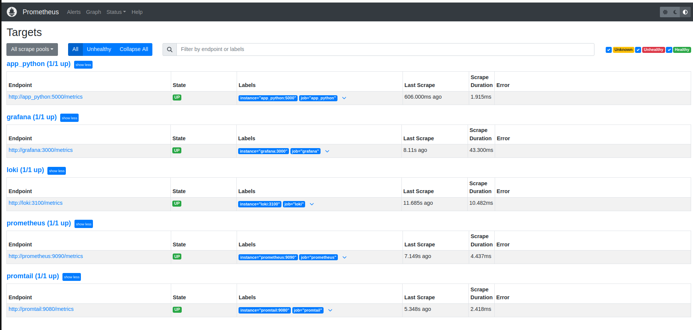
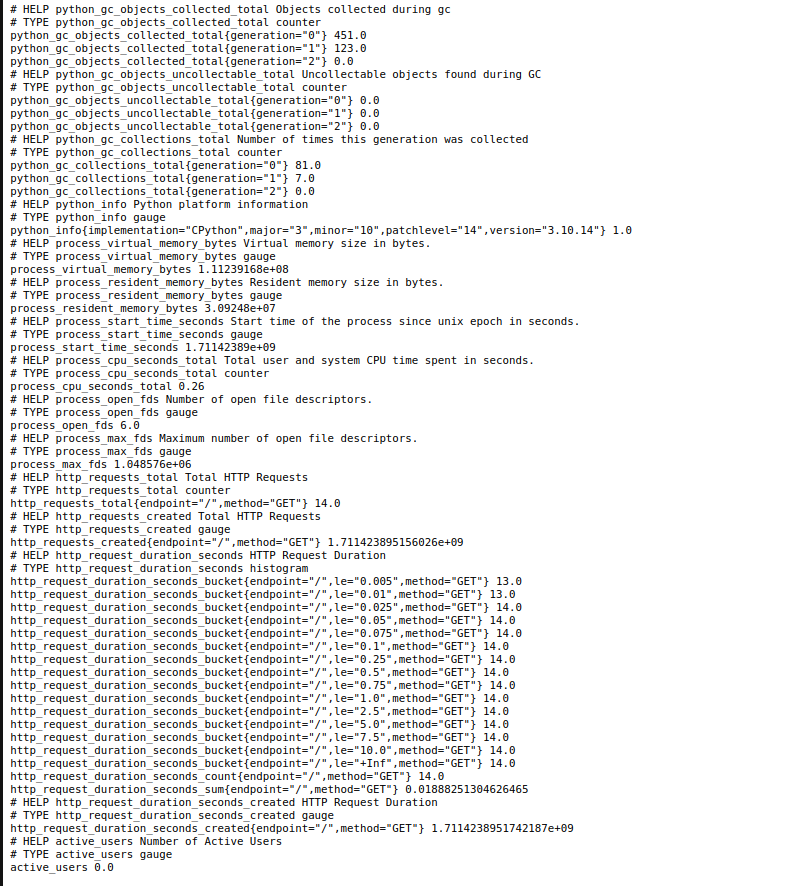
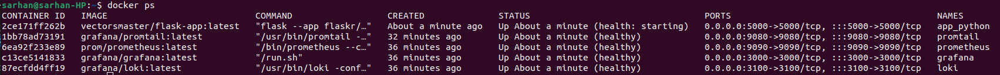

# Task1



# Task2

## Loki dashboard



## Prometheus dashboard



## Log rotation mechanisms and memory limit

```docker-compose
logging:
    driver: "json-file"
    options:
    max-size: "10m"
    max-file: "3"
deploy:
    resources:
        limits: 
            memory: 128M
```

For logging, I've specified that logs should be stored in JSON format using the "json-file" driver. This ensures that logs are structured and easier to parse for analysis. Additionally, I've set up log rotation, which means that when a log file reaches a size of 10 megabytes, it will be rotated. I've also configured log rotation to retain a maximum of 3 log files (the oldest will be removed if there are more than 3)

Regarding deployment, I've set a memory limit for each container to 128 megabytes. This restricts the amount of memory that each container can use, helping to prevent one container from consuming too many resources.

## Gatering information from all services



# Bonus Task

## metrics integration


I've integrated metrics with the app_python. I used prometheus client library. The image above shows the response of `localhost:5000/metrics` where the app is deployed.

## health checks
```docker-compose
healthcheck:
    test: [ "CMD", "curl", "-f", "app_python:5000/health"]
    interval: 30s
    timeout: 30s
    retries: 3
```
I've add `/health` endpoint to the python app.

