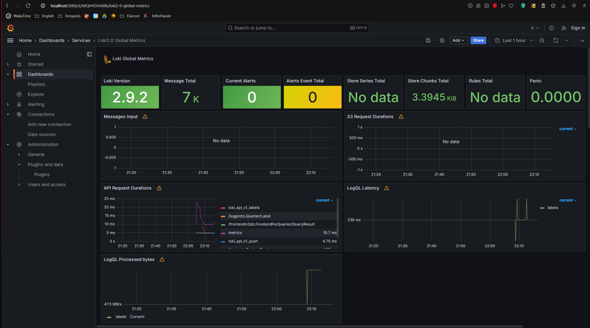
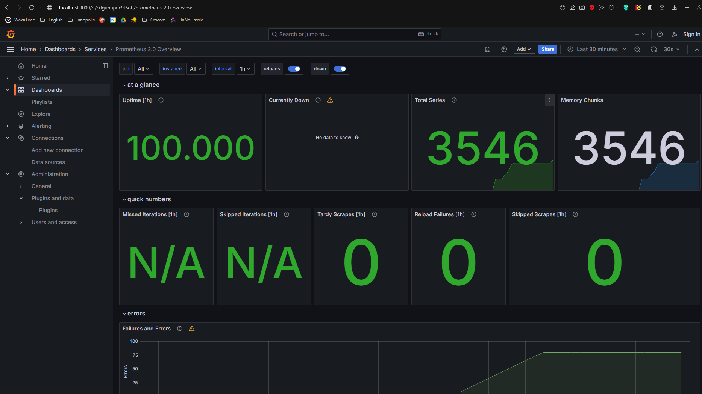

# Prometheus Targets

# Dashboards
## Loki

## Prometheus

# Service Configuration Updates
- Implemented log rotation using the "json-file" logging driver for every container.
- Set a maximum log file size of 100 megabyte with a limit of 5 log files for every container.
- Specified a memory limit of 700 megabytes for every container.
