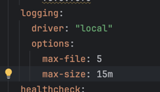
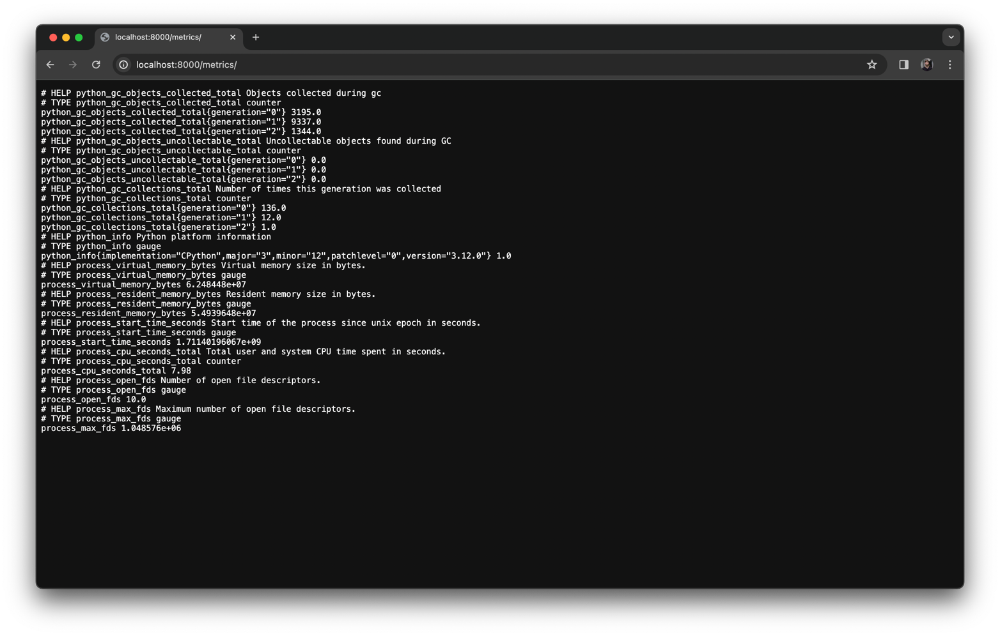
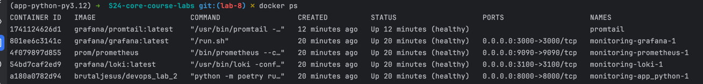

Prometheus scraps metrics successfully

Loki dashboard:

Prometheus dashboard:

Log rotation:

For each container I have set up that it has at most 5 log files, each can be 15 MB max and the driver is `local`.

Metrics of Python app:

Healthchecks:

