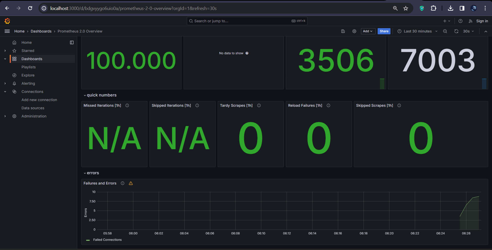
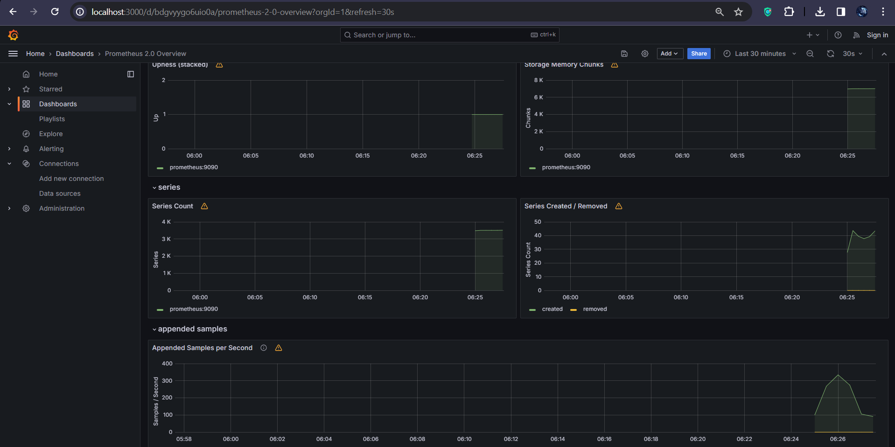
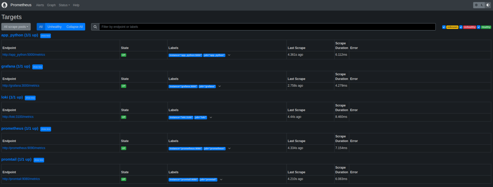

# Metrics Documentation

## Prometheus Integration

### Overview

Prometheus has been integrated into the monitoring stack to collect metrics from various components of our system.

### Prometheus Integration

- **Prometheus Setup**: Integrated Prometheus into the Docker Compose environment to collect metrics from various services.
- **Prometheus Configuration**: Configured Prometheus to scrape metrics from both Loki and Prometheus containers.
- **Metrics Gathering**: I extended Prometheus to gather metrics from all services defined in the Docker Compose file.

### Grafana Dashboards

- **Grafana Dashboards**: Dashboards in Grafana for both Loki and Prometheus were set up. I used the provided dashboards examples.

### Service Configuration Updates

- **Enhanced Configurations**: Log rotation mechanisms and specify memory limits for containers were included.

  - Memory limit: was set as 100MB

  - Log rotation: was set as:

        max-size: "10M"
        max-file: "5"

- **Health Checks**: Added health checks to all services to monitor container health.

---

## Screenshots

### Prometheus Dashboard

### Loki Dashboard

### Targets

