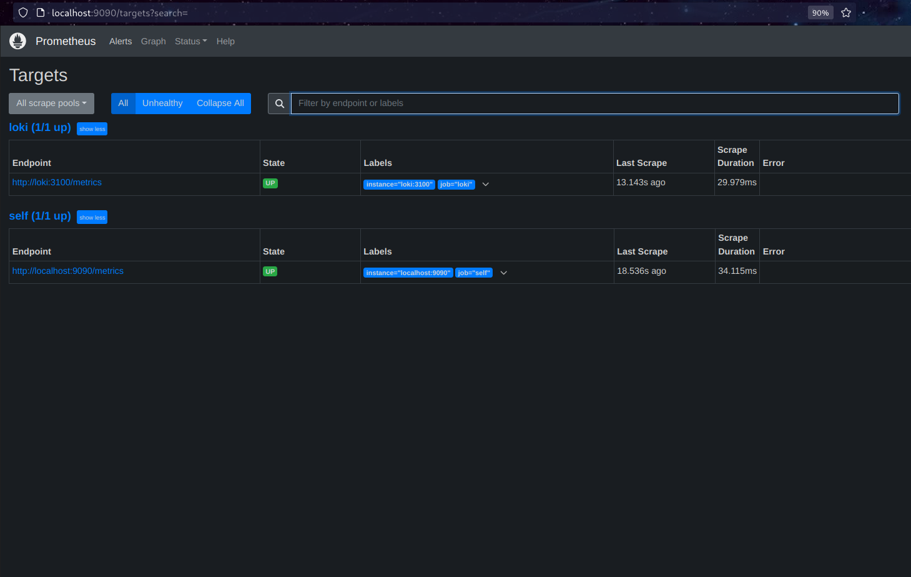
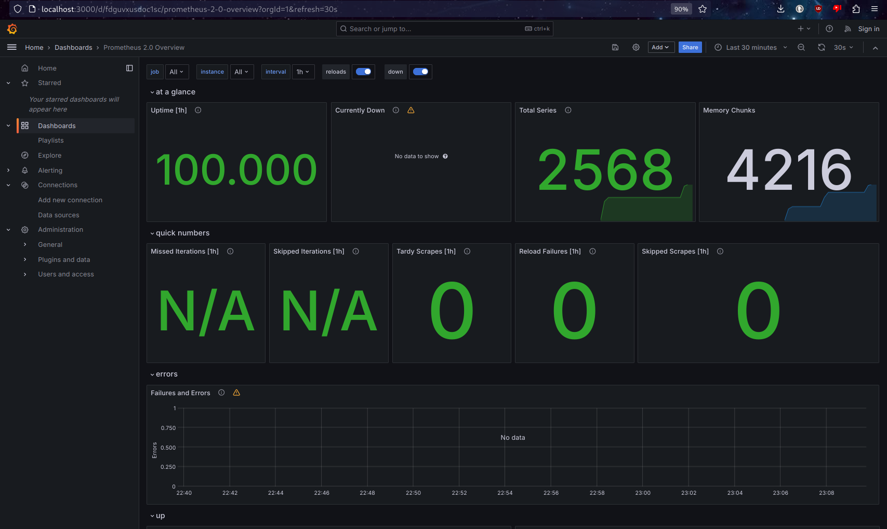
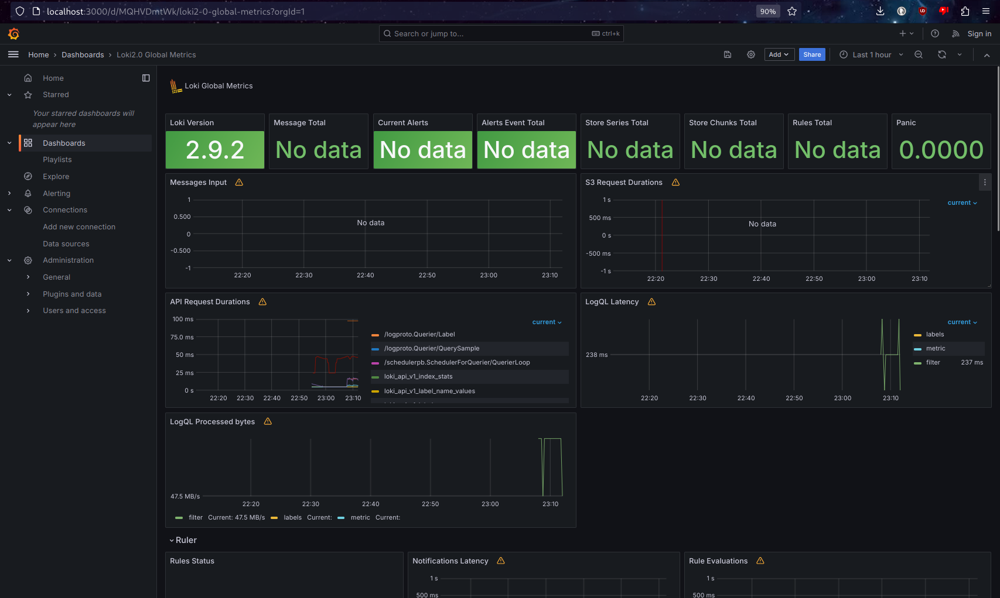
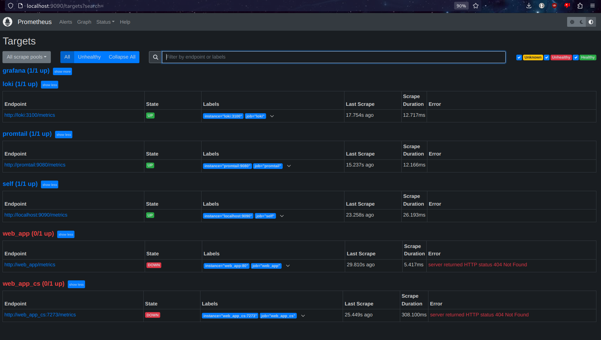

# Metrics setup

## Prometheus and Loki

## Grafana dashboards

## Service Configuration

### Memory limits

Memory limit of each service is set to 100m via special param.

### Log rotation

Log rotation is setup via max-size and max-file params on logging in docker-compose.

### New prometheus scrapping

Note that scrapping endpoints for custom servers are not setup.

