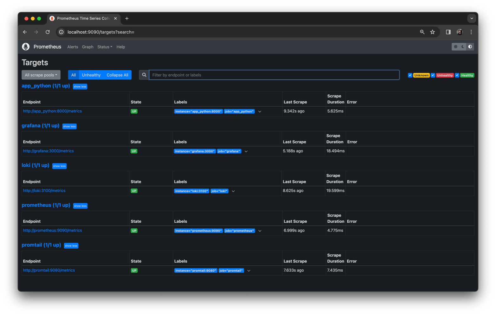
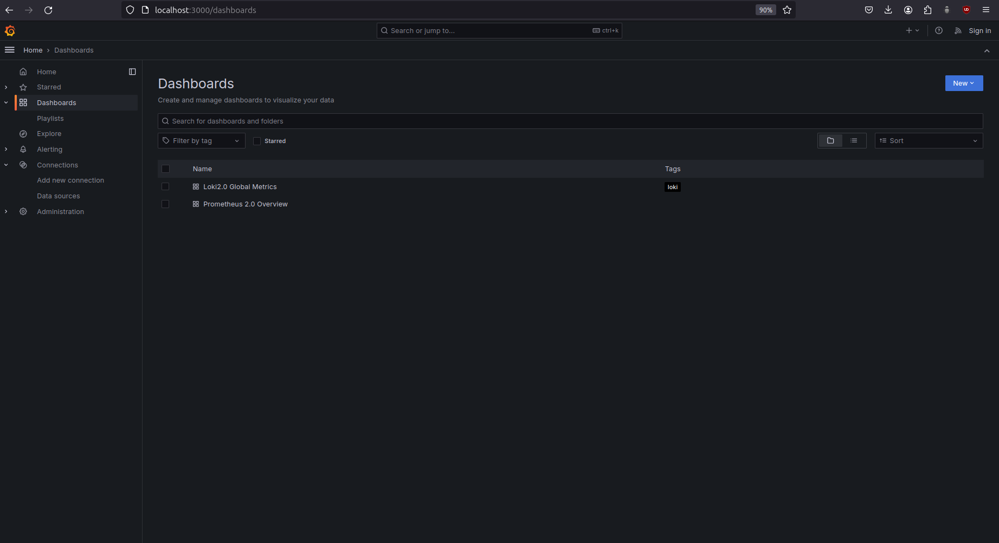
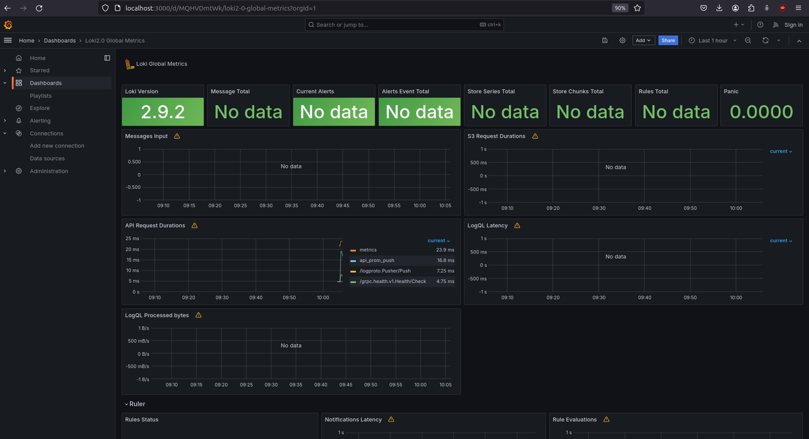
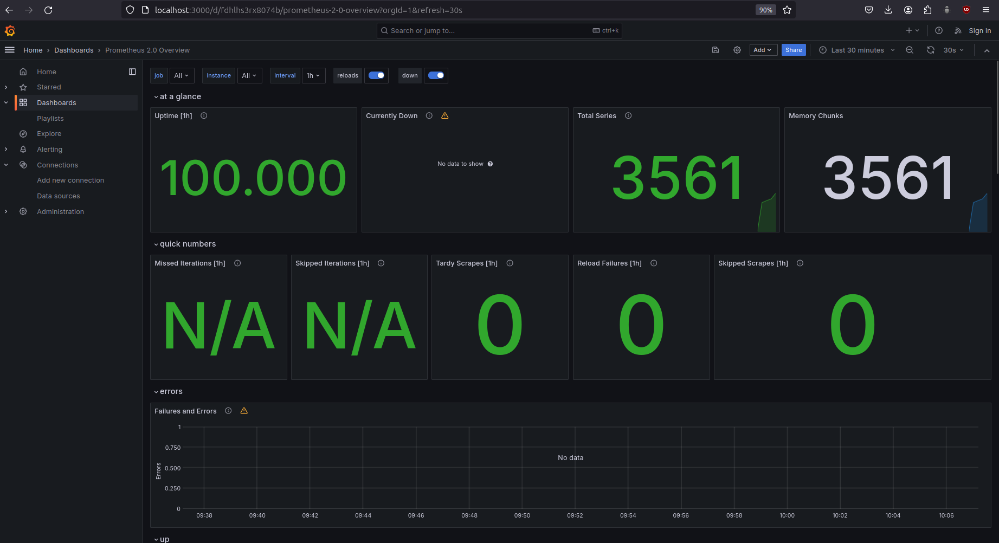

# Metrics

## All promotheus targets

## All dashboards

## Log rotation and memory limits

- Log rotation mechanisms have been added to prevent log files from consuming too much disk space. The configuration limits log files to a maximum size of 200KB and keeps up to 10 log files before older files are removed. This is achieved using the `logging` configuration in the `docker-compose.yml` file.

- A memory limit of 200MB has been specified  to prevent it from consuming too much memory. This is set using the `mem_limit` option in the `docker-compose.yml` file.