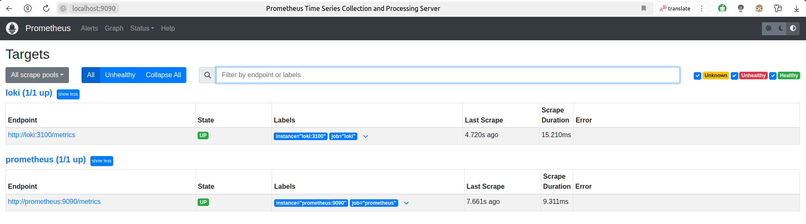
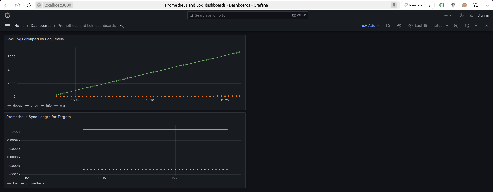
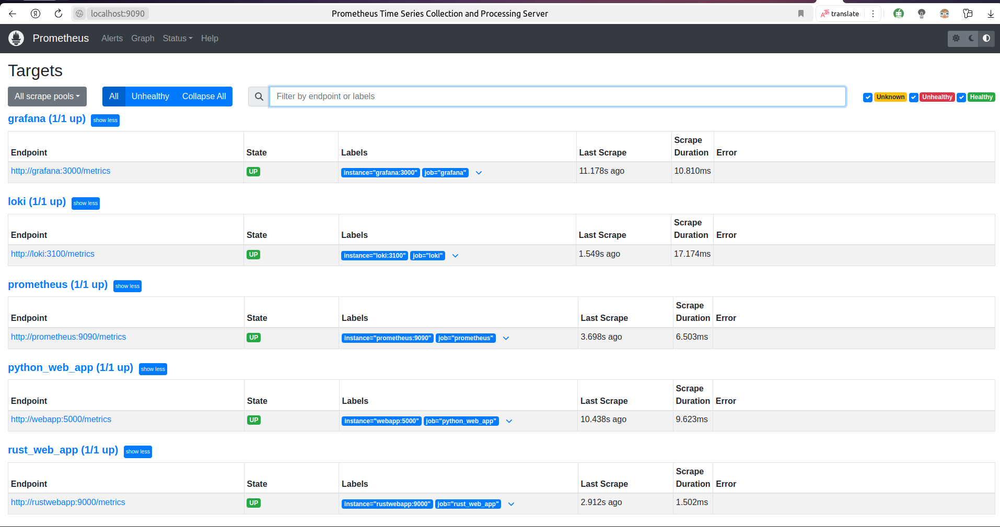
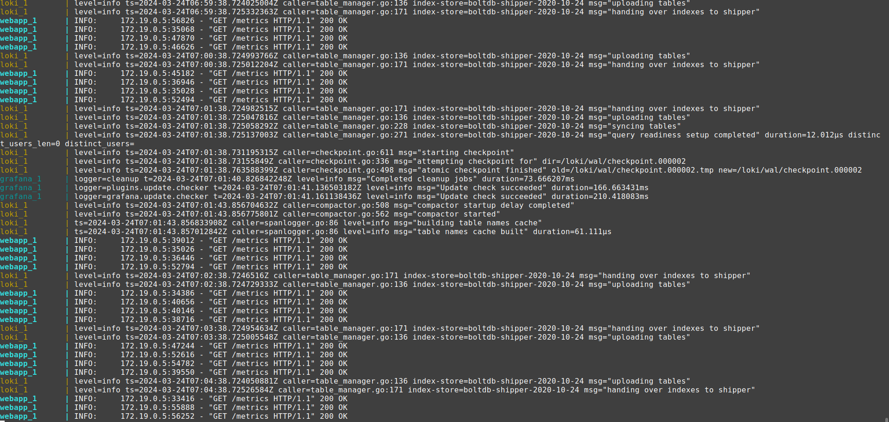
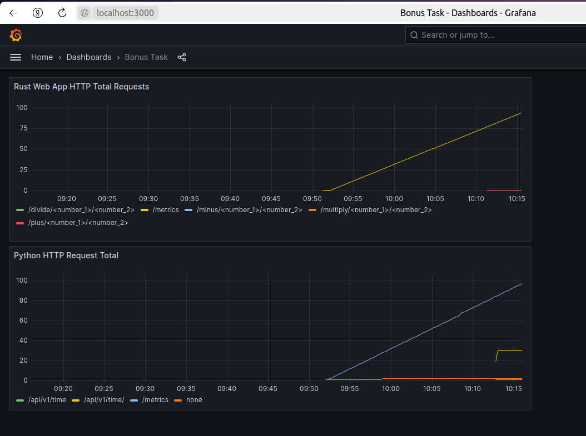

# Metrics

---

## Logs

There is a specified log rotation

- log size = 1k
- log max number of files = 3

---

## Web App Metrics Scrapping

It is realized by using special library for used
web frameworks

### Python Web App

Used `prometheus_fastapi_instrumentator` library

### Rust Web App

Used `rocket_prometheus` library

All metrics are in `/metrics` endpoint

---

## Screenshots

Metrics from Prometheus and Loki inside Prometheus targets

Dashboards for Loki and Prometheus (From Prometheus metrics)

Web App Logs

