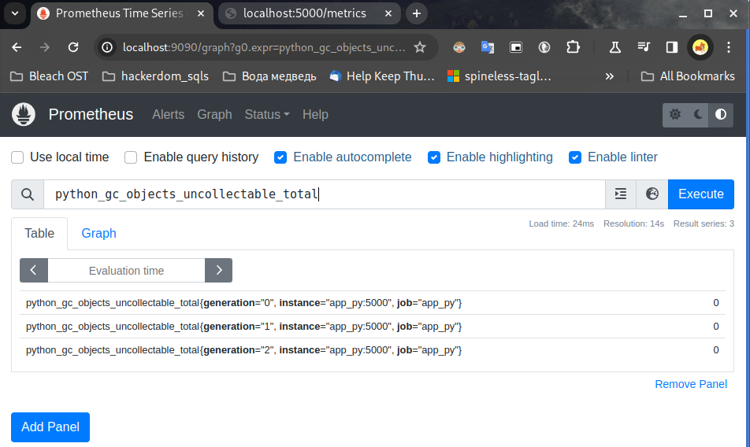
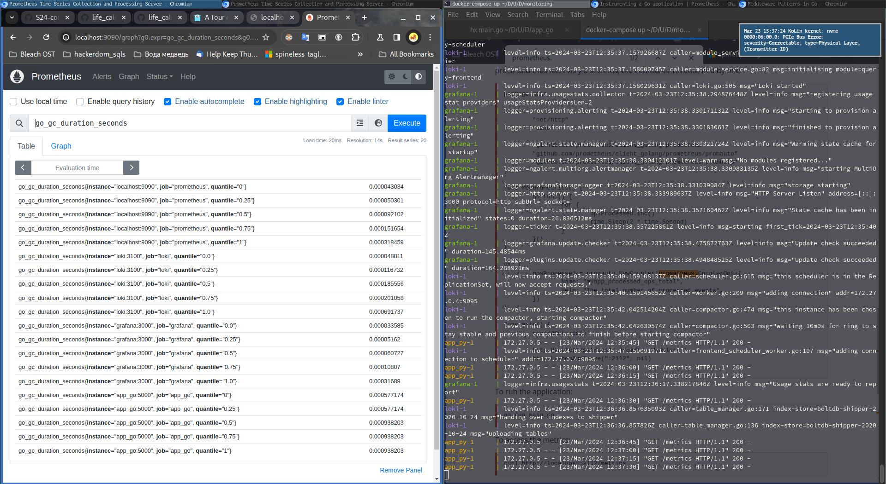

# Prometheus metrics

## Screenshots

.png)

## Enhancements

Grafana, Loki, and Promtail each have the RAM limit of 100MiB, Prometheus's memory is limited
to 50MiB, limits for app_py and app_go are 30MiB and 20MiB respectively.

## Metrics from web apps

The Python app exports metrics corresponding to the web app (requests count, request handle
time), as well as metrics related to python runtime exposed by the `promteheus_client`, for instance:

The Go app exports metrics corresponding to the web app (requests count, request handle time),
as well as metrics related to go runtime exposed by the prometheus client, for instance:

