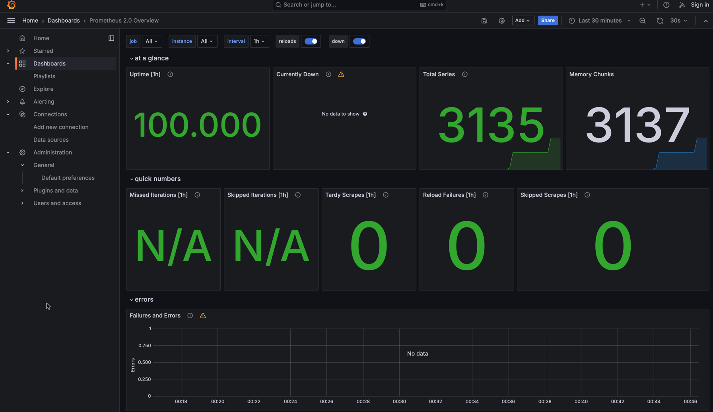
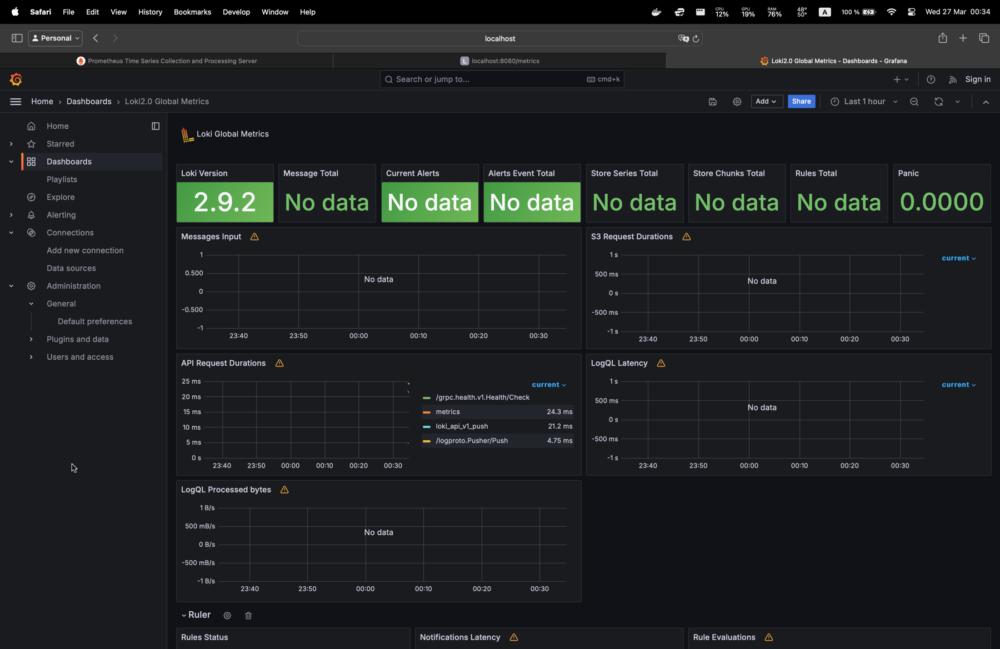

# Metrics

## Screenshots

### `Prometheus` and `Loki` metrics in `Grafana`

### `Prometheus` dashboard

### `Loki` dashboard

## Log Rotation and memory limit

All services are configured to have `json-file` logging driver with `100m` maximum size and `10` files.

Also services are limited in memory:

- `app_python`, `app_kotlin` - `300m`
- `grafana`, `prometheus`, `loki`, `promtail` - `500m`
