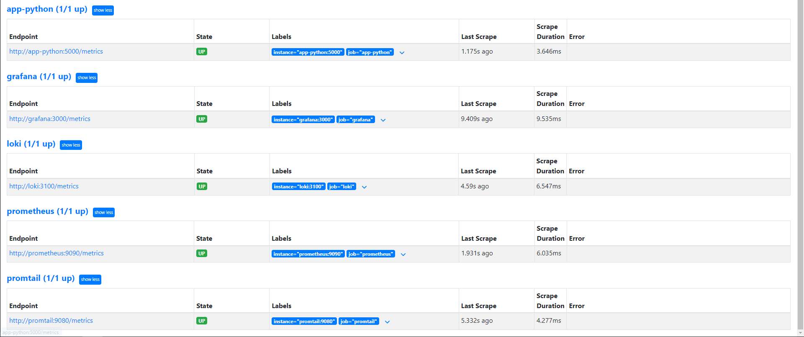
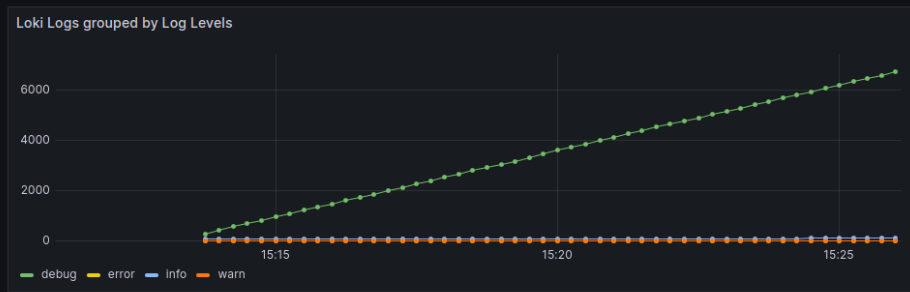
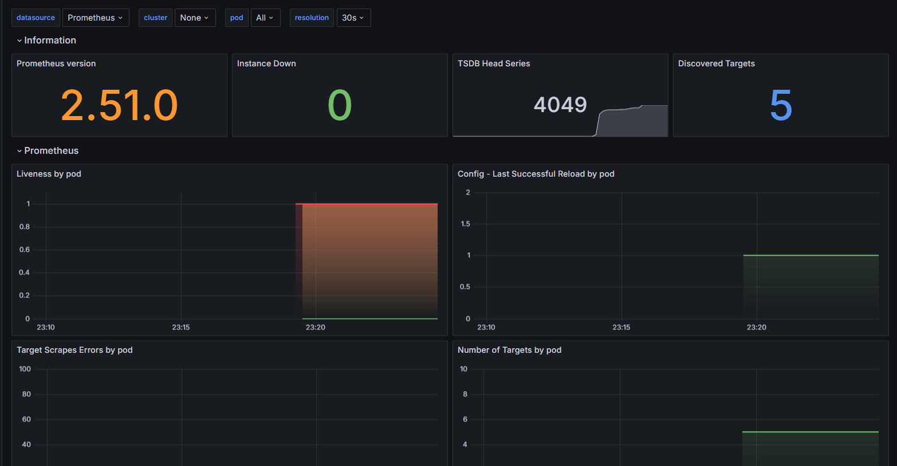
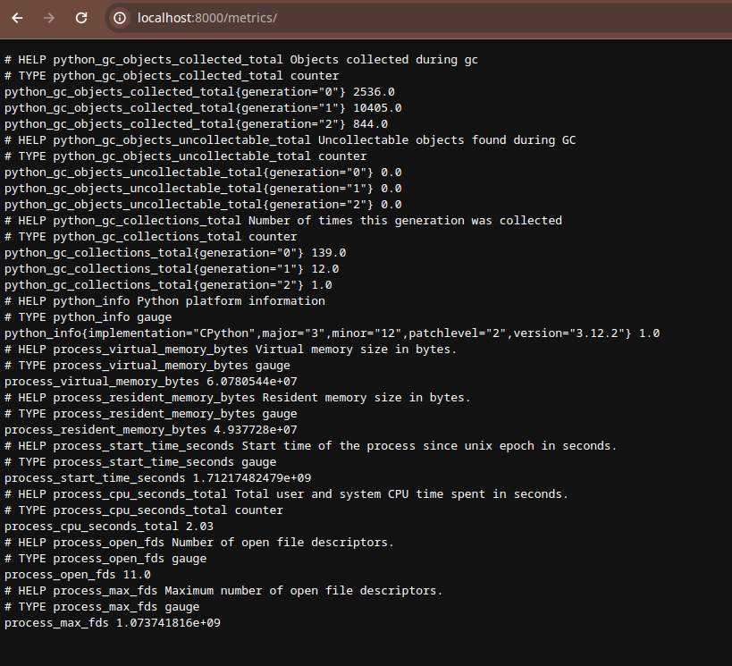
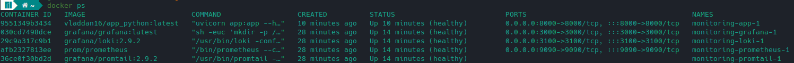

# Metrics

## Successful setup of Prometheus
  

## Loki dashboard

  

## Prometheus dashboard

  

## Log rotation and limits

I've added limits to ensure log rotation: 

```yaml
x-logging:
  &default-logging
  driver: "json-file"
  options:
    max-size: 200k
    max-file: 10
    tag: "{{.ImageName}}|{{.Name}}"

x-deploy:
  &default-deploy
  resources:
    limits:
      memory: 100M
```

## Application metrics

The promtail service can reach the metrics:

  

## Healthchecks

  