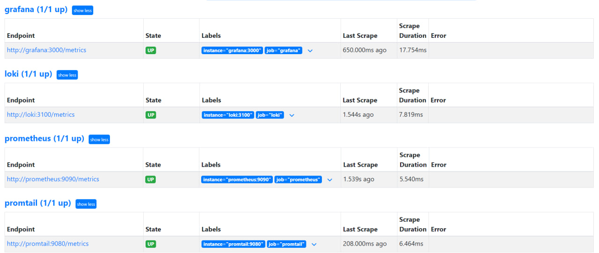

# Monitoring

## Prometheus Targets



## Grafana Dashboards

### Prometheus Dashboard


### Loki Dashboard


## Log rotation

I added the following lines to the `x-logging`

```bash
max-size: "20m"
max-file: "5"
```

where `max-size` specifies the maximum size of the log file and `max-file` specifies the number of log files for each service to keep. When file reaches the size limit, it will be rotated and new file will be created. When number of log files reaches the maximum number the oldest one will be deleted and new one created.

## Memory limits

I added the following lines into `docker-compose.yml`

```bash
x-deploy: &default-deploy
  resources:
    limits:
      memory: 200M
```

which limits each service to use only 200mb of memory.