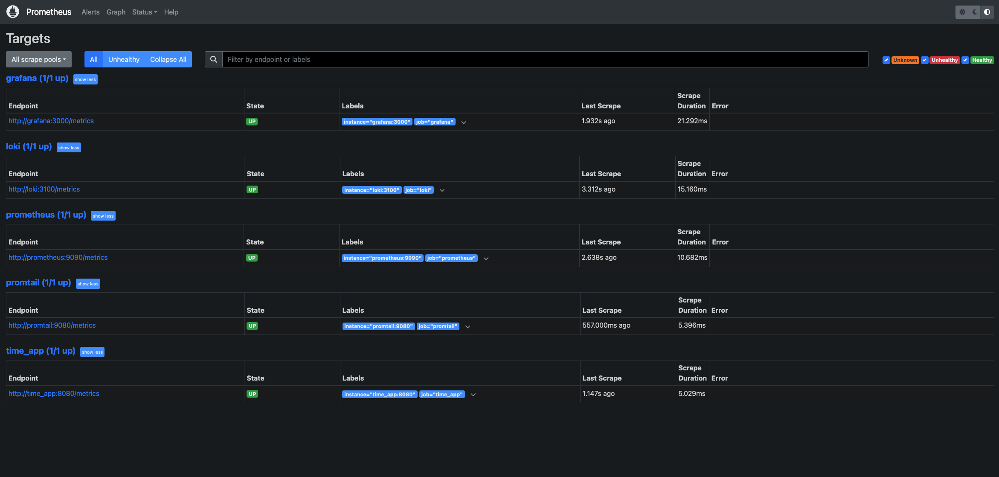
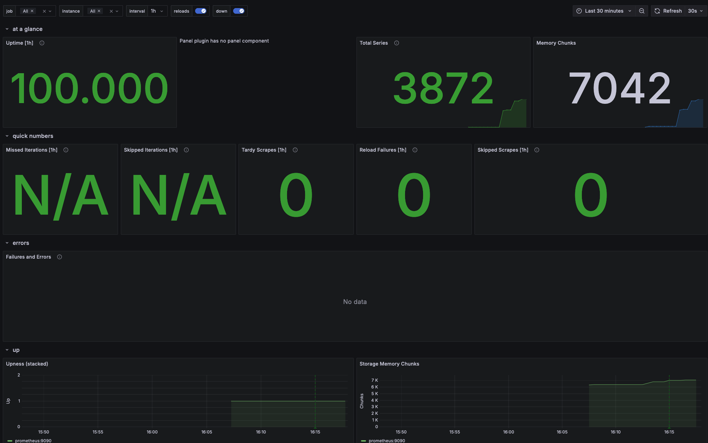
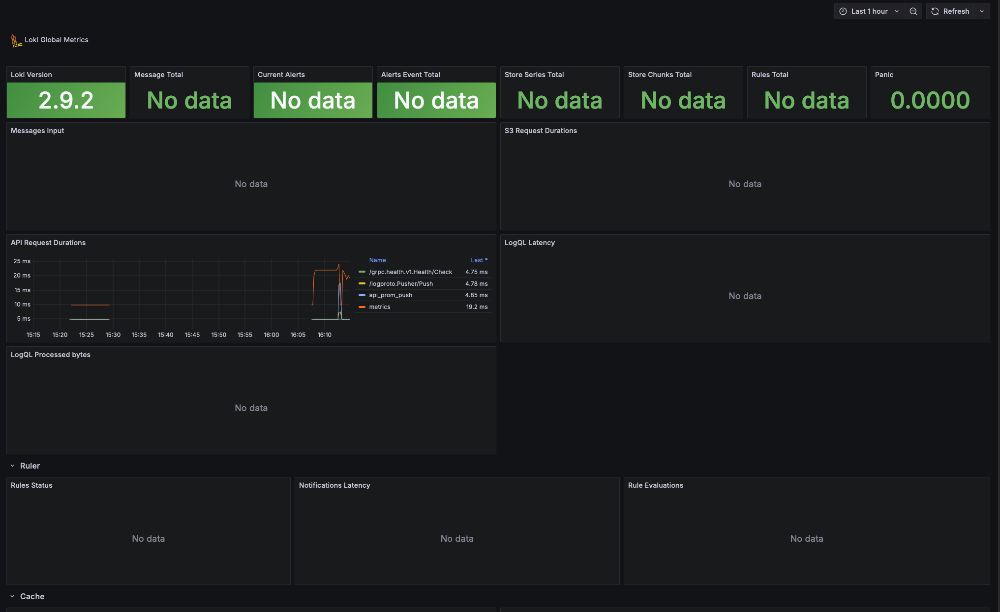
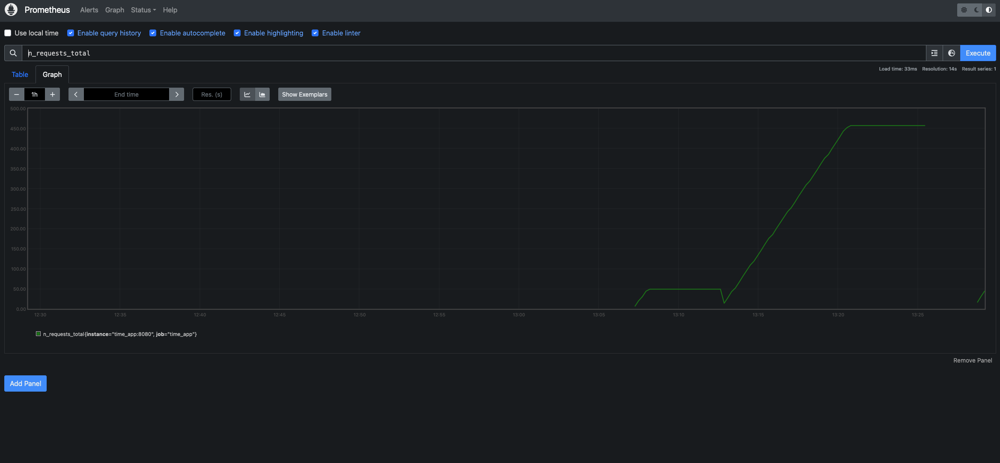

# Monitoring with Pormetheus

## Task 1

- Prometheus is collecting data:

## Task 2

### Dashboard configurations

- Prometheus:

- Loki:

### Changes to service configuration:
- Increased `logging.max-file` of all services to 5 (previously 1)
- Set `deploy.resources.limits.memory` to 500M for all services

## Task 2.5
- Added a "number of requests since last restart" metric to the app.
- Resulting graph view:

