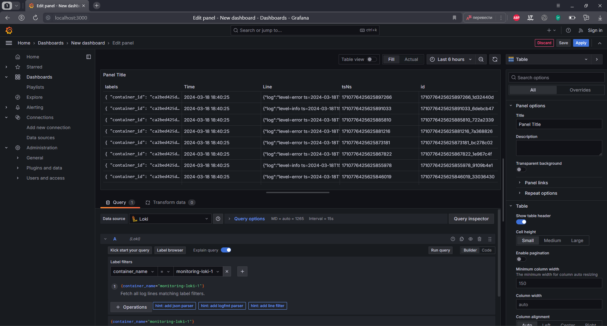
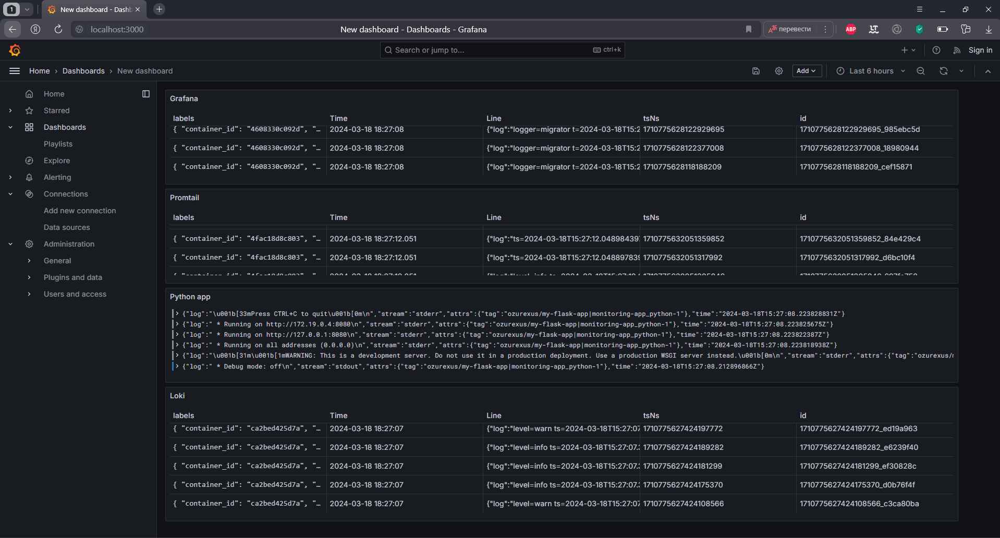
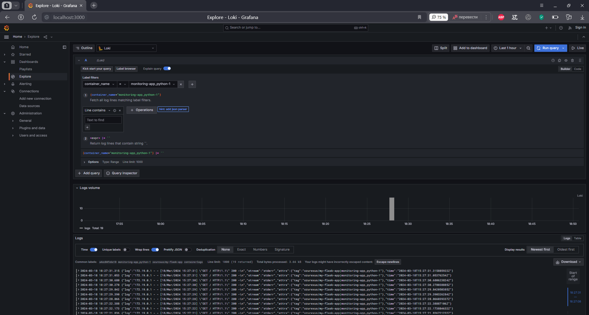

# Logging Stack Report

## Components

### Grafana

Grafana is a multi-platform open source analytics and interactive visualization web application. It provides charts, graphs, and alerts for the web when connected to supported data sources. Its role in this stack is to visualize the logs and metrics collected by Loki and Promtail.

### Promtail

Promtail is an agent which ships the contents of local logs to our Loki instance. It is usually deployed to every machine that has applications needed to be monitored.

### Loki

Loki's role in this stack is to store logs and make them available for querying. It does not index the contents of the logs, but rather a set of labels for each log stream.

### Flask Application

The Flask application is a simple web application that shows current time in Moscow. It is used to generate logs for the monitoring stack.

## Screenshots

