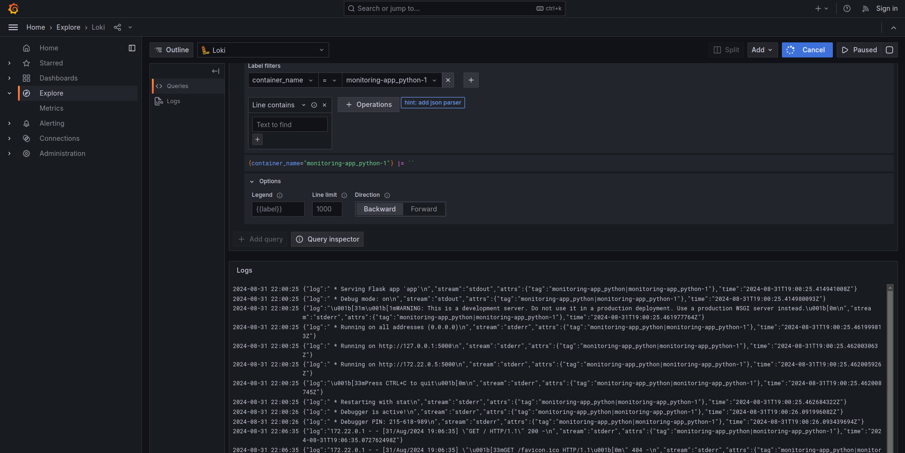
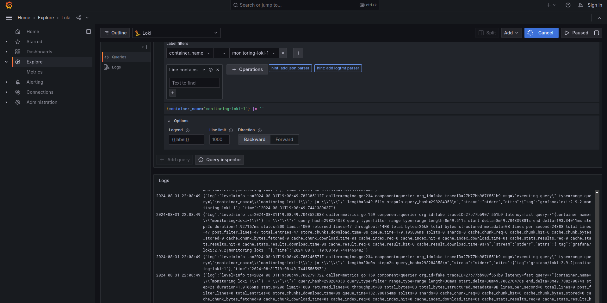
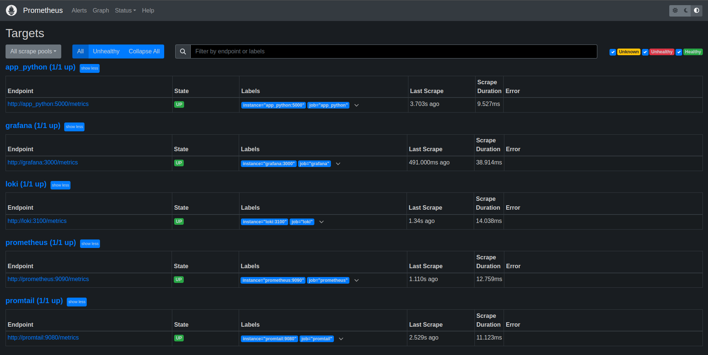

# Logging Stack Report

## Log Management Stack

The logging stack leverages three primary components:
- Loki: A tool designed for efficient log storage and aggregation.
- Promtail: An agent responsible for collecting logs from Docker containers and forwarding them to Loki.
- Grafana: A graphical user interface (GUI) for log and metric visualization. These tools work seamlessly together to provide a comprehensive logging solution.

## Log Acquisition
Promtail is deployed to collect logs from all active Docker containers. The containers share a standardized logging configuration that outputs logs in a structured JSON format. This format includes details like the actual log message, the stream it originated from (typically stdout), relevant container attributes (including image and container names), and a timestamp.

The promtail.yaml configuration file dictates how Promtail interacts with Docker logs. It instructs Promtail to:

- Scrape Logs: Locate log files from localhost specifically associated with Docker containers.
- Process Logs: Parse the acquired logs and extract relevant information.
- Forward Logs: Send the processed logs to the Loki server for storage and indexing.

The scrape_configs section within promtail.yaml plays a crucial role.  Here, Promtail is configured to process Docker logs and group them by relevant attributes such as stream, timestamp, image name, container name, and container ID. This grouping facilitates efficient searching and analysis within Loki and Grafana.

## Log Visualization (Grafana)
Grafana acts as the front-end visualization tool. It interacts with Loki to retrieve the stored logs and presents them on customizable dashboards. This allows users to analyze log data, identify trends, and troubleshoot issues effectively.

Screenshots:

