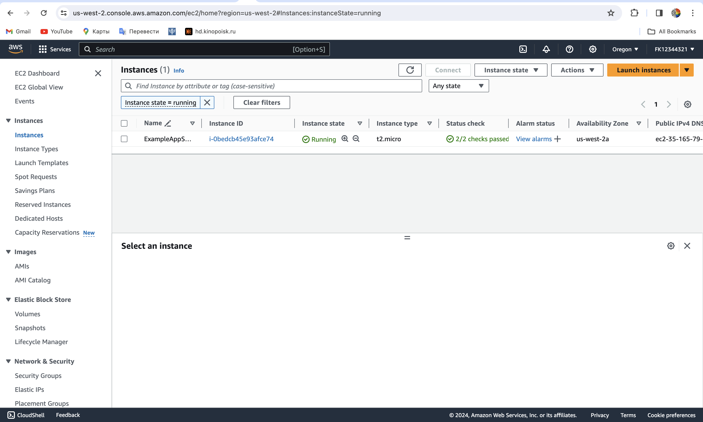
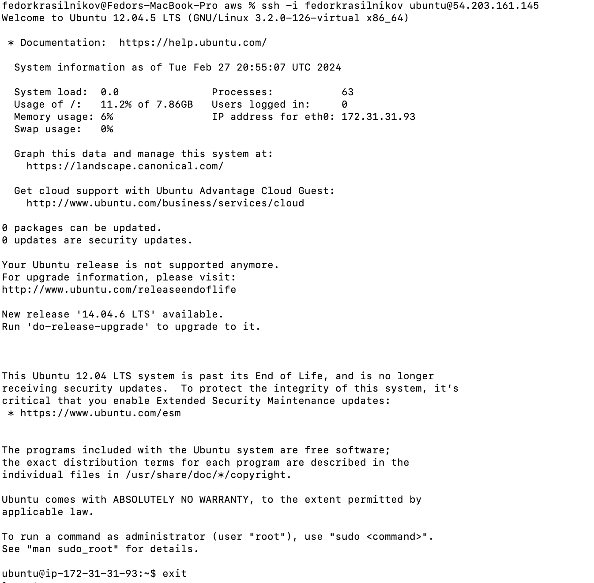

## Best practices 
1. All the terraform files are stored in github, so it can help revert to the previous states and not to loose important configurations 
2. Command `terraform import` was used to drag github resources under management of terraform \
3. Resources are logically split up into diffrent files such as `variables.tf`, `output.tf`, etc 
4. Different infrastructures are managed by different folders: docker, aws, github 

## Docker 

**terraform state list**
```
docker_container.nginx <br>
docker_image.nginx
```

**terraform state show docker_container.nginx**
```
# docker_container.nginx:
resource "docker_container" "nginx" {
    attach                                      = false
    command                                     = [
        "nginx",
        "-g",
        "daemon off;",
    ]
    container_read_refresh_timeout_milliseconds = 15000
    cpu_shares                                  = 0
    entrypoint                                  = [
        "/docker-entrypoint.sh",
    ]
    env                                         = []
    hostname                                    = "3c3b8222007a"
    id                                          = "3c3b8222007a690ad66b69ef709d6432cb6aeeab2700853d3d6a7bdf72933c21"
    image                                       = "sha256:12ef77b9fab686eea5e3fd0d6f3c7b2763eaeb657f037121335a60805d3be8a7"
    init                                        = false
    ipc_mode                                    = "private"
    log_driver                                  = "json-file"
    logs                                        = false
    max_retry_count                             = 0
    memory                                      = 0
    memory_swap                                 = 0
    must_run                                    = true
    name                                        = "tutorial"
    network_data                                = [
        {
            gateway                   = "172.17.0.1"
            global_ipv6_address       = ""
            global_ipv6_prefix_length = 0
            ip_address                = "172.17.0.2"
            ip_prefix_length          = 16
            ipv6_gateway              = ""
            mac_address               = "02:42:ac:11:00:02"
            network_name              = "bridge"
        },
    ]
    network_mode                                = "default"
    privileged                                  = false
    publish_all_ports                           = false
    read_only                                   = false
    remove_volumes                              = true
    restart                                     = "no"
    rm                                          = false
    runtime                                     = "runc"
    security_opts                               = []
    shm_size                                    = 64
    start                                       = true
    stdin_open                                  = false
    stop_signal                                 = "SIGQUIT"
    stop_timeout                                = 0
    tty                                         = false
    wait                                        = false
    wait_timeout                                = 60

    ports {
        external = 8000
        internal = 80
        ip       = "0.0.0.0"
        protocol = "tcp"
    }
}
```

**terraform state show docker_image.nginx**
```
# docker_image.nginx:
resource "docker_image" "nginx" {
    id           = "sha256:12ef77b9fab686eea5e3fd0d6f3c7b2763eaeb657f037121335a60805d3be8a7nginx:latest"
    image_id     = "sha256:12ef77b9fab686eea5e3fd0d6f3c7b2763eaeb657f037121335a60805d3be8a7"
    keep_locally = false
    name         = "nginx:latest"
    repo_digest  = "nginx@sha256:b4af4f8b6470febf45dc10f564551af682a802eda1743055a7dfc8332dffa595"
}
```


```
Terraform used the selected providers to generate the following execution plan. Resource actions are indicated with
the following symbols:
  + create

Terraform will perform the following actions:

  # docker_container.nginx will be created
  + resource "docker_container" "nginx" {
      + attach                                      = false
      + bridge                                      = (known after apply)
      + command                                     = (known after apply)
      + container_logs                              = (known after apply)
      + container_read_refresh_timeout_milliseconds = 15000
      + entrypoint                                  = (known after apply)
      + env                                         = (known after apply)
      + exit_code                                   = (known after apply)
      + hostname                                    = (known after apply)
      + id                                          = (known after apply)
      + image                                       = (known after apply)
      + init                                        = (known after apply)
      + ipc_mode                                    = (known after apply)
      + log_driver                                  = (known after apply)
      + logs                                        = false
      + must_run                                    = true
      + name                                        = "tutorial"
      + network_data                                = (known after apply)
      + read_only                                   = false
      + remove_volumes                              = true
      + restart                                     = "no"
      + rm                                          = false
      + runtime                                     = (known after apply)
      + security_opts                               = (known after apply)
      + shm_size                                    = (known after apply)
      + start                                       = true
      + stdin_open                                  = false
      + stop_signal                                 = (known after apply)
      + stop_timeout                                = (known after apply)
      + tty                                         = false
      + wait                                        = false
      + wait_timeout                                = 60

      + ports {
          + external = 8000
          + internal = 80
          + ip       = "0.0.0.0"
          + protocol = "tcp"
        }
    }

  # docker_image.nginx will be created
  + resource "docker_image" "nginx" {
      + id           = (known after apply)
      + image_id     = (known after apply)
      + keep_locally = false
      + name         = "nginx:latest"
      + repo_digest  = (known after apply)
    }

Plan: 2 to add, 0 to change, 0 to destroy.
```

With input variables 
```
Apply complete! Resources: 1 added, 0 changed, 1 destroyed.

  # docker_container.nginx must be replaced
-/+ resource "docker_container" "nginx" {
      + bridge                                      = (known after apply)
      ~ command                                     = [
          - "nginx",
          - "-g",
          - "daemon off;",
        ] -> (known after apply)
      + container_logs                              = (known after apply)
      - cpu_shares                                  = 0 -> null
      - dns                                         = [] -> null
      - dns_opts                                    = [] -> null
      - dns_search                                  = [] -> null
      ~ entrypoint                                  = [
          - "/docker-entrypoint.sh",
        ] -> (known after apply)
      ~ env                                         = [] -> (known after apply)
      + exit_code                                   = (known after apply)
      - group_add                                   = [] -> null
      ~ hostname                                    = "3c3b8222007a" -> (known after apply)
      ~ id                                          = "3c3b8222007a690ad66b69ef709d6432cb6aeeab2700853d3d6a7bdf72933c21" -> (known after apply)
      ~ init                                        = false -> (known after apply)
      ~ ipc_mode                                    = "private" -> (known after apply)
      ~ log_driver                                  = "json-file" -> (known after apply)
      - log_opts                                    = {} -> null
      - max_retry_count                             = 0 -> null
      - memory                                      = 0 -> null
      - memory_swap                                 = 0 -> null
      ~ name                                        = "tutorial" -> "nginx-container" # forces replacement
      ~ network_data                                = [
          - {
              - gateway                   = "172.17.0.1"
              - global_ipv6_address       = ""
              - global_ipv6_prefix_length = 0
              - ip_address                = "172.17.0.2"
              - ip_prefix_length          = 16
              - ipv6_gateway              = ""
              - mac_address               = "02:42:ac:11:00:02"
              - network_name              = "bridge"
            },
        ] -> (known after apply)
      - network_mode                                = "default" -> null
      - privileged                                  = false -> null
      - publish_all_ports                           = false -> null
      ~ runtime                                     = "runc" -> (known after apply)
      ~ security_opts                               = [] -> (known after apply)
      ~ shm_size                                    = 64 -> (known after apply)
      ~ stop_signal                                 = "SIGQUIT" -> (known after apply)
      ~ stop_timeout                                = 0 -> (known after apply)
      - storage_opts                                = {} -> null
      - sysctls                                     = {} -> null
      - tmpfs                                       = {} -> null
        # (14 unchanged attributes hidden)

        # (1 unchanged block hidden)
    }
    
Plan: 1 to add, 0 to change, 1 to destroy.
```

## Terraform output 
```
container_id = "36ed90534e405560e24e97a409072cc049dbaea0feede551aa11f0bede388ca4"
image_id = "sha256:12ef77b9fab686eea5e3fd0d6f3c7b2763eaeb657f037121335a60805d3be8a7nginx:latest"
```

## AWS 
I followed the tutorial, created an account on aws using an international bank account. I created a resource and here is a picture of the AWS web UI panel 

Additionally I modified the script, so it generates an ssh key for me for connecting to the vm 
```
fedorkrasilnikov@Fedors-MacBook-Pro aws % terraform state list 
aws_instance.app_server
aws_key_pair.key_pair
aws_security_group.sg_ec2
local_file.private_key
tls_private_key.rsa_4096
```
And here is the output of `aws_instance.app_server `
```
# aws_instance.app_server:
resource "aws_instance" "app_server" {
    ami                                  = "ami-830c94e3"
    arn                                  = "arn:aws:ec2:us-west-2:637423257153:instance/i-039db647b006e4858"
    associate_public_ip_address          = true
    availability_zone                    = "us-west-2a"
    cpu_core_count                       = 1
    cpu_threads_per_core                 = 1
    disable_api_stop                     = false
    disable_api_termination              = false
    ebs_optimized                        = false
    get_password_data                    = false
    hibernation                          = false
    id                                   = "i-039db647b006e4858"
    instance_initiated_shutdown_behavior = "stop"
    instance_state                       = "running"
    instance_type                        = "t2.micro"
    ipv6_address_count                   = 0
    ipv6_addresses                       = []
    key_name                             = "fedorkrasilnikov"
    monitoring                           = false
    placement_partition_number           = 0
    primary_network_interface_id         = "eni-089206febe536586c"
    private_dns                          = "ip-172-31-31-93.us-west-2.compute.internal"
    private_ip                           = "172.31.31.93"
    public_dns                           = "ec2-54-203-161-145.us-west-2.compute.amazonaws.com"
    public_ip                            = "54.203.161.145"
    secondary_private_ips                = []
    security_groups                      = [
        "default",
    ]
    source_dest_check                    = true
    subnet_id                            = "subnet-06f2b002cab504ffb"
    tags                                 = {
        "Name" = "WebServer"
    }
    tags_all                             = {
        "Name" = "WebServer"
    }
    tenancy                              = "default"
    user_data_replace_on_change          = false
    vpc_security_group_ids               = [
        "sg-0d870c65b3d21f2ac",
    ]

    capacity_reservation_specification {
        capacity_reservation_preference = "open"
    }

    cpu_options {
        core_count       = 1
        threads_per_core = 1
    }

    credit_specification {
        cpu_credits = "standard"
    }

    enclave_options {
        enabled = false
    }

    maintenance_options {
        auto_recovery = "default"
    }

    metadata_options {
        http_endpoint               = "enabled"
        http_put_response_hop_limit = 1
        http_tokens                 = "optional"
        instance_metadata_tags      = "disabled"
    }

    private_dns_name_options {
        enable_resource_name_dns_a_record    = false
        enable_resource_name_dns_aaaa_record = false
        hostname_type                        = "ip-name"
    }

    root_block_device {
        delete_on_termination = true
        device_name           = "/dev/sda1"
        encrypted             = false
        iops                  = 0
        tags                  = {}
        throughput            = 0
        volume_id             = "vol-0e98b26e76ce8f48f"
        volume_size           = 8
        volume_type           = "standard"
    }
}

```

And here I tried to connect to the VM


## Github 

Firstly, I created a demo repository with main branch protection. And here is the result of `terraform apply`
```bash
var.token
  Specifies the GitHub PAT token or `GITHUB_TOKEN`

  Enter a value: 

github_repository.S24-core-course-labs: Refreshing state... [id=S24-core-course-labs]

Terraform used the selected providers to generate the following execution plan. Resource actions are indicated with the following
symbols:
  + create
  ~ update in-place

Terraform will perform the following actions:

  # github_branch_default.main will be created
  + resource "github_branch_default" "main" {
      + branch     = "main"
      + id         = (known after apply)
      + repository = "Demo-DevOps-S23-repo"
    }

  # github_branch_protection.default will be created
  + resource "github_branch_protection" "default" {
      + allows_deletions                = false
      + allows_force_pushes             = false
      + blocks_creations                = false
      + enforce_admins                  = true
      + id                              = (known after apply)
      + pattern                         = "main"
      + repository_id                   = (known after apply)
      + require_conversation_resolution = true
      + require_signed_commits          = false
      + required_linear_history         = false

      + required_pull_request_reviews {
          + required_approving_review_count = 1
        }
    }

  # github_repository.S24-core-course-labs will be updated in-place
  ~ resource "github_repository" "S24-core-course-labs" {
      - has_downloads               = true -> null
      - has_projects                = true -> null
      - has_wiki                    = true -> null
        id                          = "S24-core-course-labs"
        name                        = "S24-core-course-labs"
        # (28 unchanged attributes hidden)
    }

  # github_repository.devops_s23_demo will be created
  + resource "github_repository" "devops_s23_demo" {
      + allow_auto_merge            = false
      + allow_merge_commit          = true
      + allow_rebase_merge          = true
      + allow_squash_merge          = true
      + archived                    = false
      + auto_init                   = true
      + branches                    = (known after apply)
      + default_branch              = (known after apply)
      + delete_branch_on_merge      = false
      + description                 = "Demo repo for the course"
      + etag                        = (known after apply)
      + full_name                   = (known after apply)
      + git_clone_url               = (known after apply)
      + gitignore_template          = "VisualStudio"
      + has_issues                  = true
      + has_wiki                    = false
      + html_url                    = (known after apply)
      + http_clone_url              = (known after apply)
      + id                          = (known after apply)
      + license_template            = "mit"
      + merge_commit_message        = "PR_TITLE"
      + merge_commit_title          = "MERGE_MESSAGE"
      + name                        = "Demo-DevOps-S23-repo"
      + node_id                     = (known after apply)
      + private                     = (known after apply)
      + repo_id                     = (known after apply)
      + squash_merge_commit_message = "COMMIT_MESSAGES"
      + squash_merge_commit_title   = "COMMIT_OR_PR_TITLE"
      + ssh_clone_url               = (known after apply)
      + svn_url                     = (known after apply)
      + visibility                  = "public"
    }

Plan: 3 to add, 1 to change, 0 to destroy.

Do you want to perform these actions?
  Terraform will perform the actions described above.
  Only 'yes' will be accepted to approve.

  Enter a value: yes   

github_repository.devops_s23_demo: Creating...
github_repository.S24-core-course-labs: Modifying... [id=S24-core-course-labs]
github_repository.S24-core-course-labs: Modifications complete after 8s [id=S24-core-course-labs]
github_repository.devops_s23_demo: Creation complete after 8s [id=Demo-DevOps-S23-repo]
github_branch_default.main: Creating...
github_branch_default.main: Creation complete after 2s [id=Demo-DevOps-S23-repo]
github_branch_protection.default: Creating...
github_branch_protection.default: Creation complete after 4s [id=BPR_kwDOLW8Yvc4C0OYt]
```

### Created repo 
The repo created by the command can be found [here](https://github.com/FK12344321/Demo-DevOps-S23-repo)

### Import 
After that I imported my local repo so it gets managed by github

```bash
fedorkrasilnikov@Fedors-MBP github % terraform import "github_repository.S24-core-course-labs" "S24-core-course-labs"
var.token
  Specifies the GitHub PAT token or `GITHUB_TOKEN`

  Enter a value: 

github_repository.S24-core-course-labs: Importing from ID "S24-core-course-labs"...
github_repository.S24-core-course-labs: Import prepared!
  Prepared github_repository for import
github_repository.S24-core-course-labs: Refreshing state... [id=S24-core-course-labs]

Import successful!

The resources that were imported are shown above. These resources are now in
your Terraform state and will henceforth be managed by Terraform.
```

## Github teams 
I created an organization https://github.com/S24-demo-org. After that I set up 1 repo 2 teams with different permissions in that organization. Everything except for the org creation was accomplished with terraform. Here is the result of `terraform show`

```
# github_repository.devops_s23_demo:
resource "github_repository" "devops_s23_demo" {
    allow_auto_merge            = false
    allow_merge_commit          = true
    allow_rebase_merge          = true
    allow_squash_merge          = true
    archived                    = false
    auto_init                   = true
    branches                    = [
        {
            name      = "main"
            protected = false
        },
    ]
    default_branch              = "main"
    delete_branch_on_merge      = false
    description                 = "Demo repo for the course"
    etag                        = "W/\"4624d890ae8179c00c2fca9592ada41bb9a7281fca85e0ab6e20f5abc344c5d9\""
    full_name                   = "S24-demo-org/Demo-DevOps-S23-repo"
    git_clone_url               = "git://github.com/S24-demo-org/Demo-DevOps-S23-repo.git"
    gitignore_template          = "VisualStudio"
    has_downloads               = false
    has_issues                  = true
    has_projects                = false
    has_wiki                    = false
    html_url                    = "https://github.com/S24-demo-org/Demo-DevOps-S23-repo"
    http_clone_url              = "https://github.com/S24-demo-org/Demo-DevOps-S23-repo.git"
    id                          = "Demo-DevOps-S23-repo"
    is_template                 = false
    license_template            = "mit"
    merge_commit_message        = "PR_TITLE"
    merge_commit_title          = "MERGE_MESSAGE"
    name                        = "Demo-DevOps-S23-repo"
    node_id                     = "R_kgDOLXB17A"
    private                     = false
    repo_id                     = 762344940
    squash_merge_commit_message = "COMMIT_MESSAGES"
    squash_merge_commit_title   = "COMMIT_OR_PR_TITLE"
    ssh_clone_url               = "git@github.com:S24-demo-org/Demo-DevOps-S23-repo.git"
    svn_url                     = "https://github.com/S24-demo-org/Demo-DevOps-S23-repo"
    visibility                  = "public"
    vulnerability_alerts        = false
}

# github_team.admins:
resource "github_team" "admins" {
    create_default_maintainer = false
    description               = "Admins of the project"
    etag                      = "W/\"44db5e3a3e24521a5adee670ef018b208ea4878e19505cfc47b04b474d5fe614\""
    id                        = "9549463"
    members_count             = 0
    name                      = "Admins"
    node_id                   = "T_kwDOCZl9Xs4AkbaX"
    privacy                   = "closed"
    slug                      = "admins"
}

# github_team.developers:
resource "github_team" "developers" {
    create_default_maintainer = false
    description               = "Developers of the project"
    etag                      = "W/\"82265e29a1d8974e8144ec11ddda4b2e8bcc7a91728c32761338ea8952abd061\""
    id                        = "9549462"
    members_count             = 0
    name                      = "Developers"
    node_id                   = "T_kwDOCZl9Xs4AkbaW"
    privacy                   = "closed"
    slug                      = "developers"
}

# github_team_membership.admins_membership:
resource "github_team_membership" "admins_membership" {
    etag     = "W/\"74872ad04057a8815f55497330d3972a2c4f30bcc73afeb32099aa1a76d2a807\""
    id       = "9549463:FK12344321"
    role     = "maintainer"
    team_id  = "9549463"
    username = "FK12344321"
}

# github_team_membership.devs_membership:
resource "github_team_membership" "devs_membership" {
    etag     = "W/\"2a017ee2b5d0130b5b8b6ae804ddf191c2fc2198b42790dda044654cae241f02\""
    id       = "9549462:WinnerJust"
    role     = "member"
    team_id  = "9549462"
    username = "WinnerJust"
}

# github_team_repository.admins_bind:
resource "github_team_repository" "admins_bind" {
    etag       = "W/\"5eb500d06d121c08cc99cf24c2b273259d9d632ae17f25589524837e28a557ff\""
    id         = "9549462:Demo-DevOps-S23-repo"
    permission = "maintain"
    repository = "Demo-DevOps-S23-repo"
    team_id    = "9549462"
}

# github_team_repository.devs_bind:
resource "github_team_repository" "devs_bind" {
    etag       = "W/\"5eb500d06d121c08cc99cf24c2b273259d9d632ae17f25589524837e28a557ff\""
    id         = "9549462:Demo-DevOps-S23-repo"
    permission = "maintain"
    repository = "Demo-DevOps-S23-repo"
    team_id    = "9549462"
}
```
