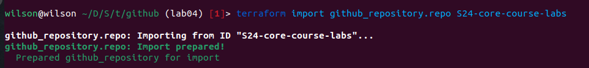

## Docker Infrastructure Using Terraform 

The terraform files are under `/terraform/docker`

## Commands & Output(s)
- `terraform init` 
- `terraform fmt`
- `terraform validate`
- `terraform apply`
- `terraform state list`
    ```python
    docker_container.app_javascript
    docker_container.app_python
    docker_image.app_javascript
    docker_image.app_python
    ```
- `terraform state show docker_container.app_javascript`, `terraform state show docker_container.app_python`, `terraform state show docker_image.app_javascript`, `terraform state show docker_image.app_python` 
    ```python
    # docker_container.app_javascript:
    resource "docker_container" "app_javascript" {
        attach                                      = false
        command                                     = [
            "node",
            "app.js",
        ]
        container_read_refresh_timeout_milliseconds = 15000
        cpu_shares                                  = 0
        entrypoint                                  = [
            "docker-entrypoint.sh",
        ]
        env                                         = []
        hostname                                    = "570fb9534563"
        id                                          = "570fb953456315cb2e077c36f302e1826ce235113bb5af7cfbf8a38e0fc0d6b2"
        image                                       = "sha256:2eb6456359c194f3aa4981b7a848d40f34cbc1c166444cad8bcb9ab755186fd1"
        init                                        = false
        ipc_mode                                    = "private"
        log_driver                                  = "json-file"
        logs                                        = false
        max_retry_count                             = 0
        memory                                      = 0
        memory_swap                                 = 0
        must_run                                    = true
        name                                        = "app_javascript"
        network_data                                = [
            {
                gateway                   = "172.17.0.1"
                global_ipv6_address       = ""
                global_ipv6_prefix_length = 0
                ip_address                = "172.17.0.3"
                ip_prefix_length          = 16
                ipv6_gateway              = ""
                mac_address               = "02:42:ac:11:00:03"
                network_name              = "bridge"
            },
        ]
        network_mode                                = "default"
        privileged                                  = false
        publish_all_ports                           = false
        read_only                                   = false
        remove_volumes                              = true
        restart                                     = "no"
        rm                                          = false
        runtime                                     = "runc"
        security_opts                               = []
        shm_size                                    = 64
        start                                       = true
        stdin_open                                  = false
        stop_timeout                                = 0
        tty                                         = false
        user                                        = "myuser"
        wait                                        = false
        wait_timeout                                = 60
        working_dir                                 = "/home/myuser"

        ports {
            external = 3000
            internal = 3000
            ip       = "0.0.0.0"
            protocol = "tcp"
        }
    }
    ```
    ```python
    # docker_container.app_python:
    resource "docker_container" "app_python" {
        attach                                      = false
        command                                     = [
            "python3",
            "app/routes.py",
        ]
        container_read_refresh_timeout_milliseconds = 15000
        cpu_shares                                  = 0
        dns                                         = []
        dns_opts                                    = []
        dns_search                                  = []
        entrypoint                                  = []
        env                                         = []
        group_add                                   = []
        hostname                                    = "733c25d078c6"
        id                                          = "733c25d078c60842e9658b53e6fc212341ec8c161b65cb5deb9e71f405396b3b"
        image                                       = "sha256:9fe03b6cdae4062ab1e878c64239c95cbbcd1636de5fefa36d8d1bfd818e90ca"
        init                                        = false
        ipc_mode                                    = "private"
        log_driver                                  = "json-file"
        log_opts                                    = {}
        logs                                        = false
        max_retry_count                             = 0
        memory                                      = 0
        memory_swap                                 = 0
        must_run                                    = true
        name                                        = "app_python"
        network_data                                = [
            {
                gateway                   = "172.17.0.1"
                global_ipv6_address       = ""
                global_ipv6_prefix_length = 0
                ip_address                = "172.17.0.2"
                ip_prefix_length          = 16
                ipv6_gateway              = ""
                mac_address               = "02:42:ac:11:00:02"
                network_name              = "bridge"
            },
        ]
        network_mode                                = "default"
        privileged                                  = false
        publish_all_ports                           = false
        read_only                                   = false
        remove_volumes                              = true
        restart                                     = "no"
        rm                                          = false
        runtime                                     = "runc"
        security_opts                               = []
        shm_size                                    = 64
        start                                       = true
        stdin_open                                  = false
        stop_timeout                                = 0
        storage_opts                                = {}
        sysctls                                     = {}
        tmpfs                                       = {}
        tty                                         = false
        user                                        = "myuser"
        wait                                        = false
        wait_timeout                                = 60
        working_dir                                 = "/app"

        ports {
            external = 5000
            internal = 5000
            ip       = "0.0.0.0"
            protocol = "tcp"
        }
    }
    ```
    ```python
    # docker_image.app_javascript:
    resource "docker_image" "app_javascript" {
        id           = "sha256:2eb6456359c194f3aa4981b7a848d40f34cbc1c166444cad8bcb9ab755186fd1cogbonna/app_javascript_image:latest"
        image_id     = "sha256:2eb6456359c194f3aa4981b7a848d40f34cbc1c166444cad8bcb9ab755186fd1"
        keep_locally = true
        name         = "cogbonna/app_javascript_image:latest"
        repo_digest  = "cogbonna/app_javascript_image@sha256:9c6a976c126cf61b12c65c7ca4d92333babbb0da65183bd2feb590aeeb230c32"
    }
    ```
    ```python
    # docker_image.app_python:
    resource "docker_image" "app_python" {
        id           = "sha256:9fe03b6cdae4062ab1e878c64239c95cbbcd1636de5fefa36d8d1bfd818e90cacogbonna/app_python_image:latest"
        image_id     = "sha256:9fe03b6cdae4062ab1e878c64239c95cbbcd1636de5fefa36d8d1bfd818e90ca"
        keep_locally = true
        name         = "cogbonna/app_python_image:latest"
        repo_digest  = "cogbonna/app_python_image@sha256:e1c23881fe8ae41c020b99aff9b5e013084ad443ade99e1ab54a82850ffe0c01"
    }
    ```
- `terraform apply -var "javascript_container_name=js-container"` (Renaming container)
    ```python
      # docker_container.app_javascript must be replaced
    -/+ resource "docker_container" "app_javascript" {
          + bridge                                      = (known after apply)
          ~ command                                     = [
              - "node",
              - "app.js",
            ] -> (known after apply)
          + container_logs                              = (known after apply)
          - cpu_shares                                  = 0 -> null
          - dns                                         = [] -> null
          - dns_opts                                    = [] -> null
          - dns_search                                  = [] -> null
          ~ entrypoint                                  = [
              - "docker-entrypoint.sh",
            ] -> (known after apply)
          ~ env                                         = [] -> (known after apply)
          + exit_code                                   = (known after apply)
          - group_add                                   = [] -> null
          ~ hostname                                    = "570fb9534563" -> (known after apply)
          ~ id                                          = "570fb953456315cb2e077c36f302e1826ce235113bb5af7cfbf8a38e0fc0d6b2" -> (known after apply)
          ~ init                                        = false -> (known after apply)
          ~ ipc_mode                                    = "private" -> (known after apply)
          ~ log_driver                                  = "json-file" -> (known after apply)
          - log_opts                                    = {} -> null
          - max_retry_count                             = 0 -> null
          - memory                                      = 0 -> null
          - memory_swap                                 = 0 -> null
          ~ name                                        = "app_javascript" -> "js-container" # forces replacement
    ```
- `terraform output`
    ```python
    javascript-container-id = "915da567d2d3c54088710deb6348f0e029bb862c5bb88d0bdf431ea59c717f24"
    python-container-id = "733c25d078c60842e9658b53e6fc212341ec8c161b65cb5deb9e71f405396b3b"
    ```

## AWS Infrastructure Using Terraform:

The terraform files are under `/terraform/aws`

### Commands & Output(s) 
- `terraform init` 
- `terraform apply` 
    ```python
    -/+ resource "aws_instance" "app_server" {
      ~ arn                                  = "arn:aws:ec2:us-east-1:905418130500:instance/i-0a09cc3432e429498" -> (known after apply)
      ~ associate_public_ip_address          = true -> (known after apply)
      ~ availability_zone                    = "us-east-1a" -> (known after apply)
      ~ cpu_core_count                       = 1 -> (known after apply)
      ~ cpu_threads_per_core                 = 1 -> (known after apply)
      ~ disable_api_stop                     = false -> (known after apply)
      ~ disable_api_termination              = false -> (known after apply)
      ~ ebs_optimized                        = false -> (known after apply)
      - hibernation                          = false -> null
      + host_id                              = (known after apply)
      + host_resource_group_arn              = (known after apply)
      + iam_instance_profile                 = (known after apply)
      ~ id                                   = "i-0a09cc3432e429498" -> (known after apply)
      ~ instance_initiated_shutdown_behavior = "stop" -> (known after apply)
      + instance_lifecycle                   = (known after apply)
      ~ instance_state                       = "running" -> (known after apply)
      ~ ipv6_address_count                   = 0 -> (known after apply)
      ~ ipv6_addresses                       = [] -> (known after apply)
      + key_name                             = (known after apply)
      ~ monitoring                           = false -> (known after apply)
      + outpost_arn                          = (known after apply)
      + password_data                        = (known after apply)
      + placement_group                      = (known after apply)
      ~ placement_partition_number           = 0 -> (known after apply)
      ~ primary_network_interface_id         = "eni-0560b63e569983607" -> (known after apply)
      ~ private_dns                          = "ip-172-31-82-123.ec2.internal" -> (known after apply)
      ~ private_ip                           = "172.31.82.123" -> (known after apply)
      ~ public_dns                           = "ec2-54-225-14-85.compute-1.amazonaws.com" -> (known after apply)
      ~ public_ip                            = "54.225.14.85" -> (known after apply)
      ~ secondary_private_ips                = [] -> (known after apply)
    ```
- `terraform state show aws_instance.app_server`
    ```python
        # aws_instance.app_server:
    resource "aws_instance" "app_server" {
        ami                                  = "ami-0cf1810907a781f00"
        arn                                  = "arn:aws:ec2:us-east-1:905418130500:instance/i-041a47db3359ccabc"
        associate_public_ip_address          = true
        availability_zone                    = "us-east-1a"
        cpu_core_count                       = 1
        cpu_threads_per_core                 = 1
        disable_api_stop                     = false
        disable_api_termination              = false
        ebs_optimized                        = false
        get_password_data                    = false
        hibernation                          = false
        id                                   = "i-041a47db3359ccabc"
        instance_initiated_shutdown_behavior = "stop"
        instance_state                       = "running"
        instance_type                        = "t2.micro"
        ipv6_address_count                   = 0
        ipv6_addresses                       = []
        monitoring                           = false
        placement_partition_number           = 0
        primary_network_interface_id         = "eni-0c0d2721932b6b72c"
        private_dns                          = "ip-172-31-91-48.ec2.internal"
        private_ip                           = "172.31.91.48"
        public_dns                           = "ec2-54-159-229-143.compute-1.amazonaws.com"
        public_ip                            = "54.159.229.143"
        secondary_private_ips                = []
        security_groups                      = [
            "default",
        ]
        source_dest_check                    = true
        subnet_id                            = "subnet-059c40e1a96ef811a"
        tags                                 = {
            "Name" = "app-server"
        }
        tags_all                             = {
            "Name" = "app-server"
        }
        tenancy                              = "default"
        user_data_replace_on_change          = false
        vpc_security_group_ids               = [
            "sg-0324fe9ae3a27e128",
        ]

        capacity_reservation_specification {
            capacity_reservation_preference = "open"
        }

        cpu_options {
            core_count       = 1
            threads_per_core = 1
        }

        credit_specification {
            cpu_credits = "standard"
        }

        enclave_options {
            enabled = false
        }

        maintenance_options {
            auto_recovery = "default"
        }

        metadata_options {
            http_endpoint               = "enabled"
            http_protocol_ipv6          = "disabled"
            http_put_response_hop_limit = 1
            http_tokens                 = "optional"
            instance_metadata_tags      = "disabled"
        }

        private_dns_name_options {
            enable_resource_name_dns_a_record    = false
            enable_resource_name_dns_aaaa_record = false
            hostname_type                        = "ip-name"
        }

        root_block_device {
            delete_on_termination = true
            device_name           = "/dev/sda1"
            encrypted             = false
            iops                  = 100
            tags                  = {}
            throughput            = 0
            volume_id             = "vol-041c86a02c5a1731c"
            volume_size           = 8
            volume_type           = "gp2"
        }
    }
    ```

- `terraform output` 
    ```python
    aws-public-ip = "54.159.229.143"
    ```

## Terraform for GitHub 

The terraform files are under `/terraform/github`

### Commands & Output(s)
- `export TF_VAR_github_token=xxx`
- `terraform init` 
- `terraform apply`
- `terraform import github_repository.repo S24-core-course-labs`


### Best Practices

#### Docker Resources:
- `docker.tf`: Contains Docker provider settings and Docker resource configurations.
- `variables.tf` & `outputs.tf`: Define and output variables specific to the Docker environment.

#### AWS Resources:
- `aws.tf`: Defines the AWS provider and specifies the AWS resources being created or managed.
- `variables.tf`: Contains all the variable definitions relevant to the AWS configuration.
- `outputs.tf`: Lists the output variables that provide valuable information post-creation of AWS resources.

#### GitHub Resources:
- `github.tf`: Manages GitHub resources, such as repositories and permissions.
- `providers.tf`: Specifies version and provider information, including GitHub.
- `variables.tf`: Holds variables related to GitHub configurations.

I followed best practices in Terraform naming conventions, ensuring each file is intuitively named according to its purpose, such as defining providers, variables, and outputs. This structure not only facilitates readability but also enhances maintainability.

Crucial to security and good practice, secrets were never hardcoded but instead passed as environment variables, minimizing risks associated with sensitive data exposure.

Throughout the development process, I leveraged Terraform's commands to maintain code quality and ensure reliable deployments:

- **Formatting and Validation**: Utilized `terraform fmt` to standardize code formatting and `terraform validate` to check for any potential errors in the configurations.
- **State Management**: Commands like `terraform state list` and `terraform state show` were indispensable tools for inspecting current state and planning resource modifications or deletions.
- **Targeted Applications and Imports**: The `target` flag proved useful for applying changes to specific resources when needed, offering fine-grained control over the infrastructure updates. For integrating existing resources into Terraform management, `terraform import` was employed, allowing me to seamlessly bring external resources under Terraform's purview without recreating them.