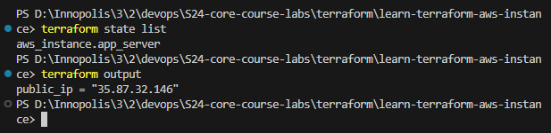

# Terraform

## Docker Terraform Tutorial

- After following the tutorial from [Docker](https://developer.hashicorp.com/terraform/tutorials/docker-get-started/), I have created a Terraform configuration to deploy a simple Docker container.

```bash
    terraform show
```

- The output of the above command:

```bash
          # docker_container.nginx:

  resource "docker_container" "nginx" {
  attach = false
  command = [
  "nginx",
  "-g",
  "daemon off;",
  ]
  container_read_refresh_timeout_milliseconds = 15000
  cpu_shares = 0
  dns = []
  dns_opts = []
  dns_search = []
  entrypoint = [
  "/docker-entrypoint.sh",
  ]
  env = []
  group_add = []
  hostname = "6455e7fc487c"
  id = "6455e7fc487c8c6d1b2381279e0fdf7da5f7d76fd660fb5c217e9c367c1654d5"
  image = "sha256:e4720093a3c1381245b53a5a51b417963b3c4472d3f47fc301930a4f3b17666a"
  init = false
  ipc_mode = "private"
  log_driver = "json-file"
  log_opts = {}
  logs = false
  max_retry_count = 0
  memory = 0
  memory_swap = 0
  must_run = true
  name = "tutorial"
  network_data = [
  {
  gateway = "172.17.0.1"
  global_ipv6_address = ""
  global_ipv6_prefix_length = 0
  ip_address = "172.17.0.2"
  ip_prefix_length = 16
  ipv6_gateway = ""
  mac_address = "02:42:ac:11:00:02"
  network_name = "bridge"
  },
  ]
  network_mode = "default"
  privileged = false
  publish_all_ports = false
  read_only = false
  remove_volumes = true
  restart = "no"
  rm = false
  runtime = "runc"
  security_opts = []
  shm_size = 64
  start = true
  stdin_open = false
  stop_signal = "SIGQUIT"
  stop_timeout = 0
  storage_opts = {}
  sysctls = {}
  tmpfs = {}
  tty = false
  wait = false
  wait_timeout = 60

      ports {
          external = 8000
          internal = 80
          ip       = "0.0.0.0"
          protocol = "tcp"
      }

  }

# docker_image.nginx:

resource "docker_image" "nginx" {
id = "sha256:e4720093a3c1381245b53a5a51b417963b3c4472d3f47fc301930a4f3b17666anginx:latest"
image_id = "sha256:e4720093a3c1381245b53a5a51b417963b3c4472d3f47fc301930a4f3b17666a"
keep_locally = false
name = "nginx:latest"
repo_digest = "nginx@sha256:c26ae7472d624ba1fafd296e73cecc4f93f853088e6a9c13c0d52f6ca5865107"
}

Outputs:

docker_container_external_port = 8000

```

- About the state list

```bash
    terraform state list
```

- The output of the above command:

```bash
    docker_container.nginx
    docker_image.nginx
```


## AWS Terraform Tutorial

- After following the tutorial from [AWS](https://developer.hashicorp.com/terraform/tutorials/aws-get-started/aws-build?in=terraform%2Faws-get-started), I have created a Terraform configuration to deploy a simple AWS EC2 instance.

```bash
    terraform show
```

- The output of the above command:

```bash
# aws_instance.app_server:
resource "aws_instance" "app_server" {
    ami                                  = "ami-830c94e3"
    arn                                  = "arn:aws:ec2:us-west-2:195079873263:instance/i-053992c186ce575fa"
    associate_public_ip_address          = true
    availability_zone                    = "us-west-2b"
    cpu_core_count                       = 1
    cpu_threads_per_core                 = 1
    disable_api_stop                     = false
    disable_api_termination              = false
    ebs_optimized                        = false
    get_password_data                    = false
    hibernation                          = false
    id                                   = "i-053992c186ce575fa"
    instance_initiated_shutdown_behavior = "stop"
    instance_state                       = "running"
    instance_type                        = "t2.micro"
    ipv6_address_count                   = 0
    ipv6_addresses                       = []
    monitoring                           = false
    placement_partition_number           = 0
    primary_network_interface_id         = "eni-0659473d227137dc4"
    private_dns                          = "ip-172-31-28-97.us-west-2.compute.internal"
    private_ip                           = "172.31.28.97"
    public_dns                           = "ec2-35-87-32-146.us-west-2.compute.amazonaws.com"
    public_ip                            = "35.87.32.146"
    secondary_private_ips                = []
    security_groups                      = [
        "default",
    ]
    source_dest_check                    = true
    subnet_id                            = "subnet-09cfe4f959ea1bac6"
    tags                                 = {
        "Name" = "example-instance"
    }
    tags_all                             = {
        "Name" = "example-instance"
    }
    tenancy                              = "default"
    user_data_replace_on_change          = false
    vpc_security_group_ids               = [
        "sg-09e6f3a95edee0aee",
    ]

    capacity_reservation_specification {
        capacity_reservation_preference = "open"
    }

    cpu_options {
        core_count       = 1
        threads_per_core = 1
    }

    credit_specification {
        cpu_credits = "standard"
    }

    enclave_options {
        enabled = false
    }

    maintenance_options {
        auto_recovery = "default"
    }

    metadata_options {
        http_endpoint               = "enabled"
        http_put_response_hop_limit = 1
        http_tokens                 = "optional"
        instance_metadata_tags      = "disabled"
    }

    private_dns_name_options {
        enable_resource_name_dns_a_record    = false
        enable_resource_name_dns_aaaa_record = false
        hostname_type                        = "ip-name"
    }

    root_block_device {
        delete_on_termination = true
        device_name           = "/dev/sda1"
        encrypted             = false
        iops                  = 0
        tags                  = {}
        throughput            = 0
        volume_id             = "vol-0b893370060b8c5fa"
        volume_size           = 8
        volume_type           = "standard"
    }
}


Outputs:

public_ip = "35.87.32.146"

```

- About the state list

```bash
    terraform state list
```

- The output of the above command:

```bash
    aws_instance.app_server
```




## Create Terraform for the Python and Python Apps

## Best Practices Followed

1. **Modular Structure**: Configuration files are organized within separate directories for Docker and AWS, improving maintainability and clarity.

2. **Provider Declaration**: Providers are declared explicitly within each main.tf file, ensuring clear dependency management.

3. **Resource Declarations**: Resources are defined appropriately inside the corresponding resources.tf file, enhancing readability and maintainability. Moreover, resources are named meaningfully, ensuring clarity and consistency.

4. **Variable Usage**: Variables are utilized to parameterize configuration, enhancing flexibility and reusability.

5. **Output Usage**: Outputs are defined to expose the results of the infrastructure deployment, ensuring clarity and consistency.

6. **Secrets Management**: Sensitive information is managed securely using environment variables.

```

```

```

```

```

```
