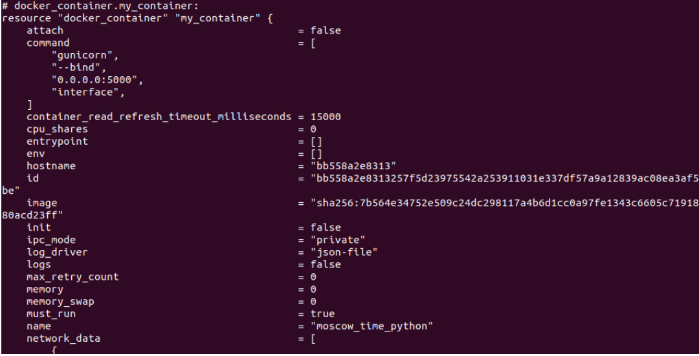

### Prerequisites

- Install [Terraform CLI](https://www.terraform.io/downloads)
- Create `terraform` directory with 4 subdirectories (modules) for `github`, `docker`, and `aws`.

### Docker Provider

- Write main.tf that uses docker provider [kreuzwerker/docker](https://github.com/kreuzwerker/terraform-provider-docker) to create resources of types `docker_image` and a `docker_container`.

- Parametrize `container_name` in variables.tf and define outputs in `outputs.tf`

- Use terraform to run `roukaya/moscow_time_python`

  ```bash
  docker pull roukaya/moscow_time_python
  docker tag roukaya/moscow_time_python moscow_time_python
  terraform init
  terraform validate
  terraform fmt
  terraform plan
  ```

- Apply plan with the custom value: `terraform apply -var 'container_name=moscow_time_python'`

- Show list

  

  

### GitHub Provider

- Write main.tf that uses `integrations/github` provider.

- Configure `github` provider with `token` declared in variables.tf and assign the value from command line or `.tfvars` file.

- Declare resources of types `github_repository`, `github_branch`, `github_branch_default`, and `github_branch_protection_v3` with the desired configurations.

- Import the remote repo to use the existing configuration

  ```bash
  terraform import github_repository.<resource_name> <repo_name>
  ```

- Use the same terraform commands as above to manage the repository configuration from terraform.


### AWS Provider

- Download AWS CLI and configure AWS secret key and id
- Write main.tf that uses `hashicorp/aws` provider to provision an EC2 instance by creating an `aws_instance` resource.

- Specify the OS to run using its corresponding AMI ([Ubuntu](https://cloud-images.ubuntu.com/locator/ec2/) examples).

- Run

  ```bash
  terraform init
  terraform validate
  terraform fmt
  terraform plan
  terraform apply
  ```

- Verify instance was created

- Destroy instance with `terraform destroy`

## Best Practices

- Use an IDE plugin to help with syntax highlighting and autocompletion ([official VSCode plugin](https://marketplace.visualstudio.com/items?itemName=HashiCorp.terraform)).
- Use built-in formatter and validator, check plan before applying changes.
- Sensitive information (state and secret variables) shouldn’t be pushed to the VCS; they can be stored locally and ignored by the VCS, or stored remotely and encrypted at rest ([.gitignore for terraform](https://github.com/github/gitignore/blob/main/Terraform.gitignore)).
- Recommended directory structure and file naming for a minimal module:

  ```bash
  .
  ├── README.md     # module description
  ├── main.tf       # entry point (resource definition)
  ├── variables.tf  # input variables and locals
  ├── outputs.tf    # output variables
  ```

- When using providers (for vagrant or terraform), be sure to pin their versions to ensure reproducibility.

## Bonus Task

the github terrform configuration created 2 teams as expected in **_roukaya-org_** organization with test repo as configured

