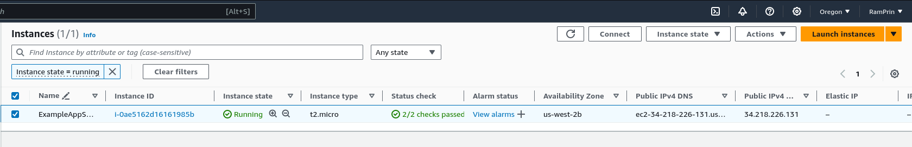
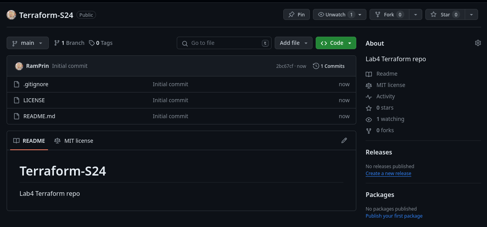
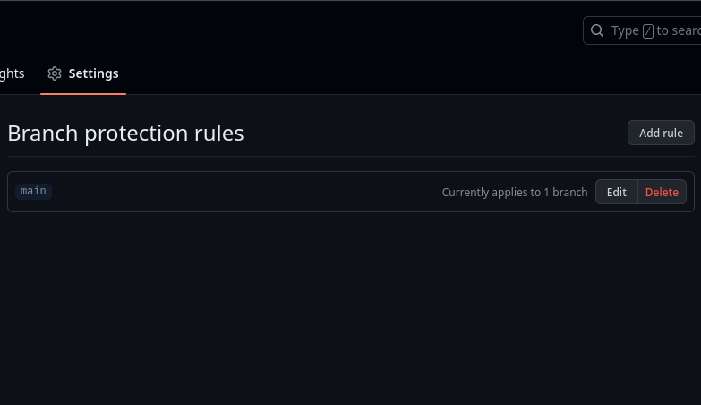
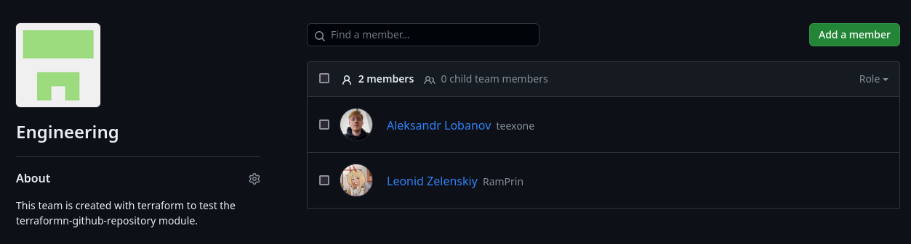
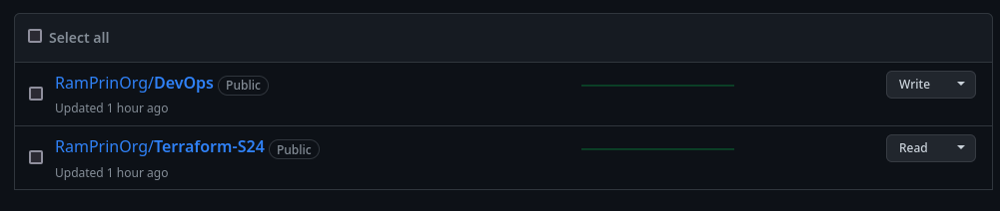

# Terraform

## Docker infrastructure

### Build and add input variables

```bash
$ terraform state show docker_container.devops
docker_container.devops:
resource "docker_container" "devops" {
    attach                                      = false
    command                                     = []
    container_read_refresh_timeout_milliseconds = 15000
    cpu_shares                                  = 0
    entrypoint                                  = [
        "uvicorn",
        "--host",
        "0.0.0.0",
        "--port",
        "8080",
        "server:server",
    ]
    env                                         = []
    hostname                                    = "bacf7339eda7"
    id                                          = "bacf7339eda7ad665c2e8ad66b956939755caf37f3334de659ae022e878b3a6e"
    image                                       = "sha256:5819d3286d01eaff596a667a90149a967e58fbfc1ad77e2fb0972ea06482d358"
    init                                        = false
    ipc_mode                                    = "private"
    log_driver                                  = "json-file"
    logs                                        = false
    max_retry_count                             = 0
    memory                                      = 0
    memory_swap                                 = 0
    must_run                                    = true
    name                                        = "lab4"
    network_data                                = [
        {
            gateway                   = "172.17.0.1"
            global_ipv6_address       = ""
            global_ipv6_prefix_length = 0
            ip_address                = "172.17.0.2"
            ip_prefix_length          = 16
            ipv6_gateway              = ""
            mac_address               = "02:42:ac:11:00:02"
            network_name              = "bridge"
        },
    ]
    network_mode                                = "default"
    privileged                                  = false
    publish_all_ports                           = false
    read_only                                   = false
    remove_volumes                              = true
    restart                                     = "no"
    rm                                          = false
    runtime                                     = "runc"
    security_opts                               = []
    shm_size                                    = 64
    start                                       = true
    stdin_open                                  = false
    stop_timeout                                = 0
    tty                                         = false
    user                                        = "ramprin:server"
    wait                                        = false
    wait_timeout                                = 60
    working_dir                                 = "/server"

    ports {
        external = 80
        internal = 8080
        ip       = "0.0.0.0"
        protocol = "tcp"
    }
}

$ terraform state show docker_image.devops    
docker_image.devops:
resource "docker_image" "devops" {
    id           = "sha256:5819d3286d01eaff596a667a90149a967e58fbfc1ad77e2fb0972ea06482d358ramprin/devops_py"
    image_id     = "sha256:5819d3286d01eaff596a667a90149a967e58fbfc1ad77e2fb0972ea06482d358"
    keep_locally = false
    name         = "ramprin/devops_py"
    repo_digest  = "ramprin/devops_py@sha256:63915c91fb392c3ea04d2ebb2d29b77111070bee3d945ab53807d1c64fb0c895"
}
```

### Outputs

```bash

$ terraform output              
container_id = "b5dd746594d5003069cfa48f8a988bd1a082494f7bd4b00cb77c02cda24aaced"
image_id = "sha256:5819d3286d01eaff596a667a90149a967e58fbfc1ad77e2fb0972ea06482d358ramprin/devops_py"

```

[source](docker/main.tf)

## AWS

By following the guide, I've built an infrastructure which creates a t2.microtype instance in EC2.



[source](aws/main.tf)

## GitHub

### Create repository

[Result](https://github.com/RamPrin/Terraform-S24)

As a result, the new repository with protection of main branch was created.





### Import

```bash
$ terraform import github_repository.DevOps "DevOps"
github_repository.DevOps: Importing from ID "DevOps"...
github_repository.DevOps: Import prepared!
  Prepared github_repository for import
github_repository.DevOps: Refreshing state... [id=DevOps]

Import successful!                                                                                                   
                                                                                                                     
The resources that were imported are shown above. These resources are now in                                         
your Terraform state and will henceforth be managed by Terraform. 
```

[source](github/main.tf)

## GitHub Teams

After creating an organization. Terraform created a team with 2 members and different accesses to the repositories.





[source](github_teams/main.tf)
