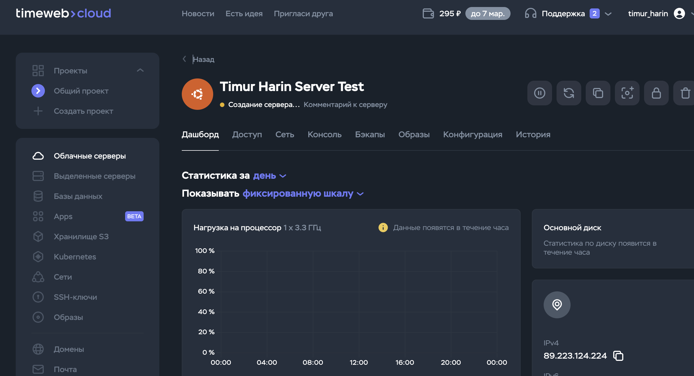
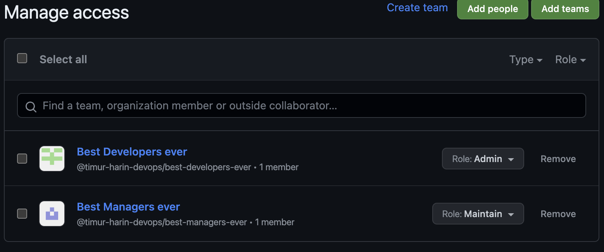

# Terraform lab results

<br> <br/>

# Best practicies

- Logically separate to files like `variables/output/main.tf`
- Modularize your code: Break down your infrastructure into reusable modules to promote reusability and maintainability
- Automate testing: Write automated tests for your Terraform code to catch errors early and ensure reliability before applying changes
- Infrastructure as Code (IaC) principles: Treat infrastructure as code, apply code review, and adopt CI/CD practices
- Follow least privilege: Use the principle of least privilege when defining IAM roles and permissions in your infrastructure code
- Document your code: Include comments and documentation to explain the purpose and behavior of your infrastructure code
- Use `terraform fmt` to formatting the code
- Use `terraform plan`to create an execution plan for changes to your infrastructure and to check that the execution plan for a set of changes matches your expectations
- Use `terraform validate` to validate the configuration files in a directory to check for syntax errors and other easy-to-spot problems within the module or plan
- Avoid including validation tokens, credentials, or sensitive data directly inside your Terraform configuration files. Instead, use secure mechanisms such as environment variables, Terraform variables with sensitive flag, or a dedicated secrets management tool to handle sensitive information. This helps to prevent accidental exposure and maintain security best practices
- Utilize trusted and reliable providers for your infrastructure components, and consistently update the versions of modules and machines you intend to use. Regularly updating to the latest versions helps ensure that you benefit from bug fixes, performance improvements, and security patches. It is important to stay informed about updates and changes to avoid compatibility issues and maintain a secure and efficient infrastructure

<br> <br/>
<br> <br/>
<br> <br/>

# Docker part

## `terraform show` output:

```  
# docker_container.container:
resource "docker_container" "container" {
    attach                                      = false
    command                                     = [
        "nginx",
        "-g",
        "daemon off;",
    ]
    container_read_refresh_timeout_milliseconds = 15000
    cpu_shares                                  = 0
    dns                                         = []
    dns_opts                                    = []
    dns_search                                  = []
    entrypoint                                  = [
        "/docker-entrypoint.sh",
    ]
    env                                         = []
    group_add                                   = []
    hostname                                    = "540b7c86506a"
    id                                          = "540b7c86506a7e19cd50554b52c370d5650628effdedb73fb97e04fc48972072"
    image                                       = "sha256:760b7cbba31e196288effd2af6924c42637ac5e0d67db4de6309f24518844676"
    init                                        = false
    ipc_mode                                    = "private"
    log_driver                                  = "json-file"
    log_opts                                    = {}
    logs                                        = false
    max_retry_count                             = 0
    memory                                      = 0
    memory_swap                                 = 0
    must_run                                    = true
    name                                        = "timur_harin_lab4"
    network_data                                = [
        {
            gateway                   = "172.17.0.1"
            global_ipv6_address       = ""
            global_ipv6_prefix_length = 0
            ip_address                = "172.17.0.2"
            ip_prefix_length          = 16
            ipv6_gateway              = ""
            mac_address               = "02:42:ac:11:00:02"
            network_name              = "bridge"
        },
    ]
    network_mode                                = "default"
    privileged                                  = false
    publish_all_ports                           = false
    read_only                                   = false
    remove_volumes                              = true
    restart                                     = "no"
    rm                                          = false
    runtime                                     = "runc"
    security_opts                               = []
    shm_size                                    = 64
    start                                       = true
    stdin_open                                  = false
    stop_signal                                 = "SIGQUIT"
    stop_timeout                                = 0
    storage_opts                                = {}
    sysctls                                     = {}
    tmpfs                                       = {}
    tty                                         = false
    wait                                        = false
    wait_timeout                                = 60

    ports {
        external = 8080
        internal = 8000
        ip       = "0.0.0.0"
        protocol = "tcp"
    }
}

# docker_image.image:
resource "docker_image" "image" {
    id           = "sha256:760b7cbba31e196288effd2af6924c42637ac5e0d67db4de6309f24518844676nginx:latest"
    image_id     = "sha256:760b7cbba31e196288effd2af6924c42637ac5e0d67db4de6309f24518844676"
    keep_locally = false
    name         = "nginx:latest"
    repo_digest  = "nginx@sha256:c26ae7472d624ba1fafd296e73cecc4f93f853088e6a9c13c0d52f6ca5865107"
}


Outputs:

container_id = "540b7c86506a7e19cd50554b52c370d5650628effdedb73fb97e04fc48972072"
image_id = "sha256:760b7cbba31e196288effd2af6924c42637ac5e0d67db4de6309f24518844676nginx:latest"
```

<br> <br/> 

## `terraform state list` output:

```
docker_container.container
docker_image.image
```

<br> <br/> 


## Applied changes

### Changes Applied for the Docker Container "timur_harin_lab4":
- **Command**: "nginx -g daemon off;" - default command
- **Hostname**: "540b7c86506a"
- **Network Data**: IP address "172.17.0.2", gateway "172.17.0.1" - default values for the Docker bridge network
- **Ports**: External port changed to 8080, internal port changed to 8000; IP and protocol - default

### Docker Image "nginx:latest" Details:
- **Image ID**: sha256:760b7cbba31e196288effd2af6924c42637ac5e0d67db4de6309f24518844676
- **Repository Digest**: nginx@sha256:c26ae7472d624ba1fafd296e73cecc4f93f853088e6a9c13c0d52f6ca5865107

<br> <br/> 
<br> <br/> 
<br> <br/> 

# Cloud part (TimeWeb)

Here it is, very simple
<br><br/>


## `terraform show` output:

```  
# data.twc_configurator.configurator:
data "twc_configurator" "configurator" {
    cpu_frequency = "3.3"
    disk_type     = "nvme"
    id            = "11"
    location      = "ru-1"

    requirements {
        cpu_max                = 104
        cpu_min                = 1
        cpu_step               = 1
        disk_max               = 2048000
        disk_min               = 10240
        disk_step              = 5120
        network_bandwidth_max  = 1000
        network_bandwidth_min  = 200
        network_bandwidth_step = 100
        ram_max                = 747520
        ram_min                = 1024
        ram_step               = 1024
    }
}

# data.twc_os.os:
data "twc_os" "os" {
    family           = "linux"
    id               = "61"
    name             = "ubuntu"
    version          = "20.04"
    version_codename = "focal"

    requirements {
        bandwidth_min = 0
        cpu_min       = 0
        disk_min      = 0
        ram_min       = 0
    }
}

# twc_server.example-server:
resource "twc_server" "example-server" {
    availability_zone = "spb-2"
    boot_mode         = "std"
    configurator_id   = 11
    cpu               = 1
    cpu_frequency     = "3.3"
    disks             = [
        {
            id          = 16802279
            is_mounted  = true
            is_system   = true
            size        = 10240
            status      = "done"
            system_name = "vda"
            type        = "nvme"
            used        = 0
        },
    ]
    id                = "2601939"
    is_ddos_guard     = false
    location          = "ru-1"
    main_ipv4         = "89.223.124.224"
    name              = (sensitive value)
    networks          = [
        {
            bandwidth     = 200
            ips           = [
                {
                    ip      = "2a03:6f00:5:1::117b"
                    is_main = true
                    ptr     = ""
                    type    = "ipv6"
                },
                {
                    ip      = "89.223.124.224"
                    is_main = true
                    ptr     = ""
                    type    = "ipv4"
                },
            ]
            is_ddos_guard = false
            nat_mode      = ""
            type          = "public"
        },
    ]
    os                = [
        {
            id      = 61
            name    = "ubuntu"
            version = "20.04"
        },
    ]
    os_id             = 61
    preset_id         = 0
    project_id        = 527545
    ram               = 1024
    software          = []
    status            = "installing"

    configuration {
        configurator_id = 11
        cpu             = 1
        disk            = 10240
        ram             = 1024
    }
}


Outputs:

availability_zone = "spb-2"
location = "ru-1"
```

<br> <br/> 

## `terraform state list` output:

```
data.twc_configurator.configurator
data.twc_os.os
twc_server.example-server
```

<br> <br/> 
<br> <br/> 
<br> <br/> 

# GitHub part

### After running `main.tf` I have this new [Repo : devops-timur-harin-terraform-lab](https://github.com/timur-harin/devops-timur-harin-terraform-lab) with license, description and settings of visibility

<br> <br/>

## `terraform show` output:

```       
# github_branch_default.main:
resource "github_branch_default" "main" {
    branch     = "main"
    etag       = "W/\"291d7105c0fd2848fd9bdde382d83cda81b74bcc1b03f4ca2d481a0cb778d9a9\""
    id         = "devops-timur-harin-terraform-lab"
    rename     = false
    repository = "devops-timur-harin-terraform-lab"
}

# github_branch_protection.default:
resource "github_branch_protection" "default" {
    allows_deletions                = false
    allows_force_pushes             = false
    enforce_admins                  = true
    id                              = "BPR_kwDOLZEBvM4C00DR"
    lock_branch                     = false
    pattern                         = "main"
    repository_id                   = "devops-timur-harin-terraform-lab"
    require_conversation_resolution = true
    require_signed_commits          = false
    required_linear_history         = false

    required_pull_request_reviews {
        dismiss_stale_reviews           = false
        require_code_owner_reviews      = false
        require_last_push_approval      = false
        required_approving_review_count = 1
        restrict_dismissals             = false
    }
}

# github_repository.repo:
resource "github_repository" "repo" {
    allow_auto_merge            = false
    allow_merge_commit          = true
    allow_rebase_merge          = true
    allow_squash_merge          = true
    allow_update_branch         = false
    archived                    = false
    auto_init                   = true
    default_branch              = "main"
    delete_branch_on_merge      = false
    description                 = "Test repo for lab"
    etag                        = "W/\"291d7105c0fd2848fd9bdde382d83cda81b74bcc1b03f4ca2d481a0cb778d9a9\""
    full_name                   = "timur-harin/devops-timur-harin-terraform-lab"
    git_clone_url               = "git://github.com/timur-harin/devops-timur-harin-terraform-lab.git"
    has_discussions             = false
    has_downloads               = true
    has_issues                  = true
    has_projects                = true
    has_wiki                    = true
    html_url                    = "https://github.com/timur-harin/devops-timur-harin-terraform-lab"
    http_clone_url              = "https://github.com/timur-harin/devops-timur-harin-terraform-lab.git"
    id                          = "devops-timur-harin-terraform-lab"
    is_template                 = false
    license_template            = "mit"
    merge_commit_message        = "PR_TITLE"
    merge_commit_title          = "MERGE_MESSAGE"
    name                        = "devops-timur-harin-terraform-lab"
    node_id                     = "R_kgDOLZEBvA"
    private                     = false
    repo_id                     = 764477884
    squash_merge_commit_message = "COMMIT_MESSAGES"
    squash_merge_commit_title   = "COMMIT_OR_PR_TITLE"
    ssh_clone_url               = "git@github.com:timur-harin/devops-timur-harin-terraform-lab.git"
    svn_url                     = "https://github.com/timur-harin/devops-timur-harin-terraform-lab"
    topics                      = []
    visibility                  = "public"
    vulnerability_alerts        = false
    web_commit_signoff_required = false

    security_and_analysis {
        secret_scanning {
            status = "disabled"
        }
        secret_scanning_push_protection {
            status = "disabled"
        }
    }
}


Outputs:

repo_name = "devops-timur-harin-terraform-lab"
```

<br> <br/> 


## `terraform state list` output:

```
github_branch_default.main
github_branch_protection.default
github_repository.repo
```

<br> <br/> 

## `terraform import "github_repository.repo" "devops-timur-harin-terraform-lab"` output:

To do it I had to delete `terraform.tfstate` to forget already imported repo

```
github_repository.repo: Importing from ID "devops-timur-harin-terraform-lab"...
github_repository.repo: Import prepared!
  Prepared github_repository for import
github_repository.repo: Refreshing state... [id=devops-timur-harin-terraform-lab]

Import successful!

The resources that were imported are shown above. These resources are now in
your Terraform state and will henceforth be managed by Terraform.
```


<br> <br/> 
<br> <br/> 
<br> <br/> 

# GitHub Teams (Bonus Task)

### After running `main.tf` I have this new [Repo : timur-harin-devops/test-repo](https://github.com/timur-harin-devops/test-repo) with team management as you can see here in settings of repo <br> <br/> 
 

<br> <br/> 

## `terraform show` output:

```       
# github_team.dev:
resource "github_team" "dev" {
    create_default_maintainer = false
    etag                      = "W/\"78932252199bfbc62f9f74e5091321015dba11510002336f9cf0397846920384\""
    id                        = "9574842"
    members_count             = 1
    name                      = "Best Developers ever"
    node_id                   = "T_kwDOCaFOMM4Akhm6"
    privacy                   = "closed"
    slug                      = "best-developers-ever"
}

# github_team.managers:
resource "github_team" "managers" {
    create_default_maintainer = false
    etag                      = "W/\"76a93a8b9c24c6e7ed03df1927e76fc713d586d52252a1659bf1085320992151\""
    id                        = "9574843"
    members_count             = 1
    name                      = "Best Managers ever"
    node_id                   = "T_kwDOCaFOMM4Akhm7"
    privacy                   = "closed"
    slug                      = "best-managers-ever"
}

# github_team_membership.member_for_developers:
resource "github_team_membership" "member_for_developers" {
    etag     = "W/\"fe8d1fcfc5c06a392379a5513e42294353cceb129a39999dcc8d2b9b5b8dbc63\""
    id       = "9574842:timur-harin"
    role     = "member"
    team_id  = "9574842"
    username = "timur-harin"
}

# github_team_membership.member_for_manager:
resource "github_team_membership" "member_for_manager" {
    etag     = "W/\"61d488accc4040882ce53ebdc7c6c94b3a262bf1e3aa105e958e955d79c381db\""
    id       = "9574843:timur-harin"
    role     = "member"
    team_id  = "9574843"
    username = "timur-harin"
}

# github_team_repository.develop_permission:
resource "github_team_repository" "develop_permission" {
    etag       = "W/\"37a4ef95cbd172a98388459d6ce8b0f3a56043dd811bf125639c1a8cd46b9425\""
    id         = "9574842:test-repo"
    permission = "admin"
    repository = (sensitive value)
    team_id    = "9574842"
}

# github_team_repository.manager_permission:
resource "github_team_repository" "manager_permission" {
    etag       = "W/\"0c4cbd7368ac9e203d9ef8055586d614363687dd1011c4db1c218da2c0e5da0d\""
    id         = "9574843:test-repo"
    permission = "maintain"
    repository = (sensitive value)
    team_id    = "9574843"
}
```

<br> <br/> 


## `terraform state list` output:

```
github_team.dev
github_team.managers
github_team_membership.member_for_developers
github_team_membership.member_for_manager
github_team_repository.develop_permission
github_team_repository.manager_permission
```

<br> <br/> 
<br> <br/> 
<br> <br/> 

