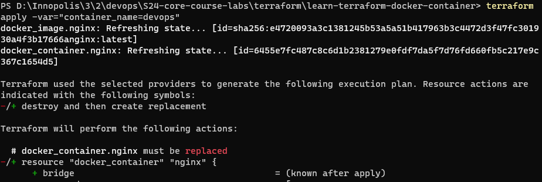
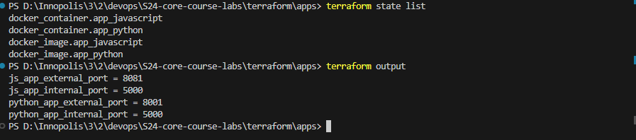
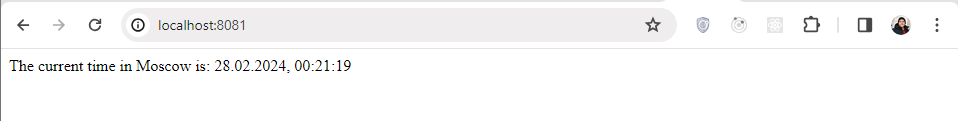
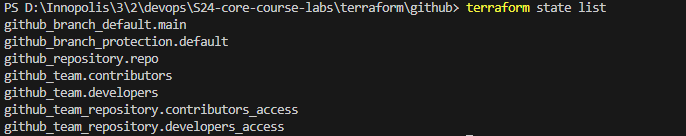
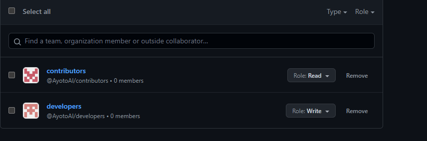
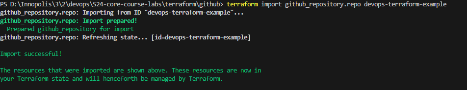

# Terraform

## Docker Terraform Tutorial

- After following the tutorial from [Docker](https://developer.hashicorp.com/terraform/tutorials/docker-get-started/), I have created a Terraform configuration to deploy a simple Docker container.

```bash
    terraform show
```

- The output of the above command:

```bash
          # docker_container.nginx:

  resource "docker_container" "nginx" {
  attach = false
  command = [
  "nginx",
  "-g",
  "daemon off;",
  ]
  container_read_refresh_timeout_milliseconds = 15000
  cpu_shares = 0
  dns = []
  dns_opts = []
  dns_search = []
  entrypoint = [
  "/docker-entrypoint.sh",
  ]
  env = []
  group_add = []
  hostname = "6455e7fc487c"
  id = "6455e7fc487c8c6d1b2381279e0fdf7da5f7d76fd660fb5c217e9c367c1654d5"
  image = "sha256:e4720093a3c1381245b53a5a51b417963b3c4472d3f47fc301930a4f3b17666a"
  init = false
  ipc_mode = "private"
  log_driver = "json-file"
  log_opts = {}
  logs = false
  max_retry_count = 0
  memory = 0
  memory_swap = 0
  must_run = true
  name = "tutorial"
  network_data = [
  {
  gateway = "172.17.0.1"
  global_ipv6_address = ""
  global_ipv6_prefix_length = 0
  ip_address = "172.17.0.2"
  ip_prefix_length = 16
  ipv6_gateway = ""
  mac_address = "02:42:ac:11:00:02"
  network_name = "bridge"
  },
  ]
  network_mode = "default"
  privileged = false
  publish_all_ports = false
  read_only = false
  remove_volumes = true
  restart = "no"
  rm = false
  runtime = "runc"
  security_opts = []
  shm_size = 64
  start = true
  stdin_open = false
  stop_signal = "SIGQUIT"
  stop_timeout = 0
  storage_opts = {}
  sysctls = {}
  tmpfs = {}
  tty = false
  wait = false
  wait_timeout = 60

      ports {
          external = 8000
          internal = 80
          ip       = "0.0.0.0"
          protocol = "tcp"
      }

  }

# docker_image.nginx:

resource "docker_image" "nginx" {
id = "sha256:e4720093a3c1381245b53a5a51b417963b3c4472d3f47fc301930a4f3b17666anginx:latest"
image_id = "sha256:e4720093a3c1381245b53a5a51b417963b3c4472d3f47fc301930a4f3b17666a"
keep_locally = false
name = "nginx:latest"
repo_digest = "nginx@sha256:c26ae7472d624ba1fafd296e73cecc4f93f853088e6a9c13c0d52f6ca5865107"
}

Outputs:

docker_container_external_port = 8000

```

- About the state list

```bash
    terraform state list
```

- The output of the above command:

```bash
    docker_container.nginx
    docker_image.nginx
```

## Verify the Deployed Docker Container


## Use `-var` to Rename the Docker Container



## AWS Terraform Tutorial

- After following the tutorial from [AWS](https://developer.hashicorp.com/terraform/tutorials/aws-get-started/aws-build?in=terraform%2Faws-get-started), I have created a Terraform configuration to deploy a simple AWS EC2 instance.

```bash
    terraform show
```

- The output of the above command:

```bash
# aws_instance.app_server:
resource "aws_instance" "app_server" {
    ami                                  = "ami-830c94e3"
    arn                                  = "arn:aws:ec2:us-west-2:195079873263:instance/i-053992c186ce575fa"
    associate_public_ip_address          = true
    availability_zone                    = "us-west-2b"
    cpu_core_count                       = 1
    cpu_threads_per_core                 = 1
    disable_api_stop                     = false
    disable_api_termination              = false
    ebs_optimized                        = false
    get_password_data                    = false
    hibernation                          = false
    id                                   = "i-053992c186ce575fa"
    instance_initiated_shutdown_behavior = "stop"
    instance_state                       = "running"
    instance_type                        = "t2.micro"
    ipv6_address_count                   = 0
    ipv6_addresses                       = []
    monitoring                           = false
    placement_partition_number           = 0
    primary_network_interface_id         = "eni-0659473d227137dc4"
    private_dns                          = "ip-172-31-28-97.us-west-2.compute.internal"
    private_ip                           = "172.31.28.97"
    public_dns                           = "ec2-35-87-32-146.us-west-2.compute.amazonaws.com"
    public_ip                            = "35.87.32.146"
    secondary_private_ips                = []
    security_groups                      = [
        "default",
    ]
    source_dest_check                    = true
    subnet_id                            = "subnet-09cfe4f959ea1bac6"
    tags                                 = {
        "Name" = "example-instance"
    }
    tags_all                             = {
        "Name" = "example-instance"
    }
    tenancy                              = "default"
    user_data_replace_on_change          = false
    vpc_security_group_ids               = [
        "sg-09e6f3a95edee0aee",
    ]

    capacity_reservation_specification {
        capacity_reservation_preference = "open"
    }

    cpu_options {
        core_count       = 1
        threads_per_core = 1
    }

    credit_specification {
        cpu_credits = "standard"
    }

    enclave_options {
        enabled = false
    }

    maintenance_options {
        auto_recovery = "default"
    }

    metadata_options {
        http_endpoint               = "enabled"
        http_put_response_hop_limit = 1
        http_tokens                 = "optional"
        instance_metadata_tags      = "disabled"
    }

    private_dns_name_options {
        enable_resource_name_dns_a_record    = false
        enable_resource_name_dns_aaaa_record = false
        hostname_type                        = "ip-name"
    }

    root_block_device {
        delete_on_termination = true
        device_name           = "/dev/sda1"
        encrypted             = false
        iops                  = 0
        tags                  = {}
        throughput            = 0
        volume_id             = "vol-0b893370060b8c5fa"
        volume_size           = 8
        volume_type           = "standard"
    }
}


Outputs:

public_ip = "35.87.32.146"

```

- About the state list

```bash
    terraform state list
```

- The output of the above command:

```bash
    aws_instance.app_server
```


## Create Terraform for the Python and Python Apps

- Based on the created apps in the previous labs, I have created a Terraform configuration to deploy a simple Python app.

- Inside the `apps` directory, I have created the terraform configuration files.

```bash
    terraform show
```

```bash
# docker_container.app_javascript:
resource "docker_container" "app_javascript" {
    attach                                      = false
    command                                     = [
        "node",
        "app.js",
    ]
    container_read_refresh_timeout_milliseconds = 15000
    cpu_shares                                  = 0
    dns                                         = []
    dns_opts                                    = []
    dns_search                                  = []
    entrypoint                                  = [
        "docker-entrypoint.sh",
    ]
    env                                         = []
    group_add                                   = []
    hostname                                    = "d62ae86eb83c"
    id                                          = "d62ae86eb83caeec581357aef483386593ea75b5bb0183653cabd1c8c20634a8"
    image                                       = "sha256:772326f0f306e78fef630c213e80461bd792762d91a8dff8f6e127efafe1c450"
    init                                        = false
    ipc_mode                                    = "private"
    log_driver                                  = "json-file"
    log_opts                                    = {}
    logs                                        = false
    max_retry_count                             = 0
    memory                                      = 0
    memory_swap                                 = 0
    must_run                                    = true
    name                                        = "moscow_tz_js"
    network_data                                = [
        {
            gateway                   = "172.17.0.1"
            global_ipv6_address       = ""
            global_ipv6_prefix_length = 0
            ip_address                = "172.17.0.4"
            ip_prefix_length          = 16
            ipv6_gateway              = ""
            mac_address               = "02:42:ac:11:00:04"
            network_name              = "bridge"
        },
    ]
    network_mode                                = "default"
    privileged                                  = false
    publish_all_ports                           = false
    read_only                                   = false
    remove_volumes                              = true
    restart                                     = "no"
    rm                                          = false
    runtime                                     = "runc"
    security_opts                               = []
    shm_size                                    = 64
    start                                       = true
    stdin_open                                  = false
    stop_timeout                                = 0
    storage_opts                                = {}
    sysctls                                     = {}
    tmpfs                                       = {}
    tty                                         = false
    user                                        = "appuser"
    wait                                        = false
    wait_timeout                                = 60
    working_dir                                 = "/app"

    ports {
        external = 8081
        internal = 5000
        ip       = "0.0.0.0"
        protocol = "tcp"
    }
}

# docker_container.app_python:
resource "docker_container" "app_python" {
    attach                                      = false
    command                                     = [
        "python",
        "app.py",
    ]
    container_read_refresh_timeout_milliseconds = 15000
    cpu_shares                                  = 0
    dns                                         = []
    dns_opts                                    = []
    dns_search                                  = []
    entrypoint                                  = []
    env                                         = []
    group_add                                   = []
    hostname                                    = "13493c5d3f42"
    id                                          = "13493c5d3f42360ee7d2b9a1ad7fcc333802d53718ad3abe65b68541f141e8d4"
    image                                       = "sha256:3226e78feadb63e7dd48edc46038a7d3b6ed4b10d5c095da54ac5cf1760c819d"
    init                                        = false
    ipc_mode                                    = "private"
    log_driver                                  = "json-file"
    log_opts                                    = {}
    logs                                        = false
    max_retry_count                             = 0
    memory                                      = 0
    memory_swap                                 = 0
    must_run                                    = true
    name                                        = "moscow_tz"
    network_data                                = [
        {
            gateway                   = "172.17.0.1"
            global_ipv6_address       = ""
            global_ipv6_prefix_length = 0
            ip_address                = "172.17.0.3"
            ip_prefix_length          = 16
            ipv6_gateway              = ""
            mac_address               = "02:42:ac:11:00:03"
            network_name              = "bridge"
        },
    ]
    network_mode                                = "default"
    privileged                                  = false
    publish_all_ports                           = false
    read_only                                   = false
    remove_volumes                              = true
    restart                                     = "no"
    rm                                          = false
    runtime                                     = "runc"
    security_opts                               = []
    shm_size                                    = 64
    start                                       = true
    stdin_open                                  = false
    stop_timeout                                = 0
    storage_opts                                = {}
    sysctls                                     = {}
    tmpfs                                       = {}
    tty                                         = false
    user                                        = "appuser"
    wait                                        = false
    wait_timeout                                = 60
    working_dir                                 = "/app"

    ports {
        external = 8001
        internal = 5000
        ip       = "0.0.0.0"
        protocol = "tcp"
    }
}

# docker_image.app_javascript:
resource "docker_image" "app_javascript" {
    id           = "sha256:772326f0f306e78fef630c213e80461bd792762d91a8dff8f6e127efafe1c450zeyadalagamy/moscow_tz_js:latest"
    image_id     = "sha256:772326f0f306e78fef630c213e80461bd792762d91a8dff8f6e127efafe1c450"
    keep_locally = true
    name         = "zeyadalagamy/moscow_tz_js:latest"
    repo_digest  = "zeyadalagamy/moscow_tz_js@sha256:518c27116d9cc8b875efe32110169352471925d814ec138c4d7cedbede264d9d"
}

# docker_image.app_python:
resource "docker_image" "app_python" {
    id           = "sha256:3226e78feadb63e7dd48edc46038a7d3b6ed4b10d5c095da54ac5cf1760c819dzeyadalagamy/moscow_tz:latest"
    image_id     = "sha256:3226e78feadb63e7dd48edc46038a7d3b6ed4b10d5c095da54ac5cf1760c819d"
    keep_locally = true
    name         = "zeyadalagamy/moscow_tz:latest"
    repo_digest  = "zeyadalagamy/moscow_tz@sha256:3c56fe21acce6b095b3913944878c3c0efe1cee22e341be7932b83feaf453278"
}


Outputs:

js_app_external_port = 8081
js_app_internal_port = 5000
python_app_external_port = 8001

```

- About the state list

```bash
    terraform state list
```

- The output of the above command:

```bash
    docker_container.app_javascript
    docker_container.app_python
    docker_image.app_javascript
    docker_image.app_python
```



### Verify the Deployed Apps




## GitHub Terraform + `Bonus`

- I have an existing Github Organization called `AyotoAI` and I have created a Terraform configuration to deploy a simple GitHub repository.

- I have created two empty teams called `developers` and `contributors`.

```bash
    terraform show
```

```bash
# github_branch_default.main:
resource "github_branch_default" "main" {
    branch     = "main"
    etag       = "W/\"d9224209c0e2a3c2d42175471f07c76f2901b37001476969e5916e1565044685\""
    id         = "devops-terraform-example"
    rename     = false
    repository = "devops-terraform-example"
}

# github_branch_protection.default:
resource "github_branch_protection" "default" {
    allows_deletions                = false
    allows_force_pushes             = false
    blocks_creations                = false
    enforce_admins                  = true
    force_push_bypassers            = []
    id                              = "BPR_kwDOLY4h284C0waN"
    lock_branch                     = false
    pattern                         = "main"
    push_restrictions               = []
    repository_id                   = "devops-terraform-example"
    require_conversation_resolution = true
    require_signed_commits          = false
    required_linear_history         = false

    required_pull_request_reviews {
        dismiss_stale_reviews           = false
        dismissal_restrictions          = []
        pull_request_bypassers          = []
        require_code_owner_reviews      = false
        require_last_push_approval      = false
        required_approving_review_count = 1
        restrict_dismissals             = false
    }
}

# github_repository.repo:
resource "github_repository" "repo" {
    allow_auto_merge            = false
    allow_merge_commit          = true
    allow_rebase_merge          = true
    allow_squash_merge          = true
    allow_update_branch         = false
    archived                    = false
    auto_init                   = false
    default_branch              = "main"
    delete_branch_on_merge      = false
    description                 = "Terraform example to create a GitHub repository"
    etag                        = "W/\"d9224209c0e2a3c2d42175471f07c76f2901b37001476969e5916e1565044685\""
    full_name                   = "AyotoAI/devops-terraform-example"
    git_clone_url               = "git://github.com/AyotoAI/devops-terraform-example.git"
    gitignore_template          = "VisualStudio"
    has_discussions             = false
    has_downloads               = false
    has_issues                  = true
    has_projects                = false
    has_wiki                    = true
    html_url                    = "https://github.com/AyotoAI/devops-terraform-example"
    http_clone_url              = "https://github.com/AyotoAI/devops-terraform-example.git"
    id                          = "devops-terraform-example"
    is_template                 = false
    license_template            = "mit"
    merge_commit_message        = "PR_TITLE"
    merge_commit_title          = "MERGE_MESSAGE"
    name                        = "devops-terraform-example"
    node_id                     = "R_kgDOLY4h2w"
    private                     = false
    repo_id                     = 764289499
    squash_merge_commit_message = "COMMIT_MESSAGES"
    squash_merge_commit_title   = "COMMIT_OR_PR_TITLE"
    ssh_clone_url               = "git@github.com:AyotoAI/devops-terraform-example.git"
    svn_url                     = "https://github.com/AyotoAI/devops-terraform-example"
    topics                      = []
    visibility                  = "public"
    vulnerability_alerts        = false
    web_commit_signoff_required = false

    security_and_analysis {
        secret_scanning {
            status = "disabled"
        }
        secret_scanning_push_protection {
            status = "disabled"
        }
    }
}

# github_team.contributors:
resource "github_team" "contributors" {
    create_default_maintainer = false
    description               = "Contributors team"
    etag                      = "W/\"f92e9e49f421801c020088dffc37d044293a53586c90326c8cd74d48131b771c\""
    id                        = "9572710"
    members_count             = 0
    name                      = "contributors"
    node_id                   = "T_kwDOCCIaQM4AkhFm"
    privacy                   = "secret"
    slug                      = "contributors"
}

# github_team.developers:
resource "github_team" "developers" {
    create_default_maintainer = false
    description               = "Developers team"
    etag                      = "W/\"97b2aa42563acecf0e9096087e88b6d5dca535bf4d3e26e8cd8e388c4618c433\""
    id                        = "9572708"
    members_count             = 0
    name                      = "developers"
    node_id                   = "T_kwDOCCIaQM4AkhFk"
    privacy                   = "secret"
    slug                      = "developers"
}

# github_team_repository.contributors_access:
resource "github_team_repository" "contributors_access" {
    etag       = "W/\"88c2555d54c8758af2fcb4c18cd8f63bc907847699aef0226ef88aa5a083cbf9\""
    id         = "9572710:devops-terraform-example"
    permission = "pull"
    repository = "devops-terraform-example"
    team_id    = "9572710"
}

# github_team_repository.developers_access:
resource "github_team_repository" "developers_access" {
    etag       = "W/\"7026326f83bcf3395b54c47a2a98c4211fda8056d2b326662bb478dd7a0251b2\""
    id         = "9572708:devops-terraform-example"
    permission = "push"
    repository = "devops-terraform-example"
    team_id    = "9572708"
}
```

- About the state list

```bash
    terraform state list
```

- The output of the above command:

```bash
    github_branch_default.main
    github_branch_protection.default
    github_repository.repo
    github_team.contributors
    github_team.developers
    github_team_repository.contributors_access
    github_team_repository.developers_access
```



### Verify the Deployed GitHub Repository



- Also Import the existing GitHub repository

```bash
    terraform import github_repository.repo devops-terraform-example
```



## Best Practices Followed

1. **Modular Structure**: Configuration files are organized within separate directories for Docker and AWS, improving maintainability and clarity.

2. **Provider Declaration**: Providers are declared explicitly within each main.tf file, ensuring clear dependency management.

3. **Resource Declarations**: Resources are defined appropriately inside the corresponding resources.tf file, enhancing readability and maintainability. Moreover, resources are named meaningfully, ensuring clarity and consistency.

4. **Variable Usage**: Variables are utilized to parameterize configuration, enhancing flexibility and reusability.

5. **Output Usage**: Outputs are defined to expose the results of the infrastructure deployment, ensuring clarity and consistency.

6. **Secrets Management**: Sensitive information is managed securely using environment variables.
