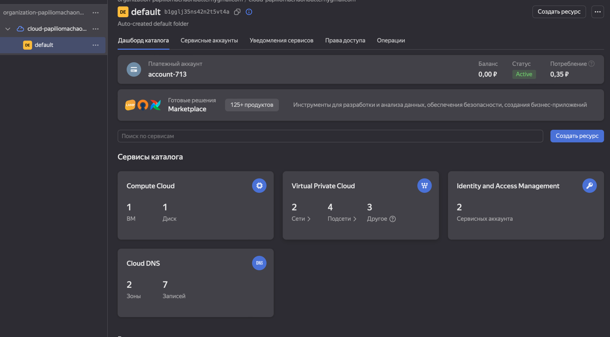

## Best practicies:
Here’s the shuffled version:

1. **Provider Configuration**:  
Providers are set apart from resources for better readability.

2. **Outputs**:  
Key outputs with descriptions are provided, accessible via interpolation.

3. **Resource Declarations**:  
Resources have clear names and use interpolation, with good formatting.

4. **Terraform Configuration**:  
Providers and version constraints are specified to ensure compatibility.

5. **Variable Definitions**:  
Each variable is clearly described with defaults where needed, and types are set for clarity.

## Docker:
 - terraform state list:

```bash
(venv) smasiner@smasIners-MacBook-Pro docker_terraform % terraform state list
docker_container.webapp_container
docker_image.webapp_image
```
 - terraform show:
```bash
(venv) smasiner@smasIners-MacBook-Pro docker_terraform % terraform state show docker_container.webapp_container   
# docker_container.webapp_container:
resource "docker_container" "webapp_container" {
    attach                                      = false
    bridge                                      = null
    command                                     = [
        "python3",
        "app.py",
    ]
    container_read_refresh_timeout_milliseconds = 15000
    cpu_set                                     = null
    cpu_shares                                  = 0
    domainname                                  = null
    entrypoint                                  = []
    env                                         = []
    hostname                                    = "cdb6730cc6e6"
    id                                          = "cdb6730cc6e65382f1530bcd7cef40619164b20a154ec26875bd752dce40e750"
    image                                       = "sha256:f14d6b63edcdd49a724204836e072534f1179986798d53e0377b5549b05806bc"
    init                                        = false
    ipc_mode                                    = "private"
    log_driver                                  = "json-file"
    logs                                        = false
    max_retry_count                             = 0
    memory                                      = 0
    memory_swap                                 = 0
    must_run                                    = true
    name                                        = "lab4"
    network_data                                = [
        {
            gateway                   = "172.17.0.1"
            global_ipv6_address       = null
            global_ipv6_prefix_length = 0
            ip_address                = "172.17.0.2"
            ip_prefix_length          = 16
            ipv6_gateway              = null
            mac_address               = "02:42:ac:11:00:02"
            network_name              = "bridge"
        },
    ]
    network_mode                                = "default"
    pid_mode                                    = null
    privileged                                  = false
    publish_all_ports                           = false
    read_only                                   = false
    remove_volumes                              = true
    restart                                     = "no"
    rm                                          = false
    runtime                                     = "runc"
    security_opts                               = []
    shm_size                                    = 64
    start                                       = true
    stdin_open                                  = false
    stop_signal                                 = null
    stop_timeout                                = 0
    tty                                         = false
    user                                        = "myuser"
    userns_mode                                 = null
    wait                                        = false
    wait_timeout                                = 60
    working_dir                                 = "/app_python"

    ports {
        external = 8080
        internal = 8000
        ip       = "0.0.0.0"
        protocol = "tcp"
    }
}
```

- Terraform apply:
```bash
(venv) smasiner@smasIners-MacBook-Pro docker_terraform % terraform apply

Terraform used the selected providers to generate the following execution plan. Resource actions are indicated with the following symbols:
  + create

Terraform will perform the following actions:

  # docker_container.webapp_container will be created
  + resource "docker_container" "webapp_container" {
      + attach                                      = false
      + bridge                                      = (known after apply)
      + command                                     = (known after apply)
      + container_logs                              = (known after apply)
      + container_read_refresh_timeout_milliseconds = 15000
      + entrypoint                                  = (known after apply)
      + env                                         = (known after apply)
      + exit_code                                   = (known after apply)
      + hostname                                    = (known after apply)
      + id                                          = (known after apply)
      + image                                       = (known after apply)
      + init                                        = (known after apply)
      + ipc_mode                                    = (known after apply)
      + log_driver                                  = (known after apply)
      + logs                                        = false
      + must_run                                    = true
      + name                                        = "lab4"
      + network_data                                = (known after apply)
      + read_only                                   = false
      + remove_volumes                              = true
      + restart                                     = "no"
      + rm                                          = false
      + runtime                                     = (known after apply)
      + security_opts                               = (known after apply)
      + shm_size                                    = (known after apply)
      + start                                       = true
      + stdin_open                                  = false
      + stop_signal                                 = (known after apply)
      + stop_timeout                                = (known after apply)
      + tty                                         = false
      + wait                                        = false
      + wait_timeout                                = 60

      + healthcheck (known after apply)

      + labels (known after apply)

      + ports {
          + external = 8080
          + internal = 8000
          + ip       = "0.0.0.0"
          + protocol = "tcp"
        }
    }

  # docker_image.webapp_image will be created
  + resource "docker_image" "webapp_image" {
      + id           = (known after apply)
      + image_id     = (known after apply)
      + keep_locally = false
      + name         = "smasiner2/python_time_app"
      + repo_digest  = (known after apply)
    }

Plan: 2 to add, 0 to change, 0 to destroy.

Changes to Outputs:
  + container_id = (known after apply)
  + image_id     = (known after apply)

Do you want to perform these actions?
  Terraform will perform the actions described above.
  Only 'yes' will be accepted to approve.

  Enter a value: yes
```
or
```bash
(venv) smasiner@smasIners-MacBook-Pro docker_terraform % terraform apply -var "container_name=changed_name"     
docker_image.webapp_image: Refreshing state... [id=sha256:f14d6b63edcdd49a724204836e072534f1179986798d53e0377b5549b05806bcsmasiner2/python_time_app]
docker_container.webapp_container: Refreshing state... [id=cdb6730cc6e65382f1530bcd7cef40619164b20a154ec26875bd752dce40e750]

Terraform used the selected providers to generate the following execution plan. Resource actions are indicated with the following symbols:
-/+ destroy and then create replacement

Terraform will perform the following actions:

  # docker_container.webapp_container must be replaced
-/+ resource "docker_container" "webapp_container" {
      + bridge                                      = (known after apply)
      ~ command                                     = [
          - "python3",
          - "app.py",
        ] -> (known after apply)
      + container_logs                              = (known after apply)
      - cpu_shares                                  = 0 -> null
      - dns                                         = [] -> null
      - dns_opts                                    = [] -> null
      - dns_search                                  = [] -> null
      ~ entrypoint                                  = [] -> (known after apply)
      ~ env                                         = [] -> (known after apply)
      + exit_code                                   = (known after apply)
      - group_add                                   = [] -> null
      ~ hostname                                    = "cdb6730cc6e6" -> (known after apply)
      ~ id                                          = "cdb6730cc6e65382f1530bcd7cef40619164b20a154ec26875bd752dce40e750" -> (known after apply)
      ~ init                                        = false -> (known after apply)
      ~ ipc_mode                                    = "private" -> (known after apply)
      ~ log_driver                                  = "json-file" -> (known after apply)
      - log_opts                                    = {} -> null
      - max_retry_count                             = 0 -> null
      - memory                                      = 0 -> null
      - memory_swap                                 = 0 -> null
      ~ name                                        = "lab4" -> "changed_name" # forces replacement
      ~ network_data                                = [
          - {
              - gateway                   = "172.17.0.1"
              - global_ipv6_prefix_length = 0
              - ip_address                = "172.17.0.2"
              - ip_prefix_length          = 16
              - mac_address               = "02:42:ac:11:00:02"
              - network_name              = "bridge"
                # (2 unchanged attributes hidden)
            },
        ] -> (known after apply)
      - network_mode                                = "default" -> null
      - privileged                                  = false -> null
      - publish_all_ports                           = false -> null
      ~ runtime                                     = "runc" -> (known after apply)
      ~ security_opts                               = [] -> (known after apply)
      ~ shm_size                                    = 64 -> (known after apply)
      + stop_signal                                 = (known after apply)
      ~ stop_timeout                                = 0 -> (known after apply)
      - storage_opts                                = {} -> null
      - sysctls                                     = {} -> null
      - tmpfs                                       = {} -> null
      - user                                        = "myuser" -> null
      - working_dir                                 = "/app_python" -> null
        # (18 unchanged attributes hidden)

      ~ healthcheck (known after apply)

      ~ labels (known after apply)

        # (1 unchanged block hidden)
    }

Plan: 1 to add, 0 to change, 1 to destroy.

Changes to Outputs:
  ~ container_id = "cdb6730cc6e65382f1530bcd7cef40619164b20a154ec26875bd752dce40e750" -> (known after apply)

Do you want to perform these actions?
  Terraform will perform the actions described above.
  Only 'yes' will be accepted to approve.

  Enter a value: yes

docker_container.webapp_container: Destroying... [id=cdb6730cc6e65382f1530bcd7cef40619164b20a154ec26875bd752dce40e750]
docker_container.webapp_container: Destruction complete after 0s
docker_container.webapp_container: Creating...
docker_container.webapp_container: Creation complete after 1s [id=4d1e9f5cae315b1bbc54661a0c0c6736d4342e64ee48af9744e4f12e5ab110f1]

Apply complete! Resources: 1 added, 0 changed, 1 destroyed.

Outputs:

container_id = "4d1e9f5cae315b1bbc54661a0c0c6736d4342e64ee48af9744e4f12e5ab110f1"
image_id = "sha256:f14d6b63edcdd49a724204836e072534f1179986798d53e0377b5549b05806bcsmasiner2/python_time_app"
(venv) smasiner@smasIners-MacBook-Pro docker_terraform % terraform state show docker_container.webapp_container
# docker_container.webapp_container:
resource "docker_container" "webapp_container" {
    attach                                      = false
    bridge                                      = null
    command                                     = [
        "python3",
        "app.py",
    ]
    container_read_refresh_timeout_milliseconds = 15000
    cpu_set                                     = null
    cpu_shares                                  = 0
    domainname                                  = null
    entrypoint                                  = []
    env                                         = []
    hostname                                    = "4d1e9f5cae31"
    id                                          = "4d1e9f5cae315b1bbc54661a0c0c6736d4342e64ee48af9744e4f12e5ab110f1"
    image                                       = "sha256:f14d6b63edcdd49a724204836e072534f1179986798d53e0377b5549b05806bc"
    init                                        = false
    ipc_mode                                    = "private"
    log_driver                                  = "json-file"
    logs                                        = false
    max_retry_count                             = 0
    memory                                      = 0
    memory_swap                                 = 0
    must_run                                    = true
    name                                        = "changed_name"
    network_data                                = [
        {
            gateway                   = "172.17.0.1"
            global_ipv6_address       = null
            global_ipv6_prefix_length = 0
            ip_address                = "172.17.0.2"
            ip_prefix_length          = 16
            ipv6_gateway              = null
            mac_address               = "02:42:ac:11:00:02"
            network_name              = "bridge"
        },
    ]
    network_mode                                = "default"
    pid_mode                                    = null
    privileged                                  = false
    publish_all_ports                           = false
    read_only                                   = false
    remove_volumes                              = true
    restart                                     = "no"
    rm                                          = false
    runtime                                     = "runc"
    security_opts                               = []
    shm_size                                    = 64
    start                                       = true
    stdin_open                                  = false
    stop_signal                                 = null
    stop_timeout                                = 0
    tty                                         = false
    user                                        = "myuser"
    userns_mode                                 = null
    wait                                        = false
    wait_timeout                                = 60
    working_dir                                 = "/app_python"

    ports {
        external = 8080
        internal = 8000
        ip       = "0.0.0.0"
        protocol = "tcp"
    }
}
```
- terraform output:
```bash
(venv) smasiner@smasIners-MacBook-Pro docker_terraform % terraform output
container_id = "4d1e9f5cae315b1bbc54661a0c0c6736d4342e64ee48af9744e4f12e5ab110f1"
image_id = "sha256:f14d6b63edcdd49a724204836e072534f1179986798d53e0377b5549b05806bcsmasiner2/python_time_app"
```
## Cloud:
Process:
```bash
(venv) smasiner@smasIners-MacBook-Pro yandex_cloud % terraform validate
Success! The configuration is valid.

(venv) smasiner@smasIners-MacBook-Pro yandex_cloud % terraform fmt
(venv) smasiner@smasIners-MacBook-Pro yandex_cloud % terraform plan

Terraform used the selected providers to generate the following execution plan. Resource actions are indicated with the following symbols:
  + create

Terraform will perform the following actions:

  # yandex_compute_disk.vm_boot_disk will be created
  + resource "yandex_compute_disk" "vm_boot_disk" {
      + block_size  = 4096
      + created_at  = (known after apply)
      + folder_id   = (known after apply)
      + id          = (known after apply)
      + image_id    = "fd800c7s2p483i648ifv"
      + name        = "vm-boot-disk"
      + product_ids = (known after apply)
      + size        = 8
      + status      = (known after apply)
      + type        = "network-hdd"
      + zone        = (known after apply)

      + disk_placement_policy (known after apply)

      + hardware_generation (known after apply)
    }

  # yandex_compute_instance.time_app_instance will be created
  + resource "yandex_compute_instance" "time_app_instance" {
      + allow_stopping_for_update = true
      + created_at                = (known after apply)
      + folder_id                 = "b1gglj35ns42n2t5vt4a"
      + fqdn                      = (known after apply)
      + gpu_cluster_id            = (known after apply)
      + hardware_generation       = (known after apply)
      + hostname                  = (known after apply)
      + id                        = (known after apply)
      + maintenance_grace_period  = (known after apply)
      + maintenance_policy        = (known after apply)
      + metadata                  = {
          + "ssh-keys" = <<-EOT
                ubuntu:ssh-rsa AAAAB3NzaC1yc2EAAAADAQABAAACAQCtwHX4W6baqir10ygLP91ms//Oiw+zr/scYhz2SZH0z7Ab7FFVA/ia/WmWwK0z3PWRXjroj8mByjZSel4AgI+MHlZnY2zjDlLPYRRx5UUMU5CnSeo8Ow9PJdKcW2qu9j3qEyfoHSPbzuV9Nz4+c3ah3iQRGUcZ/n+/j4cUiJu6SC9g3af1cCq5KqOPBNhfHFLxl298HYx4lTE2Icc4LgLRnH8GGjEhzSNl0KtjgFSco2eVXoR33G8/EUA44hAvLlXnM3cmj6VN34BDz/822hR+AJpgCVoxJdLIEQTyFRrkmBCaRFvMx73ub4lJi0Xl1V5uSGJ2dQu/V2rv4cxTnkSThM5xCuTvks2UwaSCsPX2ieblALBG5L2onYbs6u+mna0YbHSgJ05T9H+ySDXmjWYPrcVdxDdSAnlOi3j+dJXLChaINLvoKuRkCk+M4wNIQJs/XIHXpyF1fEIYibMO8O9yxdShEhg4lUyowzXPucw6LiydgHurKIptDoCaGbLXP+HycswQkTIcC9nOx80V4zTafLqhzYkp7K95Xr5VwUtveZB8LPqgh+2QJZLHjJ4KmsfGXg+Yrrv/REyauatFdxYMlJs4yoiFA8WwsoftUnnrGgj4Iy+6taRsGEJDk8zi3oplcJQbUsy8HuMQrZdSTrjAVPT7C+BqO9nKrtcBY62QYw== m.shaikhutdinov@innopolis.university
            EOT
        }
      + name                      = "time-app-instance"
      + network_acceleration_type = "standard"
      + platform_id               = "standard-v1"
      + service_account_id        = (known after apply)
      + status                    = (known after apply)
      + zone                      = (known after apply)

      + boot_disk {
          + auto_delete = true
          + device_name = (known after apply)
          + disk_id     = (known after apply)
          + mode        = (known after apply)

          + initialize_params (known after apply)
        }

      + metadata_options (known after apply)

      + network_interface {
          + index              = (known after apply)
          + ip_address         = (known after apply)
          + ipv4               = true
          + ipv6               = (known after apply)
          + ipv6_address       = (known after apply)
          + mac_address        = (known after apply)
          + nat                = true
          + nat_ip_address     = (known after apply)
          + nat_ip_version     = (known after apply)
          + security_group_ids = (known after apply)
          + subnet_id          = (known after apply)
        }

      + placement_policy (known after apply)

      + resources {
          + core_fraction = 100
          + cores         = 2
          + memory        = 2
        }

      + scheduling_policy (known after apply)
    }

  # yandex_vpc_network.vpc_network will be created
  + resource "yandex_vpc_network" "vpc_network" {
      + created_at                = (known after apply)
      + default_security_group_id = (known after apply)
      + folder_id                 = (known after apply)
      + id                        = (known after apply)
      + labels                    = (known after apply)
      + name                      = "main-vpc-network"
      + subnet_ids                = (known after apply)
    }

  # yandex_vpc_subnet.main_subnet will be created
  + resource "yandex_vpc_subnet" "main_subnet" {
      + created_at     = (known after apply)
      + folder_id      = (known after apply)
      + id             = (known after apply)
      + labels         = (known after apply)
      + name           = "main-subnet"
      + network_id     = (known after apply)
      + v4_cidr_blocks = [
          + "192.168.10.0/24",
        ]
      + v6_cidr_blocks = (known after apply)
      + zone           = "ru-central1-b"
    }

Plan: 4 to add, 0 to change, 0 to destroy.

──────────────────────────────────────────────────────────────────────────────────────────────────────────────────────────────────────────────────────────────────────

Note: You didn't use the -out option to save this plan, so Terraform can't guarantee to take exactly these actions if you run "terraform apply" now.
(venv) smasiner@smasIners-MacBook-Pro yandex_cloud % terraform apply

Terraform used the selected providers to generate the following execution plan. Resource actions are indicated with the following symbols:
  + create

Terraform will perform the following actions:

  # yandex_compute_disk.vm_boot_disk will be created
  + resource "yandex_compute_disk" "vm_boot_disk" {
      + block_size  = 4096
      + created_at  = (known after apply)
      + folder_id   = (known after apply)
      + id          = (known after apply)
      + image_id    = "fd800c7s2p483i648ifv"
      + name        = "vm-boot-disk"
      + product_ids = (known after apply)
      + size        = 8
      + status      = (known after apply)
      + type        = "network-hdd"
      + zone        = (known after apply)

      + disk_placement_policy (known after apply)

      + hardware_generation (known after apply)
    }

  # yandex_compute_instance.time_app_instance will be created
  + resource "yandex_compute_instance" "time_app_instance" {
      + allow_stopping_for_update = true
      + created_at                = (known after apply)
      + folder_id                 = "b1gglj35ns42n2t5vt4a"
      + fqdn                      = (known after apply)
      + gpu_cluster_id            = (known after apply)
      + hardware_generation       = (known after apply)
      + hostname                  = (known after apply)
      + id                        = (known after apply)
      + maintenance_grace_period  = (known after apply)
      + maintenance_policy        = (known after apply)
      + metadata                  = {
          + "ssh-keys" = <<-EOT
                ubuntu:ssh-rsa AAAAB3NzaC1yc2EAAAADAQABAAACAQCtwHX4W6baqir10ygLP91ms//Oiw+zr/scYhz2SZH0z7Ab7FFVA/ia/WmWwK0z3PWRXjroj8mByjZSel4AgI+MHlZnY2zjDlLPYRRx5UUMU5CnSeo8Ow9PJdKcW2qu9j3qEyfoHSPbzuV9Nz4+c3ah3iQRGUcZ/n+/j4cUiJu6SC9g3af1cCq5KqOPBNhfHFLxl298HYx4lTE2Icc4LgLRnH8GGjEhzSNl0KtjgFSco2eVXoR33G8/EUA44hAvLlXnM3cmj6VN34BDz/822hR+AJpgCVoxJdLIEQTyFRrkmBCaRFvMx73ub4lJi0Xl1V5uSGJ2dQu/V2rv4cxTnkSThM5xCuTvks2UwaSCsPX2ieblALBG5L2onYbs6u+mna0YbHSgJ05T9H+ySDXmjWYPrcVdxDdSAnlOi3j+dJXLChaINLvoKuRkCk+M4wNIQJs/XIHXpyF1fEIYibMO8O9yxdShEhg4lUyowzXPucw6LiydgHurKIptDoCaGbLXP+HycswQkTIcC9nOx80V4zTafLqhzYkp7K95Xr5VwUtveZB8LPqgh+2QJZLHjJ4KmsfGXg+Yrrv/REyauatFdxYMlJs4yoiFA8WwsoftUnnrGgj4Iy+6taRsGEJDk8zi3oplcJQbUsy8HuMQrZdSTrjAVPT7C+BqO9nKrtcBY62QYw== m.shaikhutdinov@innopolis.university
            EOT
        }
      + name                      = "time-app-instance"
      + network_acceleration_type = "standard"
      + platform_id               = "standard-v1"
      + service_account_id        = (known after apply)
      + status                    = (known after apply)
      + zone                      = (known after apply)

      + boot_disk {
          + auto_delete = true
          + device_name = (known after apply)
          + disk_id     = (known after apply)
          + mode        = (known after apply)

          + initialize_params (known after apply)
        }

      + metadata_options (known after apply)

      + network_interface {
          + index              = (known after apply)
          + ip_address         = (known after apply)
          + ipv4               = true
          + ipv6               = (known after apply)
          + ipv6_address       = (known after apply)
          + mac_address        = (known after apply)
          + nat                = true
          + nat_ip_address     = (known after apply)
          + nat_ip_version     = (known after apply)
          + security_group_ids = (known after apply)
          + subnet_id          = (known after apply)
        }

      + placement_policy (known after apply)

      + resources {
          + core_fraction = 100
          + cores         = 2
          + memory        = 2
        }

      + scheduling_policy (known after apply)
    }

  # yandex_vpc_network.vpc_network will be created
  + resource "yandex_vpc_network" "vpc_network" {
      + created_at                = (known after apply)
      + default_security_group_id = (known after apply)
      + folder_id                 = (known after apply)
      + id                        = (known after apply)
      + labels                    = (known after apply)
      + name                      = "main-vpc-network"
      + subnet_ids                = (known after apply)
    }

  # yandex_vpc_subnet.main_subnet will be created
  + resource "yandex_vpc_subnet" "main_subnet" {
      + created_at     = (known after apply)
      + folder_id      = (known after apply)
      + id             = (known after apply)
      + labels         = (known after apply)
      + name           = "main-subnet"
      + network_id     = (known after apply)
      + v4_cidr_blocks = [
          + "192.168.10.0/24",
        ]
      + v6_cidr_blocks = (known after apply)
      + zone           = "ru-central1-b"
    }

Plan: 4 to add, 0 to change, 0 to destroy.

Do you want to perform these actions?
  Terraform will perform the actions described above.
  Only 'yes' will be accepted to approve.

  Enter a value: yes

yandex_vpc_network.vpc_network: Creating...
yandex_compute_disk.vm_boot_disk: Creating...
yandex_vpc_network.vpc_network: Creation complete after 3s [id=enpth9dq7o04rhrijsnr]
yandex_vpc_subnet.main_subnet: Creating...
yandex_vpc_subnet.main_subnet: Creation complete after 1s [id=e2lmbq7tuammahcrjeve]
yandex_compute_disk.vm_boot_disk: Still creating... [10s elapsed]
yandex_compute_disk.vm_boot_disk: Creation complete after 19s [id=epd1mubqk7edgf63sgri]
yandex_compute_instance.time_app_instance: Creating...
yandex_compute_instance.time_app_instance: Still creating... [10s elapsed]
yandex_compute_instance.time_app_instance: Still creating... [20s elapsed]
yandex_compute_instance.time_app_instance: Still creating... [30s elapsed]
yandex_compute_instance.time_app_instance: Still creating... [40s elapsed]
yandex_compute_instance.time_app_instance: Still creating... [50s elapsed]
yandex_compute_instance.time_app_instance: Creation complete after 56s [id=epdaaqm150maken02pco]

Apply complete! Resources: 4 added, 0 changed, 0 destroyed.
(venv) smasiner@smasIners-MacBook-Pro yandex_cloud % terraform state list
yandex_compute_disk.vm_boot_disk
yandex_compute_instance.time_app_instance
yandex_vpc_network.vpc_network
yandex_vpc_subnet.main_subnet
```


## Github:
https://github.com/smasIner/demver - created using terraform

```bash
(venv) smasiner@smasIners-MacBook-Pro GitHub % terraform apply
github_repository.repo: Refreshing state... [id=demo]
github_branch_default.main: Refreshing state... [id=demo]
github_branch_protection.default: Refreshing state... [id=BPR_kwDONOLf1s4DYPGX]

No changes. Your infrastructure matches the configuration.

Terraform has compared your real infrastructure against your configuration and found no differences, so no changes are needed.

Apply complete! Resources: 0 added, 0 changed, 0 destroyed.
(venv) smasiner@smasIners-MacBook-Pro GitHub % terraform state list
github_branch_default.main
github_branch_protection.default
github_repository.repo
(venv) smasiner@smasIners-MacBook-Pro GitHub % terraform state show github_repository.repo
# github_repository.repo:
resource "github_repository" "repo" {
    allow_auto_merge            = false
    allow_merge_commit          = true
    allow_rebase_merge          = true
    allow_squash_merge          = true
    allow_update_branch         = false
    archived                    = false
    auto_init                   = true
    default_branch              = "main"
    delete_branch_on_merge      = false
    description                 = "My awesome codebase"
    etag                        = "W/\"74d36f95a91b45750c1def3b560c5fd4ddf734a940c555f2db7279756385b513\""
    full_name                   = "smasIner/demo"
    git_clone_url               = "git://github.com/smasIner/demo.git"
    gitignore_template          = "Python"
    has_discussions             = false
    has_downloads               = true
    has_issues                  = true
    has_projects                = true
    has_wiki                    = true
    homepage_url                = null
    html_url                    = "https://github.com/smasIner/demo"
    http_clone_url              = "https://github.com/smasIner/demo.git"
    id                          = "demo"
    is_template                 = false
    license_template            = "mit"
    merge_commit_message        = "PR_TITLE"
    merge_commit_title          = "MERGE_MESSAGE"
    name                        = "demo"
    node_id                     = "R_kgDONOLf1g"
    primary_language            = null
    private                     = false
    repo_id                     = 887283670
    squash_merge_commit_message = "COMMIT_MESSAGES"
    squash_merge_commit_title   = "COMMIT_OR_PR_TITLE"
    ssh_clone_url               = "git@github.com:smasIner/demo.git"
    svn_url                     = "https://github.com/smasIner/demo"
    topics                      = []
    visibility                  = "public"
    vulnerability_alerts        = false
    web_commit_signoff_required = false

    security_and_analysis {
        secret_scanning {
            status = "enabled"
        }
        secret_scanning_push_protection {
            status = "enabled"
        }
    }
}
(venv) smasiner@smasIners-MacBook-Pro GitHub % terraform import "github_repository.repo" "demo"

# Output
github_repository.repo: Importing from ID "demo"...
github_repository.repo: Import prepared!
  Prepared github_repository for import
github_repository.repo: Refreshing state... [id=devops-lab-04-test]

Import successful!

The resources that were imported are shown above. These resources are now in
your Terraform state and will henceforth be managed by Terraform.
```