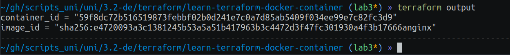
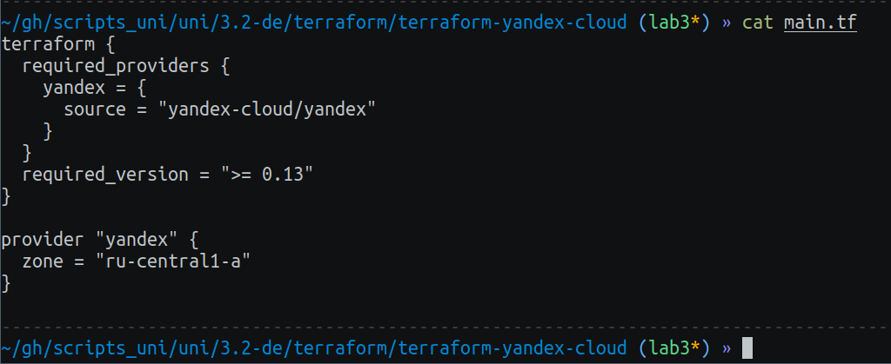
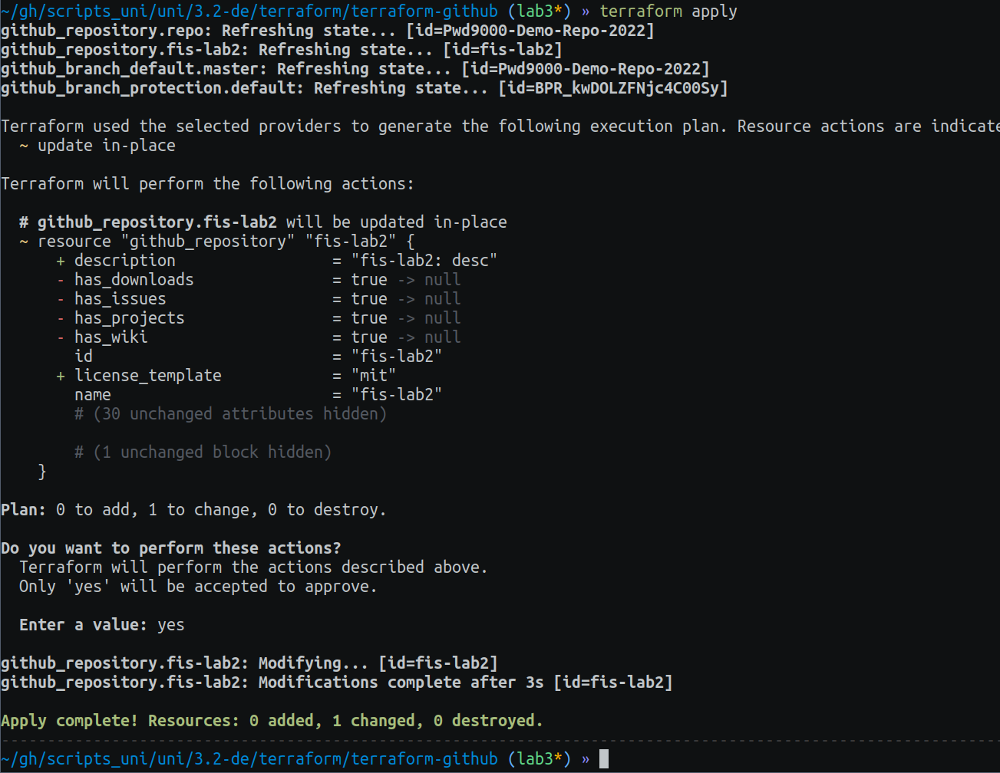

# Task 1

## 3: Docker Infrastructure Using Terraform


### Provide the output of the following commands

Output of `terraform show`:

```
# docker_container.nginx:
resource "docker_container" "nginx" {
    attach                                      = false
    command                                     = [
        "nginx",
        "-g",
        "daemon off;",
    ]
    container_read_refresh_timeout_milliseconds = 15000
    cpu_shares                                  = 0
    entrypoint                                  = [
        "/docker-entrypoint.sh",
    ]
    env                                         = []
    hostname                                    = "3e8efc068a7b"
    id                                          = "3e8efc068a7b9c360103d13e3b097e194fd160272fa88e8b956c3ee0ed5274fe"
    image                                       = "sha256:e4720093a3c1381245b53a5a51b417963b3c4472d3f47fc301930a4f3b17666a"
    init                                        = false
    ipc_mode                                    = "private"
    log_driver                                  = "json-file"
    logs                                        = false
    max_retry_count                             = 0
    memory                                      = 0
    memory_swap                                 = 0
    must_run                                    = true
    name                                        = "tutorial"
    network_data                                = [
        {
            gateway                   = "172.17.0.1"
            global_ipv6_address       = ""
            global_ipv6_prefix_length = 0
            ip_address                = "172.17.0.2"
            ip_prefix_length          = 16
            ipv6_gateway              = ""
            mac_address               = "02:42:ac:11:00:02"
            network_name              = "bridge"
        },
    ]
    network_mode                                = "default"
    privileged                                  = false
    publish_all_ports                           = false
    read_only                                   = false
    remove_volumes                              = true
    restart                                     = "no"
    rm                                          = false
    runtime                                     = "runc"
    security_opts                               = []
    shm_size                                    = 64
    start                                       = true
    stdin_open                                  = false
    stop_signal                                 = "SIGQUIT"
    stop_timeout                                = 0
    tty                                         = false
    wait                                        = false
    wait_timeout                                = 60

    ports {
        external = 8000
        internal = 80
        ip       = "0.0.0.0"
        protocol = "tcp"
    }
}

# docker_image.nginx:
resource "docker_image" "nginx" {
    id           = "sha256:e4720093a3c1381245b53a5a51b417963b3c4472d3f47fc301930a4f3b17666anginx"
    image_id     = "sha256:e4720093a3c1381245b53a5a51b417963b3c4472d3f47fc301930a4f3b17666a"
    keep_locally = false
    name         = "nginx"
    repo_digest  = "nginx@sha256:c26ae7472d624ba1fafd296e73cecc4f93f853088e6a9c13c0d52f6ca5865107"
}
```

Output of `terraform state list`:
```
docker_container.nginx
docker_image.nginx
```


### Document a part of the log with the applied changes


### Utilize input variables to rename your Docker container.


### Provide the output of the terraform output





## 4: Yandex-Cloud infrastructure using Terraform





`terraform apply`:


So, here are the created VMs, Disks, and Network at Yandex-cloud


`terraform state list`:


`terraform state show yandex_compute_instance.vm-1`:

```
# yandex_compute_instance.vm-1:
resource "yandex_compute_instance" "vm-1" {
    created_at                = "2024-02-28T07:00:20Z"
    folder_id                 = "b1gt0vdjg5nf7tktgqhq"
    fqdn                      = "fhmd784tb9r6p9f19atm.auto.internal"
    id                        = "fhmd784tb9r6p9f19atm"
    metadata                  = {
        "user-data" = <<-EOT
            #cloud-config
            users:
              - name: user1
                groups: sudo
                shell: /bin/bash
                sudo: 'ALL=(ALL) NOPASSWD:ALL'
                ssh-authorized-keys:
                  - ssh-ed25519 AAAAC3NzaC1lZDI1NTE5AAAAIAHH/BvdDqwfVGDqpYcmnMa94eMKOQmTTnIrS6MJ0rt7 void@archlinux
        EOT
    }
    name                      = "terraform1"
    network_acceleration_type = "standard"
    platform_id               = "standard-v1"
    status                    = "running"
    zone                      = "ru-central1-a"

    boot_disk {
        auto_delete = true
        device_name = "fhm4m477fjof3v0mraq2"
        disk_id     = "fhm4m477fjof3v0mraq2"
        mode        = "READ_WRITE"

        initialize_params {
            block_size = 4096
            image_id   = "fd80bm0rh4rkepi5ksdi"
            name       = "boot-disk-1"
            size       = 20
            type       = "network-hdd"
        }
    }

    metadata_options {
        aws_v1_http_endpoint = 1
        aws_v1_http_token    = 2
        gce_http_endpoint    = 1
        gce_http_token       = 1
    }

    network_interface {
        index              = 0
        ip_address         = "192.168.10.29"
        ipv4               = true
        ipv6               = false
        mac_address        = "d0:0d:d3:a0:9d:5a"
        nat                = true
        nat_ip_address     = "158.160.110.103"
        nat_ip_version     = "IPV4"
        security_group_ids = []
        subnet_id          = "e9bc27hrs50m0ia1gumf"
    }

    placement_policy {
        host_affinity_rules       = []
        placement_group_partition = 0
    }

    resources {
        core_fraction = 100
        cores         = 2
        gpus          = 0
        memory        = 2
    }

    scheduling_policy {
        preemptible = false
    }
}
```

`terraform output`:


# Task 2

## 1. GitHub Infrastructure Using Terraform:

You can see result `main.tf` in terraform-github directory.
As for managing gh token, i've put it into `config.auto.tfvars` and gitignored it as a sensitive one:
```
token = "ghp_..."
```


## 2.Import Existing Repository


## 3. Apply Terraform Changes



## 4. Best practices

- Use of Variables: Utilize variables to parameterize your configuration and make it more flexible
- Avoid Hardcoding Sensitive Information: Avoid hardcoding sensitive information like API tokens or passwords directly into the configuration. Instead, use environment variables or other secure methodd
- Resource Naming Conventions: Follow consistent naming conventions for resources to enhance readability and maintainability
